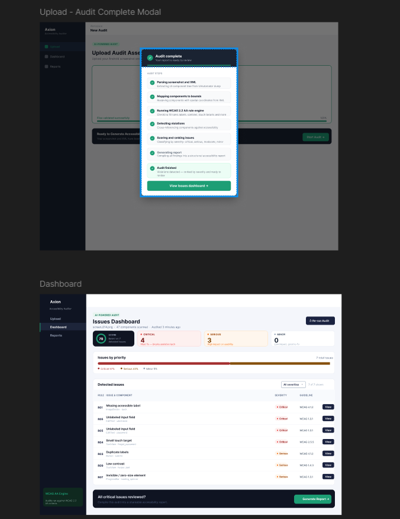
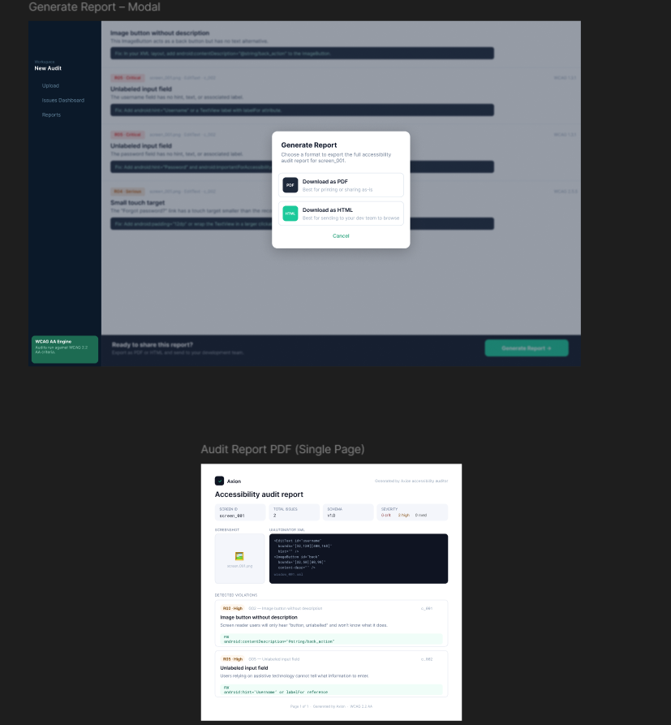

# Supplementary Progress Report

## Agentic Accessibility Auditor (Axion)

**Practical work completed — Weeks 1–6 (baseline 1 July 2026; updated 20 July 2026)**  
**Living document — see §15 for team updates; §12–§13 for literature + rule ownership**

| Field | Value |
|-------|-------|
| Report type | Empirical / progress (not theoretical SRS/SDS) |
| Prepared by | Muhammad Noor (Lead) |
| Team | Salar (parser, MASC data, rules, tests); Ayesha (Rico holdout, frontend, SRS, rules); Noor (backend, JSON schemas, SDS, agent, reports, rules, SRS review, tests, QA) |
| Repository | [MuhammadNoor7/agentic-accessibility-auditor](https://github.com/MuhammadNoor7/agentic-accessibility-auditor) |
| Canonical specs | In repo: `srs/` · `sds/` · `updated_plan.md` |

---

## 1. Purpose of this report

This document gathers what has actually been built, run, and produced so far. It is intentionally different from the SRS and SDS, which describe what the system **must do** and **how it should be designed**. Here we record:

- Real file outputs and counts
- Sign-off test results
- Dataset preparation numbers
- Repository and folder structure as it exists today
- Gaps between plan and implementation

---

## 2. Executive summary

> **Note:** Baseline below is as of **1 July 2026**. For current status after team pushes, see **§15 Team weekly updates**.

| Area | Result (16 Jul on `noor`) |
|------|---------------------------|
| Parser (Stage 1) | **Complete** — hybrid XML parser; MASC `<wrapper>` + bounds fixes; visibility field; R13–R20 extended fields |
| Rule engine (Stage 2) | **R01–R30 implemented** — 57 XML pass/fail fixtures; **146 pytest collected** |
| Agent layer (Stage 3) | **Wired** — `src/explainer.py` + `src/agent.py` (`build_audit_report`); LLM or template fallback; API-wired |
| Report generator (Stage 4) | **Done** — `src/report.py` (Jinja2 HTML + PIL + Playwright PDF); screenshot/XML persisted for export; `GET …/report/download` |
| Axion React UI | **Complete for Week 6 MVP** — Upload/Dashboard/Report/Records + Sign Up/Log In/Forgot/OTP/Reset + Google Sign-In + profile initials |
| FastAPI audit API | **Done** — paired `POST /api/v1/audit`, violations, report, download |
| Auth + Records | **Done on `noor`** — JWT + OTP/SMTP + Google OAuth + per-user `/records` (score/filename fields) |
| Docker | **Synced** — compose services **backend + auditor** (frontend via local Vite) |
| Documentation | SRS **v2.6**, SDS **v2.10**, progress report **v1.14**, plan updated 20 Jul |

**Bottom line (20 Jul):** Week 6 **complete** on `noor`. **Week 7 (Noor):** MASC 40-screen QA analysis — rule-wise R01–R30 + guideline G01–G30 summaries, FP/miss QA notes, Week 6 cross-check, team priority fixes; validation logs refreshed. **Rico holdout batch deferred.** Salar/Ayesha Week 7 tasks (FP tuning, UI polish) pending.

---

## 2.1 Team contributions & artifact ownership (12 Jul 2026)

> **Credit map** for supervisor review — reflects who built each major deliverable on branch `noor`.

| Area | Primary contributor(s) | Evidence |
|------|------------------------|----------|
| **Data collection** | All interns | Shared dataset effort |
| **MASC dataset** (7,068 screens) | Salar + Noor | `data/data-masc/`; full re-parse sign-off |
| **Rico holdout** (1,698 screens) | Ayesha | `data/data-rico-holdout/`; manifest |
| **Parser** → `components.json` | Salar + Noor | `src/parser.py` (Noor: R13–R20 fields, visibility, MASC wrapper fix) |
| **Rules** → `violations.json` | **Salar + Noor + Ayesha** (reviewed by all) | `src/rules.py` R01–R30; 57 XML fixtures; R11–R12 sign-off |
| **Agent** → `report.json` | Noor | `src/agent.py`, `src/explainer.py`, score formula |
| **Report template** (HTML/PDF) | Noor | `src/report.py`, `src/templates/audit_report.html.j2` |
| **Backend / FastAPI** | Noor (audit) + Salar (auth/records base) + Noor (OTP/SMTP/OAuth) | `backend/routers/audit.py`; `auth.py`, `otp_store.py`, `email_service.py`, `auth_router.py`, `records_router.py` |
| **Frontend (Axion)** | Ayesha (+ Salar/Noor auth wiring) | `frontend/`; Upload/Dashboard/Report/Records + full auth |
| **JSON structure + schema docs** | Noor | `docs/json_schemas.md`, `docs/schemas/auditor_schema.json`, `src/schema_documents.py` |
| **SRS / SDS** | Ayesha+Salar (SRS) / Noor (SDS + Week 6 sync) | `srs/` · `sds/` |
| **Tests (pytest)** | Salar + Noor | `tests/` + `backend/tests/` — **146 collected** (16 Jul) |

---

## 3. Pipeline status (actual vs planned)

| Stage | Owner | Output artefact | Status (16 Jul) | Evidence |
|-------|-------|-----------------|-----------------|----------|
| 1 — Parser | Salar / Noor | `*_components.json` | **Done** | `data/data-masc/parsed/` (7,068; sign-off PASS) |
| 2 — Rules | Salar + Noor + Ayesha | `violations.json` | **Done** R01–R30 | `src/rules.py`; 57 XML fixtures |
| 3 — Agent | Noor | enriched `report.json` | **Done** | `GET /api/v1/audit/{id}/report` |
| 4 — Report | Noor | HTML/PDF | **Done** | download API; screenshot/XML persist + autoescape |
| UI — Axion | Ayesha / Noor | React app | **Done (Week 6 MVP)** | Upload/Dashboard/Report/Records + full auth flows |
| API — Audit | Noor | FastAPI | **Done** | `/api/v1/audit/*` |
| Auth / Records | Salar + Noor | JWT + OTP/SMTP/OAuth + history | **Done** | `/auth/*`, `/records/*`; **146** pytest collected |
| Week 6 eval | Noor | 40-screen sheet | **Done** | `docs/week6/` + validation logs |
| Week 7 QA | Noor | Rule/guideline summaries | **Done** (holdout deferred) | `docs/week7/` · `outputs/week7_eval/` |

---

## 4. Project folder structure (repository root)

> **As of 12 July 2026** on branch `noor` (commit `4ce430feb`) — canonical repo: [agentic-accessibility-auditor](https://github.com/MuhammadNoor7/agentic-accessibility-auditor)

```
agentic-accessibility-auditor/          ← repo root (clone / _noor_push locally)
│
├── src/                                ← Stage 1–3 Python core
│   ├── parser.py                       ← XML → components.json (Stage 1; R13–R20 fields + visibility)
│   ├── rules.py                        ← R01–R30 rule checker (Stage 2)
│   ├── agent.py                        ← Score + build_audit_report (Stage 3; API-wired)
│   ├── report.py                       ← Jinja2 HTML + Playwright PDF (Stage 4)
│   ├── templates/
│   │   └── audit_report.html.j2        ← Standalone HTML report template
│   ├── explainer.py                    ← Live LLM recommendations (batched; anti-hallucination)
│   ├── guidelines.py                   ← G01–G30 + R→G mapping for explainer
│   ├── llm_providers.py                ← Anthropic / OpenAI / Gemini / Groq
│   └── schema_documents.py             ← JSON envelope builders
│
├── backend/                            ← FastAPI gateway
│   ├── main.py                         ← App entry + CORS + routers
│   ├── requirements.txt
│   ├── models/
│   │   └── audit.py                    ← Pydantic audit response models
│   └── routers/
│       └── audit.py                    ← POST /audit, GET …/violations, GET …/report, GET …/report/download
│
├── frontend/                           ← Axion React UI (Ayesha, synced to noor)
│   ├── package.json                    ← Vite 8 + React 19 + Tailwind 4
│   ├── vite.config.js
│   ├── public/                         ← favicon, icons
│   └── src/
│       ├── App.jsx                     ← Routes (auth + Upload/Dashboard/Report/Records)
│       ├── main.jsx, index.css
│       ├── state/auditFiles.js         ← Upload file state (wired to POST /audit)
│       ├── components/
│       │   ├── Sidebar.jsx
│       │   ├── layout/                 ← AuthLayout, MainLayout
│       │   └── ui/                     ← Button, TextField, OtpInput, FileDropzone, …
│       └── pages/
│           ├── auth/                   ← Login, SignUp, ForgotPassword, VerifyCode, …
│           ├── Upload.jsx, Dashboard.jsx, Report.jsx, Records.jsx
│           └── main/Placeholder.jsx
│
├── tests/                              ← pytest suite (**120** passed on `noor`)
│   ├── test_parser.py
│   ├── test_rules.py                   ← R01–R30 pass/fail XML fixtures (78 tests)
│   ├── test_agent.py                   ← score + template report
│   ├── test_audit.py                   ← FastAPI violations + report + download
│   ├── test_report.py                  ← HTML/PDF export (Week 5)
│   ├── test_explainer.py               ← anti-hallucination / batching (mocked LLM)
│   └── fixtures/rules/                 ← 57 controlled XML screens (R01–R30)
│
├── data/                               ← datasets + local uploads
│   ├── data-masc/
│   │   ├── parsed/                     ← 7,068 MASC components.json
│   │   │   ├── masc_parse_signoff_report.json
│   │   │   └── batch_parse_masc_full.log
│   │   └── splits/                     ← train / val / test split JSON
│   ├── data-rico-holdout/              ← 1,698-screen holdout + manifest
│   ├── xml/                            ← generic upload XML drops
│   ├── parsed/                         ← generic parsed output
│   └── screenshots/                    ← screenshot uploads (paired with XML for POST /audit)
│
├── outputs/                            ← pipeline artefacts
│   ├── violations/                     ← *_violations.json (Stage 2; generated locally)
│   ├── reports/                        ← *_report.json, .html, .pdf (Stages 3–4)
│   └── validation_logs/
│       ├── noor_week1–4 summaries + logs
│       ├── noor_week5_summary.md
│       └── noor_week5_validation_log.txt
│
├── notebooks/
│   └── masc_dataset_analysis.ipynb     ← Salar MASC analysis (synced Week 4)
│
├── docs/                               ← project documentation
│   ├── progress/
│   │   └── Supplementary_Progress_Report_v1.0.md   ← this report
│   ├── schemas/auditor_schema.json
│   ├── examples/                       ← sample components / violations / report JSON
│   ├── assets/                         ← Figma exports (SRS Appendix F)
│   ├── r11_r12_design.md
│   ├── qa_test_plan.md
│   └── updated_plan_v2.0.docx
│
├── scripts/                            ← batch + validation utilities
│   ├── validate_output.py
│   ├── noor_week3_validate.py
│   ├── noor_week4_validate.py
│   ├── noor_week5_validate.py
│   ├── masc_parse_signoff.py
│   ├── run_explainer_sample.py         ← Stage 3 LLM sample runner
│   ├── compare_visibility_filter_impact.py
│   ├── split_masc_dataset.py
│   └── build_rico_holdout.py
│
├── srs/                                ← SRS v2.0 (md + docx)
├── sds/                                ← SDS v2.2 (md + docx)
│
├── app.py                              ← Streamlit dev UI (parse + violations preview)
├── test_run.py                         ← CLI batch / single-file parser + rules
├── .env.example                        ← LLM_PROVIDER + API key template
├── requirements.txt                    ← root Python deps (+ anthropic/openai/groq)
├── updated_plan.md                     ← 8-week team plan
├── conftest.py
└── README.md
```

### Key paths by pipeline stage

| Stage | Primary code | Output location |
|-------|--------------|-----------------|
| 1 — Parser | `src/parser.py`, `test_run.py`, `app.py` | `data/**/parsed/*_components.json` |
| 2 — Rules | `src/rules.py` | `outputs/violations/*_violations.json` |
| 3 — Agent | `src/agent.py`, `src/explainer.py` | `outputs/reports/*_report.json` |
| 4 — Report | `src/report.py` | `outputs/reports/*_report.html` / `.pdf` + download API |
| API | `backend/routers/audit.py` | in-memory job → violations + report JSON + file download |
| UI | `frontend/` | browser at `:5173` (Upload/Dashboard/Report wired; Records mock) |

### Local workspace (optional clones)

Team members may keep additional working copies beside the canonical clone:

```
d:\internship\
├── agentic-accessibility-auditor\   ← main local copy
├── _noor_push\                      ← Noor's push branch working copy
├── _salar_pull\                     ← Salar sync copy
└── updated_plan.md                  ← local plan copy (also in repo root)
```

**Important:** Treat the GitHub repo root layout above as the single source of truth for code and folder conventions.

---

## 5. Parser deliverables (Salar)

### 5.1 Sign-off result (re-parse 6 July 2026)

| Metric | Value |
|--------|-------|
| Dataset | MASC |
| Total screens | 7,068 |
| Categories | 10 |
| Components parsed | **640,563** |
| Violations (R01–R20) | **462,542** |
| Extended parser fields | **0 missing** (all 13 R13–R20 fields) |
| Parse OK | 7,068 |
| Parse errors | 0 |
| Sign-off | **PASS** |

Source: `data/data-masc/parsed/masc_parse_signoff_report.json`  
Scripts: `python test_run.py --dataset masc` · `python scripts/masc_parse_signoff.py`  
Commit: `f7bcac9` on branch `noor`

**Parser fix (Jul 2026):** MASC widgets nest inside `<wrapper>` nodes; depth-first walk now descends into wrappers (previously ~1 component/screen).

### 5.2 MASC train / val / test split

| Split | Screens | Ratio |
|-------|---------|-------|
| Train | 4,943 | 70% |
| Val | 1,056 | 15% |
| Test | 1,069 | 15% |
| **Total** | **7,068** | 100% |

Config: `data/data-masc/splits/split_summary.json`

### 5.3 Supported XML formats

`src/parser.py` handles UIAutomator, MASC, Rico, and generic upload formats.

---

## 6. Dataset work

### 6.1 MASC (primary development corpus)

- **Screens:** 7,068 paired screenshot + XML
- **Parsed output:** `data/data-masc/parsed/{category}/{id}_components.json`
- **Splits:** `data/data-masc/splits/`

### 6.2 Rico holdout (unseen final evaluation)

- **Selected screens:** 1,698 (after removing 302 MASC-overlapping screens)
- **Overlap verification:** 0 hash collisions
- **Manifest:** `data/data-rico-holdout/manifest/selection_report.json`
- **Parsed at baseline:** 4 screens (holdout batch not yet run at scale)

---

## 7. Code and infrastructure delivered (updated 12 Jul)

| Path | Purpose | Owner |
|------|---------|-------|
| `src/parser.py` | Hybrid XML → `components.json` | Salar / Noor |
| `src/schema_documents.py` | JSON envelope builders | Noor |
| `src/rules.py` | R01–R30 rule checker → `violations.json` | Salar + Noor + Ayesha (reviewed by all) |
| `src/agent.py`, `src/explainer.py` | Agent layer → `report.json` | Noor |
| `src/report.py`, `src/templates/` | HTML/PDF report export | Noor |
| `backend/routers/audit.py` | FastAPI audit + download API | Noor |
| `test_run.py` | CLI batch / single / `--fixtures` | Salar / Noor |
| `tests/` | pytest suite (**146** collected, 16 Jul) | Salar / Noor |
| `app.py` | Streamlit dev UI | Salar |
| `scripts/validate_output.py` | JSON schema validation | Noor / Salar |
| `docker-compose.yml` | Backend + auditor services | Salar |

---

## 8. Documentation delivered

| Document | Author(s) | Status |
|----------|-----------|--------|
| SRS v2.0 | Ayesha + Salar (Noor review) | Complete |
| SDS v2.2 | Noor | Complete |
| JSON schemas + `auditor_schema.json` | Noor | Complete |
| Accessibility guidelines (G01–G30, R01–R30) | Team (Noor lead doc) | Complete |
| QA test plan (TC-01–TC-06) | Noor | Complete |
| Figma UI specs (SRS Appendix F) | Ayesha | Documented |
| Updated 8-week plan | Noor | Complete |

---

## 9. Per-person contribution summary (updated 12 Jul)

### Salar — Parser, rules, MASC data, Agent, Docker, tests, JWT/records

**Done:** Hybrid parser (with Noor); **R01–R30 rules** (with Noor + Ayesha; reviewed by all); MASC integration + batch scripts; Docker Compose; `components.json` pipeline; pytest (with Noor); **JWT auth + records API** (synced to `noor` Week 6)  
**Pending:** Branch rename `azeem` → `salar` (if still open); rule FP tuning (Week 7)

### Ayesha — Rico holdout, frontend, SRS, rules, 

**Done:** **Rico holdout** build; Figma designs; React Axion UI (incl. auth screens); **SRS co-author**; frontend ↔ API wiring; Records on live API; **rules** (with Salar + Noor; R11–R12 sign-off); Groq prompt experiments (TBD-01)  
**Pending:** UI polish / prompt comparison notes (Week 7)

### Noor (Lead) — Parser, MASC data, Backend, Frontend Review, schemas, SDS, agent, reports, rules, SRS review, tests, QA, Week 6 auth stretch

**Done:** **FastAPI** audit API; **JSON schemas**; **SDS**; **SRS review**; agent + **report template** (JSON/HTML/PDF + export fix); parser extensions; **rules** (with Salar + Ayesha); Week 1–6 validation; **OTP + Gmail SMTP + Google OAuth**; any-domain signup emails; profile initials; **40/40** eval sheet + R26–R30 design; docs/plan alignment  
**Pending:** Rico holdout evaluation (Week 8); Friday demo rehearsal

---

## 10. Week 2 completion checklist (baseline)

| Task | Done? |
|------|-------|
| MASC dataset integrated locally | Yes |
| Parser handles MASC/Rico/UIAutomator formats | Yes |
| 7,068 `components.json` files generated | Yes |
| Parser sign-off PASS | Yes |
| Train/val/test split created | Yes |
| Rico holdout built (1,698 disjoint screens) | Yes |
| JSON schemas documented + validated | Yes |
| SRS + SDS v2.0 written | Yes |
| Docker backend runs (health only) | Yes |
| Rule engine R01–R10 | No (at baseline) |
| React UI started | No |

**Week 2 status:** ~75% complete at baseline.

---

## 11. Key output file locations

| What | Where |
|------|-------|
| Parsed MASC components | `data/data-masc/parsed/` |
| Parser sign-off report | `data/data-masc/parsed/masc_parse_signoff_report.json` |
| Split summary | `data/data-masc/splits/split_summary.json` |
| Rico holdout manifest | `data/data-rico-holdout/manifest/selection_report.json` |
| JSON schema | `docs/schemas/auditor_schema.json` |
| Example outputs | `docs/examples/components.json`, `violations.json`, `report.json` |

---

## 12. Literature insights (Chen et al., IEEE TSE 2021)

**Paper:** *Accessible or Not? An Empirical Investigation of Android App Accessibility* (Chen et al., 2021, DOI [10.1109/TSE.2021.3108162](https://doi.org/10.1109/TSE.2021.3108162))

**Why it matters for Axion:** The paper studies **86,767 issue-level findings** from **2,270 Android apps** using automated exploration (tool: **Xbot**). This validates our approach of rule-based, violation-level auditing rather than only screen-level pass/fail.

### Top real-world issue types (literature + full MASC validation, Jul 2026)

| Rank | Issue type (literature) | Our rule(s) | MASC evidence (7,068 screens) |
|------|-------------------------|-------------|-------------------------------|
| 1 | Missing label / content description | **R01**, R02, R30 | R01: 60,112 violations / 6,185 screens |
| 2 | Layout / focus order issues | **R07**, R08, **R15** | R07: 266,393; R15: 3,860 screens |
| 3 | Small touch target / spacing | **R04**, **R17** | R17: 9,327 violations / 1,697 screens |
| 4 | Multi-gesture only | **R18** | R18: 13,529 violations / 3,945 screens |
| 5 | Unlabeled input | **R05**, **R20** | R05: 3,797; R20: 0 (no hint-only inputs in MASC) |
| 6 | Low contrast | **R09** | 0 — needs screenshot CV |

### Findings we apply directly

1. **Prioritize R01–R05** in MVP — highest frequency in literature and in our MASC sample.
2. **R07 remains dominant** on full MASC — review false-positive rate (bounds fallback).
3. **R13–R20 are active** on real data after parser re-parse (audio, focus order, spacing, gestures).
4. **Issue-level JSON** enables severity stats and guideline mapping per Chen et al.

**Sources:** `outputs/validation_logs/noor_week3_summary.md` · `data/data-masc/parsed/masc_parse_signoff_report.json`

---

## 13. Rule & guideline ownership checklist (R01–R30)

> All 30 rules and 30 guidelines are **team-owned**. "Lead" implements; "Reviewers" must approve PRs. Canonical G↔R mapping: `docs/accessibility_guidelines_report.md` §3–§4.

### Block leads (from `updated_plan.md`)

| Block | Rule lead | Guideline validation | Reviewers |
|-------|-----------|----------------------|-----------|
| R01–R10 / G01–G10 | **Salar** | **Noor** | Ayesha |
| R11–R12 / G11–G12 | **Ayesha** | **Salar** | Noor |
| R13–R20 / G13–G20 | **Noor** | **Salar** | Ayesha |
| R21–R30 / G21–G30 | **Noor** | **Ayesha** | Salar |

### Per-rule tracker

| Rule | Guideline(s) | Lead | Status | Notes |
|------|--------------|------|--------|-------|
| R01 | G01, G02, G30 | Salar | ✅ Done | High frequency in validation |
| R02 | G02, G30 | Salar | ✅ Done | |
| R03 | G03 | Salar | ✅ Done | |
| R04 | G04, G17 | Salar | ✅ Done | DPI-aware (Week 3 fix) |
| R05 | G05, G20 | Salar | ✅ Done | `hint` field + INPUT_CLASSES |
| R06 | G06, G26 | Salar | ✅ Done | |
| R07 | G07, G25 | Salar | ✅ Done | Review false-positive rate |
| R08 | G08, G15 | Salar | ✅ Done | Zero-area guard added |
| R09 | G09, G11 | Salar | 🟡 Partial | Needs declared colors / screenshot contrast |
| R10 | G10, G28, G29 | Salar | ✅ Done | |
| R11 | G11 | Ayesha | ✅ Done | Implemented by Salar; **reviewed by Ayesha + Noor** |
| R12 | G12 | Ayesha | ✅ Done | `media_type` + caption heuristics; Ayesha review sign-off |
| R13 | G13 | Noor | ✅ Done | 1,055 violations / 118 MASC screens |
| R14 | G14 | Noor | ✅ Done | 1,873 / 667 screens |
| R15 | G15, G16 | Noor | ✅ Done | 3,860 / 3,860 screens |
| R16 | G16 | Noor | ✅ Done | 130 / 115 screens |
| R17 | G17 | Noor | ✅ Done | `related_component`; 9,327 / 1,697 |
| R18 | G18 | Noor | ✅ Done | 13,529 / 3,945 screens |
| R19 | G19 | Noor | ✅ Done | 758 / 416 screens |
| R20 | G05, G20 | Noor | ✅ Done | Unit tests pass; 0 MASC hits |
| R21 | G21 | Noor | ✅ Done | Vague error message (Salar sync Week 4) |
| R22 | G22 | Noor | ✅ Done | No password toggle |
| R23 | G01, G23 | Noor | ✅ Done | Unlabeled nav control |
| R24 | G24 | Noor | ✅ Done | Missing screen title |
| R25 | G25 | Noor | ✅ Done | Uncontrolled animation |
| R26 | G06, G26 | Noor | ✅ Done | No timeout warning |
| R27 | G27 | Noor | ✅ Done | Complex label language |
| R28 | G10, G28 | Noor | ✅ Done | Font scale overflow (needs declared text size) |
| R29 | G29 | Noor | ✅ Done | All-caps body text |
| R30 | G01, G30 | Noor | ✅ Done | Icon-only, no label |

**Legend:** ✅ implemented + tests · 🟡 stub/partial · ⬜ not started

---

## 14. Recommended next steps (updated 15 July 2026)

1. **Noor:** Fill ≥25 manual rows on `docs/week6/evaluation_sheet_40_screens.csv` (FP / missed notes)
2. **All:** Friday demo — login → upload screenshot+XML → dashboard → report HTML/PDF → Records list
3. **Noor (stretch):** Map guidelines for CV training on MASC **train** → tune on **val** → test on **test**; never train on Rico holdout
4. **Ayesha:** Continue prompt experiments; polish auth/records UX if needed
5. **Salar:** Keep JWT secret configured for demos; continue rule FP tuning
6. **Team:** Friday demo path — signup/login → upload pair → report → Records

---

## 15. Team weekly updates

> **Instructions:** Each intern adds a dated entry after pushing work. Newest week at the top. Keep entries factual — file names, test counts, branch commits.

### Week 6 close-out — Noor (`noor` / `995f6d31`, 16 Jul 2026)

**Pushed by:** Muhammad Noor  
**Date:** 16 July 2026

**Completed (auth / mail / OAuth / eval / export):**
- **Sign Up / Log In** — JWT register/login; password policy (letter+digit); optional `name`; **UserAvatar** initials
- **Forgot → OTP → Reset** — `forgot-password`, `resend-otp`, `verify-otp`, `reset-password` wired end-to-end
- **SMTP** — Gmail App Password via `.env` (`SMTP_HOST`, `SMTP_USER`, `SMTP_FROM`, `SMTP_PASSWORD`); real OTP emails verified; `AUTH_DEV_SHOW_OTP=0` when mail works
- **Recipient domains** — any valid email (Yahoo, Outlook, university/education, …); sender remains Gmail
- **Google OAuth** — GIS + `POST /auth/google`; `GOOGLE_CLIENT_ID` in `.env` / `.env.example`
- **Other settings** — `JWT_SECRET`; `load_dotenv(override=True)`; frontend `VITE_API_BASE`
- **Report export fix** — persist screenshot/XML for HTML/PDF; Jinja autoescape (`123fbde4`)
- **Eval** — **40/40** assisted FP/miss notes on stratified sheet; `evaluation_sheet.md` / `.docx` + method note
- **Docs** — SRS v2.4 · SDS v2.8 · `updated_plan.md` · this progress report
- **Validation (16 Jul live):** auth **22 passed** · audit **9 passed** · R26–R30 **8 passed** · eval integrity **40/40**  
  → `outputs/validation_logs/noor_week6_validation_log.txt` + `noor_week6_summary.md`

**Pending:**
- Friday demo rehearsal
- Rico holdout batch (Week 8)

**Blockers:** None

**Secrets:** App Passwords / `JWT_SECRET` stay local (gitignored). Document env **names** only in `.env.example`.

---

### Week 6 — Noor (`noor` branch — Salar + Ayesha sync + eval, 15 Jul 2026)

**Pushed by:** Muhammad Noor (integration) — sources: Salar `198936146`, Ayesha `3d4fa82eb`  
**Date:** 15 July 2026

**Completed:**
- **Synced Salar JWT + records** into `_noor_push` / `noor` — `backend/auth.py`, `auth_router.py`, `records_router.py`, `test_auth.py`, Docker/compose, Login/SignUp, `frontend/src/utils/auth.js`
- **Synced Ayesha** — `docs/agent_prompt_experiments.md` (larger Groq sample); `Dashboard.jsx` re-run popup layout
- **Noor UI polish** — Report score ring (`accessibility_score`); Records Screenshot/XML + Score columns; Upload saves record when logged in
- **Eval sheet** — `docs/week6/evaluation_sheet_40_screens.csv` — **stratified random** 4×10 MASC categories (seed `20260715`); R26–R30 design DOCX
- **`.gitignore`** — synced from Salar (`data/` + `outputs/` + validation/samples exceptions)
- **Validation** — `scripts/noor_week6_validate.py` → `outputs/validation_logs/noor_week6_summary.md` + `noor_week6_validation_log.txt`
  - auth tests: **12 passed** (expanded to **22** on 16 Jul — see close-out entry above)
  - audit tests: **8 passed, 1 skipped** (PDF included on 16 Jul re-run)
  - R26–R30: **8 passed**
  - Auth/Records API smoke: **PASS**

**Pending (resolved 16 Jul):**
- ~~≥25 manual eval verdicts on the CSV~~ → **40/40 done**
- Rico holdout batch evaluation (Week 8)
- ~~OTP / SMTP stretch~~ → **Done**

**Blockers:** None on sync scope

---

### Upload validation fix — Ayesha + Noor (`ayesha` `052a976` → merged on `noor`, 14 Jul 2026)

**Pushed by:** Ayesha Naveed (frontend) + Muhammad Noor (backend/docs)  
**Date:** 14 July 2026

**Completed (handoff doc — 4 issues):**
- **Issue 1** — XML without screenshot shows error popup (not silent) — `Upload.jsx`
- **Issue 2** — `createAudit(screenshot, xml)` sends both files — `api.js`
- **Issue 3** — Backend requires screenshot + XML; 400 on pair mismatch — `backend/routers/audit.py`
- **Issue 4** — `filesMatch()` stem/prefix logic rejects false-positive digit matches — `Upload.jsx`
- **Tests** — `tests/test_audit.py` updated; missing-screenshot + mismatched-pair cases; validation scripts aligned

**Pending:** Records + auth (Week 6)

**Blockers:** None

---

### Week 5 — Noor (`noor` branch, commit `4ce430feb` — pushed 12 Jul 2026)

**Pushed by:** Muhammad Noor  
**Date:** 12 July 2026

**Completed:**
- **`src/report.py`** — Jinja2 template (`src/templates/audit_report.html.j2`), PIL screenshot bounding-box annotation, Playwright PDF export
- **Download API** — `GET /api/v1/audit/{id}/report/download?format=html|pdf` (sync handler for Playwright)
- **Frontend** — `downloadAuditReport()` in `api.js`; `Report.jsx` real HTML/PDF download after processing animation
- **Rule fixtures** — 21 new R09–R20 pass/fail XML files; `test_run.py --fixtures` batch mode; fixture path fix (no MASC root collision)
- **Tests** — `tests/test_report.py`; extended `tests/test_audit.py` + `tests/test_rules.py`; **120 pytest** passed
- **Validation** — `scripts/noor_week5_validate.py` + validation logs
- **Docs** — SRS/SDS/README/updated_plan/progress report aligned; WeasyPrint → Jinja2 + Playwright

**Pending:**
- Records + auth (Week 6)
- Rico holdout batch evaluation

**Blockers:** None

---

### Week 4 — Ayesha 

**Pushed by:** Ayesha Naveed
**Date:** 11 July 2026

**Completed:**
- **R11–R12 review sign-off:** reviewed `src/rules.py` implementations of `check_color_only_info` (R11) and `check_missing_captions` (R12) against `docs/r11_r12_design.md`. Confirmed both rules moved past their original Week 3 stub design — R11 now flags checkable-state widgets (CheckBox/Switch/ToggleButton/RadioButton) with no text/content_desc; R12 now uses `parent_id` sibling adjacency plus bounds-proximity fallback, not just a blanket VideoView flag. Ran `pytest tests/test_rules.py -k "r11 or r12"` — all 5 relevant tests passed (fixture pass/fail cases, non-checkable-widget exclusion, sibling-vs-bounds-distance priority, non-media stub behavior).
- **Frontend ↔ API wiring** (Priority 1): Upload, Dashboard, and Report pages now call the live backend (`POST /api/v1/audit`, `GET /report`) instead of mock data. Tested end-to-end with a real XML fixture and Groq — confirmed full pipeline works (upload → audit → dashboard → report).
- **Agent prompt experiments (TBD-01):** ran `scripts/run_explainer_sample.py` — Groq tested successfully (15/15 violations explained, good quality, no hallucination observed). Anthropic/OpenAI blocked by paid billing requirements; Gemini blocked by a Google-side free-tier quota bug (`429`, limit 0) even after Noor's SDK fix resolved the original key-format issue. Documented in `docs/agent_prompt_experiments.md` and `docs/TBD-01-decision.md`; TBD-01 marked Resolved (Groq as default) in this doc's Open Decisions table.

**Pending:**
- Full 4-provider comparison once Anthropic/OpenAI credits are available and Gemini's quota issue is resolved
- Records/Audit History page — blocked on backend (no list endpoint, no persistence yet)
- Auth pages (login/signup/etc.) — blocked on backend (no auth router implemented yet)

**Blockers:** None on my own tasks; Records + Auth wiring blocked on backend work not yet scoped.

---

### Week 4 — Noor (`noor` branch, commits `98efd2fe0` → `0144b1af3`)

**Pushed by:** Muhammad Noor  
**Date:** 9 July 2026

**Completed:**
- **Salar sync** (`98efd2fe0`): Stage 3 LLM layer — `src/explainer.py`, `src/guidelines.py`, `src/llm_providers.py`; rules **R01–R30** + visibility filter; parser bounds/visibility fixes; R11 + R21–R30 fixtures; `scripts/run_explainer_sample.py`, `compare_visibility_filter_impact.py`; `.env.example`
- **Notebook sync** (`20c96fd07`): `notebooks/masc_dataset_analysis.ipynb`
- **Ayesha frontend sync** (`2d8356066`): Report/Sidebar/Dashboard/Records/Upload updates + `frontend/src/state/auditFiles.js`
- **Agent API wiring** (`0144b1af3`): `build_audit_report()` in `src/agent.py` merges explainer + score formula (TBD-02); `GET /api/v1/audit/{id}/report`; pipeline statuses include `explaining`; template fallback when no API key (FR-AG.6); reports → `outputs/reports/`
- **Tests:** **94 pytest** passed (parser, rules R01–R30, agent, audit, explainer)
- Week 4 demo goal met: XML upload → violations → agent-enriched `report.json` (template mode without live LLM)

**Pending:**
- Ayesha: frontend ↔ API wiring; prompt experiments + TBD-01 model choice
- `src/report.py` HTML/PDF (Week 5)
- Formal R11–R15 review sign-off documentation
- Rico holdout batch evaluation
- Auth + Records API

**Blockers:** None (API ready for Ayesha)

---

### Week 3+ — Noor (`noor` branch, commit `f7bcac9`)

**Pushed by:** Muhammad Noor  
**Date:** 6 July 2026

**Completed:**
- **Parser R13–R20 extension** — 13 new component fields (`focus_order`, `parent_id`, `media_type`, etc.)
- **MASC `<wrapper>` fix** — full widget extraction (640,563 components vs ~1/screen before)
- **Rules R13–R20** wired in `check()`; **31** rule tests + **3** parser tests (**38** total with agent/audit)
- **Full MASC re-parse** — 7,068 XML → `data/data-masc/parsed/`; **462,542** violations
- **`scripts/noor_week3_validate.py`** — re-parse + pytest + random 20-screen MASC sample + schema check
- **`scripts/masc_parse_signoff.py`** — extended-field validation + R13–R20 aggregate counts
- **SDS v2.1** — R01–R20 parser/rules design, validation artefact paths
- **`auditor_schema.json`** — optional R13–R20 component fields
- Validation logs: `noor_week3_summary.md`, `noor_week3_validation_log.txt`, `masc_reparse_log.txt`
- Sign-off: `masc_parse_signoff_report.json` → **PASS** (0 extended-field misses)

**Pending:**
- Wire live LLM into agent (Week 4)
- Connect frontend to FastAPI
- `src/report.py` HTML/PDF generation
- Auth + Records API

**Blockers:** None

---

### Week 3 — Salar (`salar` branch, commits `c46b4da` → `712dbd8`)

**Pushed by:** Muhammad Salar Khan  
**Latest:** `712dbd8` — violations outputs + Week 3 validation logs

**Completed:**
- R01–R10 rule checker + **23 pytest tests**
- R04/R05/R08 fixes (real DPI, `hint`, overlap zero-area guard)
- `app.py` wired to Stage 2 (violations table + download)
- `outputs/violations/` — 69 files (MASC + fixtures)
- `outputs/validation_logs/week3_summary.md` — 20/20 schema pass
- `docs/r11_r12_design.md` shared with Ayesha

**Blockers:** None

---

### Week 3 — Ayesha (`ayesha` branch)
Pushed by: Ayesha Naveed

Completed:
* Set up React frontend project (Vite + Tailwind CSS) under `frontend/`
* Built folder structure: `pages/`, `components/`, layout wrapper, reusable UI components (Button, Input, Divider, Logo)
* Implemented 6 auth screens matching Figma designs: Sign Up, Log In, Forgot Password, Verify Code, Set Password, Password Reset Success
* Corrected route paths to match SDS §9.3 (`/verify-otp`, `/reset-password`, `/dashboard/:auditId`, `/report/:auditId`, added `/records`)
* Pulled `src/rules.py` from `salar` branch; added R11 (Color-Only Info) and R12 (Missing Captions) detection stub functions
* Opened PR #3 "Add R11/R12 detection stubs"
* Updated `frontend/` folder — synced onto `noor` branch by Noor (3 Jul, 38 files)

Pending:

* Agent/model prompt experiment session with Noor — not yet scheduled
* Wire frontend pages to FastAPI (`POST /api/v1/audit`, violations fetch) — Week 4
* Making necessary changes to frontend (Ayesha)

Blockers:None

### Week 3 — Noor (`noor` branch)

**Pushed by:** Muhammad Noor  
**Date:** 3 July 2026

**Completed:**
- Synced Salar Week 3 code + violations to `noor` branch (`fd6036b`)
- Added **§12 Literature insights** and **§13 Rule ownership checklist** (this report)
- Scaffolded **`src/agent.py`** — score formula (TBD-02), template enrichment (unit tests; not API-wired yet)
- Added **`backend/routers/audit.py`** — violations-only API (`POST /api/v1/audit` → parse → rules → `GET .../violations`)
- Added **`tests/test_agent.py`** (2 tests), **`tests/test_audit.py`** (2 tests)
- **Frontend sync (Ayesha → `noor`):** pulled `frontend/` from `ayesha` branch (`7a591b0`) — **38 files**
  - Stack: React 19, Vite 8, Tailwind 4, React Router 7
  - Auth: SignUp, Login, ForgotPassword, VerifyCode, SetPassword, ResetSuccess
  - App pages: Upload, Dashboard, Report, Records (+ shared Sidebar, layouts, UI kit)
  - Run: `cd frontend && npm ci && npm run dev` → http://localhost:5173
  - Status: UI scaffold only — no live calls to FastAPI yet
- **Validation logs (Noor Week 3):** same pattern as Salar's `week3_summary.md` / `week3_validation_log.txt`
  - `outputs/validation_logs/noor_week3_summary.md` — scope, 27 pytest pass, CLI↔API parity, schema pass
  - `outputs/validation_logs/noor_week3_validation_log.txt` — full terminal log (8 steps)
  - Re-run: `python scripts/noor_week3_validate.py`
- **SRS cleanup:** auth endpoints in §9 table; TBD-06 marked resolved; §1.4.2 auth moved to Must Have

**Pending:**
- Wire live LLM into agent (Week 4)
- Connect frontend to FastAPI
- `src/report.py` HTML/PDF generation
- Auth + Records API implementation

**Blockers:** None

---

## 15A. Week 6 evidence pack (logs, tables, UI references)

> Embedded for supervisor review. Machine log copy: `docs/progress/assets/logs/noor_week6_validation_log.txt`  
> Canonical path: `outputs/validation_logs/noor_week6_validation_log.txt`

### 15A.1 Validation result tables (16 Jul 2026)

| Check | 15 Jul baseline | 16 Jul live | Status |
|-------|----------------|------------|--------|
| `pytest backend/tests/test_auth.py` | 12 passed | **22 passed** | PASS (+ OTP / reset / Google) |
| `pytest tests/test_audit.py` | 8 passed, 1 skipped | **9 passed** | PASS (PDF included) |
| R26–R30 rules | 8 passed | **8 passed** | PASS |
| Eval sheet manual columns | blank | **40/40** | PASS |
| Auth + Records smoke | PASS | (covered by auth suite) | PASS |
| Pytest collection (repo) | — | **146 tests** | — |

#### Eval sheet verdict mix (40/40)

| Verdict | Count |
|---------|------:|
| mostly_agree | 32 |
| agree_clean | 3 |
| mixed_r30_noise | 3 |
| over_flagging | 2 |

#### Stratified sample (seed `20260715`)

| Category | Screens sampled |
|----------|----------------:|
| chat, home, list, login, maps, menu, profile, search, settings, welcome | 4 each (40 total) |

#### Working auth / mail / OAuth configuration (names only)

| Setting | Role |
|---------|------|
| `JWT_SECRET` | JWT signing |
| `GOOGLE_CLIENT_ID` | Google Sign-In Web client ID |
| `SMTP_HOST` / `SMTP_PORT` / `SMTP_TLS` | Gmail SMTP (`smtp.gmail.com:587`) |
| `SMTP_USER` / `SMTP_FROM` | Sender Gmail |
| `SMTP_PASSWORD` | Gmail App Password (**local `.env` only**) |
| `AUTH_DEV_SHOW_OTP` | `0` when real mail works |
| Email domains accepted | **Any valid** (Yahoo, Outlook, university/education, …) |

### 15A.2 Excerpt — `noor_week6_validation_log.txt` (15 Jul + 16 Jul)

```
##################################################################
# RE-RUN 2026-07-15
##################################################################
STEP 0: Regenerate eval sheet — stratified RANDOM (4/category, seed=20260715)
  Wrote 40 rows -> docs\week6\evaluation_sheet_40_screens.csv
STEP 1: pytest backend/tests/test_auth.py → 12 passed, 2 warnings in 7.96s
STEP 2: pytest tests/test_audit.py → 8 passed, 1 skipped, 2 warnings in 2.13s
STEP 3: pytest R26–R30 rules → 8 passed, 70 deselected in 0.14s
STEP 4: API smoke — POST /auth/register 200; POST /records 200; GET /records 200
Auth + Records smoke: PASS

##################################################################
# RE-RUN 2026-07-16 — recent session work (report/auth/eval)
# Branch: noor   HEAD: 995f6d31
##################################################################
CHANGESET:
  123fbde4  fix(report): persist upload screenshot/XML for HTML/PDF export
  995f6d31  feat(auth): implement OTP email verify, password reset, and Google Sign-In

STEP A: pytest backend/tests/test_auth.py → 22 passed, 2 warnings in 9.50s
STEP B: pytest tests/test_audit.py → 9 passed, 1 warning in 2.65s
STEP C: pytest R26-R30 rules → 8 passed, 116 deselected in 0.81s
STEP D: eval sheet integrity → rows=40 manual_complete=40
SUMMARY (2026-07-16 live): Overall PASS
```

Full log file (also copied under progress assets):

- `outputs/validation_logs/noor_week6_validation_log.txt`
- `docs/progress/assets/logs/noor_week6_validation_log.txt`
- Summary: `docs/progress/assets/logs/noor_week6_summary.md`

### 15A.3 UI reference images (Figma → Axion)







### 15A.4 End-to-end demo path (working)

1. **Sign Up** or **Log In** (email any domain) — or **Continue with Google**
2. Optional: **Forgot password** → OTP email (SMTP) → **Reset**
3. **Upload** matching screenshot + XML pair → validate → `POST /api/v1/audit`
4. **Dashboard** / **Report** — accessibility score ring; HTML/PDF download includes screenshot + XML + violations
5. **Records** — list shows screenshot/XML names + score (`GET /records`)

---

## 15B. Week 7 evidence pack (QA analysis — Noor)

> **Scope:** MASC 40-screen stratified sample (seed `20260715`). Rico holdout batch **not run** in this pass.  
> Artifacts: `docs/week7/` · `outputs/week7_eval/` · `outputs/validation_logs/noor_week7_*`

### 15B.1 Week 7 deliverables (Noor)

| Item | Path | Status |
|------|------|--------|
| Per-screen results (violations, score, R01–R30 counts) | `outputs/week7_eval/per_screen_results.csv` | Done |
| Rule-wise summary R01–R30 | `docs/week7/rule_summary.md` + CSV | Done |
| Guideline coverage G01–G30 | `docs/week7/guideline_summary.md` + CSV | Done |
| QA notes (FP / miss / Week 7 vs 8) | `docs/week7/qa_notes.md` | Done |
| Week 6 cross-check | `docs/week7/week6_crosscheck.md` | Done |
| Team priorities (Salar/Ayesha) | `docs/week7/team_priority_fixes.md` | Done |
| Validation | `scripts/noor_week7_validate.py` | PASS (20 Jul) |
| Rico holdout batch | `scripts/run_rico_holdout_eval.py` | **Deferred** |

### 15B.2 Key metrics (MASC n=40)

| Metric | Value |
|--------|------:|
| Screens evaluated | 40 |
| Failures | 0 |
| Mean violations / screen | 64.3 |
| Median violations / screen | 42 |
| Mean accessibility score | 6.8 |
| Manual mostly_agree | 32 |
| Manual agree_clean | 3 |
| Manual over_flagging | 2 |
| Manual mixed_r30_noise | 3 |

#### Top rules by violation count

| Rule | Violations | Notes |
|------|----------:|-------|
| R07 | 1127 | 100% of screens — primary FP cluster (nesting/zero-size) |
| R08 | 629 | 60% of screens — overlap pairs |
| R01 | 324 | Missing labels — mix of real + decorative FP |
| R18 | 102 | Multi-touch heuristic |
| R02 | 89 | Image buttons without description |
| R30 | 89 | Icon-only density — 3 manual mixed_r30_noise screens |

#### Guidelines with zero hits in sample

G09, G10, G12, G13, G22, G27, G28, G29 — mostly media/CV/stretch rules not triggered on this XML sample.

### 15B.3 Week 7 validation (20 Jul 2026)

```
STEP 1: run_week7_eval_analysis.py  → 40 screens, 0 failures
STEP 2: pytest tests/test_rules.py → PASS
STEP 3: pytest backend/tests/test_auth.py → PASS
STEP 4: pytest tests/test_audit.py → PASS
STEP 5–6: week7_eval outputs + docs/week7 → PASS
Overall → PASS
```

Full log: `outputs/validation_logs/noor_week7_validation_log.txt`  
Summary: `outputs/validation_logs/noor_week7_summary.md` · `outputs/week7_summary.md`

### 15B.4 Team priority handoff (Week 7 → Salar/Ayesha)

1. **P0 Salar** — R07/R08 nesting FP suppression  
2. **P0 Salar** — R30 overlap tolerance (list/chat/map/search)  
3. **P1 Ayesha** — UI polish for demo path  
4. **P2 Noor** — Rico holdout when dataset local  

---

## 16. Document history

| Version | Date | Author | Changes |
|---------|------|--------|---------|
| 1.0 | 1 Jul 2026 | Noor | Initial empirical report (Weeks 1–2 baseline) |
| 1.0.1 | Jul 2026 | Noor | Added to repo `docs/progress/`; team update template |
| 1.1 | 3 Jul 2026 | Noor | Literature insights, R01–R30 ownership table, Noor Week 3 deliverables |
| 1.2 | 3 Jul 2026 | Noor | Frontend sync on `noor`, Noor validation logs, violations-only API push |
| 1.3 | 3 Jul 2026 | Noor | §4 project folder structure updated for Week 3 repo layout |
| 1.4 | 6 Jul 2026 | Noor | R13–R20 parser/rules, full MASC re-parse, SDS v2.1, validation sign-off |
| 1.5 | 6 Jul 2026 | Noor | R13–R20 rule lead → Noor; DOCX regenerated |
| **1.6** | **9 Jul 2026** | **Noor** | Week 4: R01–R30, explainer + report API, 94 tests, frontend/notebook sync; next steps + §15 |
| **1.7** | **12 Jul 2026** | **Noor** | Week 5 pushed (`4ce430feb`): HTML/PDF export, download API, R09–R20 fixtures, 120 tests, docs aligned (Jinja2+Playwright) |
| **1.8** | **12 Jul 2026** | **Noor** | Team artifact ownership table (§2.1); credit map: backend/schemas/SDS (Noor), rules (Salar), frontend/Rico/SRS (Ayesha) |
| **1.9** | **13 Jul 2026** | **Noor** | Rules credit → Salar + Noor + Ayesha (reviewed by all); Word export → `Supplementary_Progress_Report_v1.0.docx`; SRS/SDS DOCX generated from markdown |
| **1.10** | **14 Jul 2026** | **Noor** | Upload validation handoff merged (Ayesha frontend + Noor backend); SRS/SDS API contract updated |
| **1.11** | **15 Jul 2026** | **Noor** | Week 6: Salar auth/records + Ayesha prompt/Dashboard synced; random 40-screen eval sheet; Week 6 validation logs; `.gitignore` from Salar |
| **1.12** | **16 Jul 2026** | **Noor** | Week 6 close-out: OTP/SMTP/Google OAuth; any-domain emails; 40/40 eval notes; report export fix; SRS/SDS/plan DOCX regen; auth 22 / audit 9 tests |
| **1.13** | **16 Jul 2026** | **Noor** | Progress evidence pack §15A (validation log excerpt + tables + Figma images); pipeline status Done; SRS/SDS path accuracy sync |
| **1.14** | **20 Jul 2026** | **Noor** | Week 7 QA evidence §15B: rule/guideline summaries, metrics tables, validation logs; Rico holdout deferred; SRS v2.6 / SDS v2.10 sync |

---

**— End of Supplementary Progress Report —**
