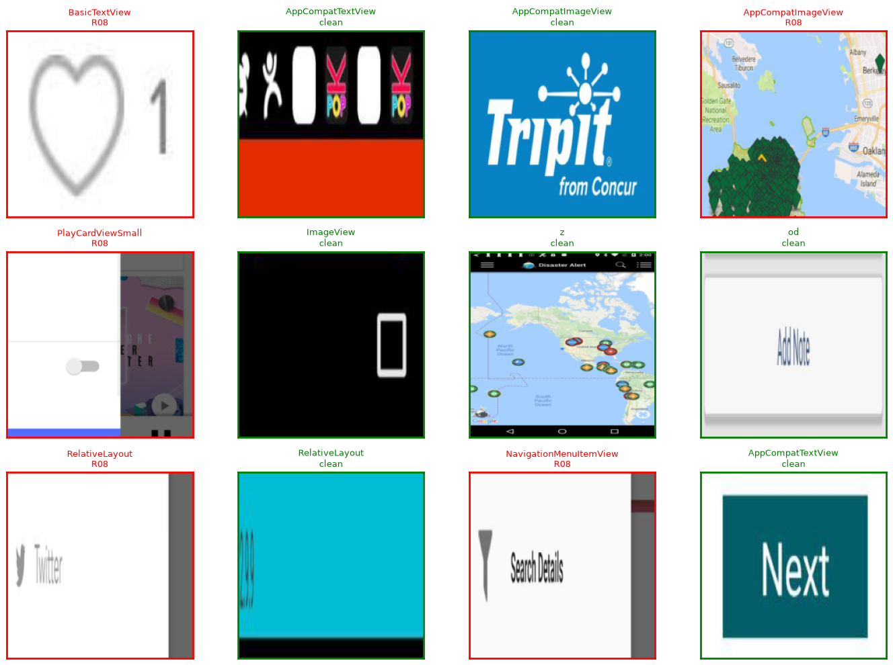
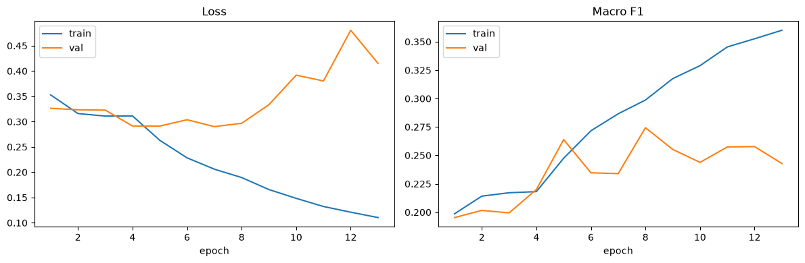
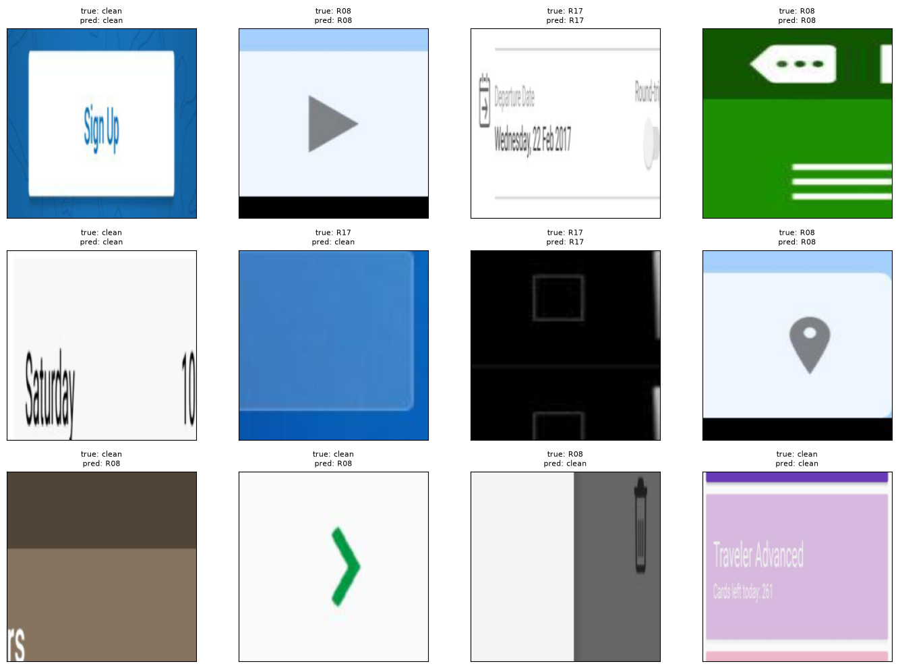
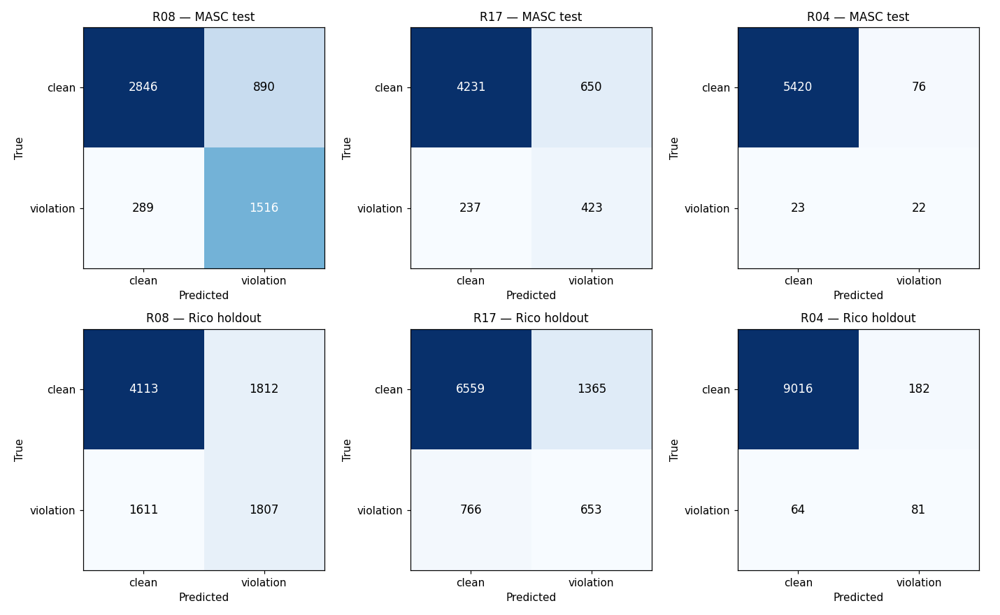
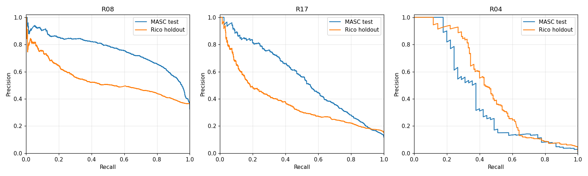
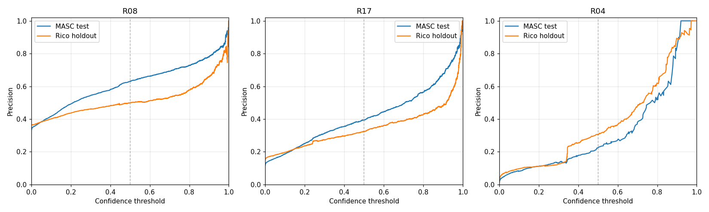
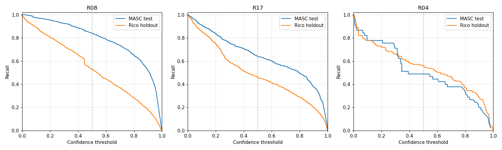
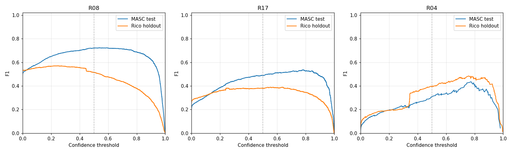
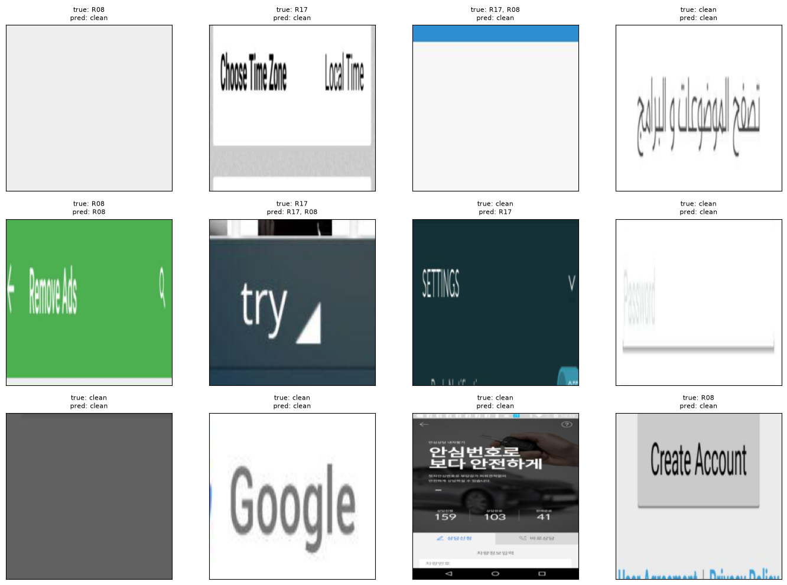

# Supplementary Progress Report

## Agentic Accessibility Auditor (Axion)

**Practical work completed — Weeks 1–8 + post–Week 7 YOLO track + Aug backend integration (baseline 1 July 2026; updated 05 August 2026)**  
**Living document — see §15 / §15B / §15C / §15J for team updates; §12–§13 for literature + rule ownership**

| Field | Value |
|-------|-------|
| Report type | Empirical / progress (not theoretical SRS/SDS) |
| Prepared by | Muhammad Noor (Lead) |
| Team | Salar (parser, MASC data, rules, tests, YOLO notebook, full YOLO train + Rico eval); Ayesha (Rico holdout, frontend, SRS, rules, prompt experiments); Noor (backend, JSON schemas, SDS, agent, reports, rules, SRS review, tests, QA, Colab YOLO training, 33-backbone crop-classifier sweep, both models' backend integration, Docker fixes) |
| Repository | [MuhammadNoor7/agentic-accessibility-auditor](https://github.com/MuhammadNoor7/agentic-accessibility-auditor) |
| Canonical specs | In repo: `srs/` · `sds/` · `updated_plan.md` |
| Report version | **v1.27** (05 Aug 2026) |

---

## 1. Purpose of this report

This document gathers what has actually been built, run, and produced so far. It is intentionally different from the SRS and SDS, which describe what the system **must do** and **how it should be designed**. Here we record:

- Real file outputs and counts
- Sign-off test results
- Dataset preparation numbers
- Repository and folder structure as it exists today
- Gaps between plan and implementation

---

## 2. Executive summary

> **Note:** Baseline below is as of **1 July 2026**. For current status after team pushes, see **§15 Team weekly updates**.

| Area | Result (27 Jul on `noor`) |
|------|---------------------------|
| Parser (Stage 1) | **Complete** — hybrid XML parser; MASC `<wrapper>` + bounds fixes; visibility field; R13–R20 extended fields |
| Rule engine (Stage 2) | **R01–R30 implemented** — 57 XML pass/fail fixtures; **146 pytest collected** |
| Agent layer (Stage 3) | **Wired** — `src/explainer.py` + `src/agent.py` (`build_audit_report`); LLM or template fallback; API-wired |
| Report generator (Stage 4) | **Done** — `src/report.py` (Jinja2 HTML + PIL + Playwright PDF); screenshot/XML persisted for export; `GET …/report/download` |
| Axion React UI | **Complete for Week 6 MVP** — Upload/Dashboard/Report/Records + Sign Up/Log In/Forgot/OTP/Reset + Google Sign-In + profile initials |
| FastAPI audit API | **Done** — paired `POST /api/v1/audit`, violations, report, download |
| Auth + Records | **Done on `noor`** — JWT + OTP/SMTP + Google OAuth + per-user `/records` (score/filename fields) |
| Docker | **Synced** — compose services **backend + auditor** (frontend via local Vite) |
| Documentation | SRS **v2.7**, SDS **v2.11**, progress report **v1.20**, plan updated 27 Jul |
| Screenshot-only YOLO detector | **Functional Prototype** — MASC fine-tuned YOLO11s UI Element detector, full 60-epoch run; `best.pt` exported (51.2 MB); Rico holdout evaluated (mAP50 0.2546); `detect_ui()` inference module ready but not backend-wired |

**Bottom line (30 Jul):** Week 6–8 **complete** on `noor`. **Post–Week 7 (YOLO Track):** Salar's YOLO UI-element training notebook merged and implemented; full 60-epoch training completed on **Google Colab T4** using MASC (7,068 screens) — final mAP50-95 **0.3217** (val), superseding the earlier 1-epoch interim figure of 0.2846. **Best weights exported** to `models/yolo_ui_detector_best.pt` (51.2 MB). **Inference module** `src/yolo_ui_detector.py` created and present to support screenshot-only auditing. **Rico holdout generalization eval done** (§15C.9): zero-shot mAP50 0.0258 → fine-tuned 0.2546. **Crop-violation classifier** also Rico-evaluated (§15G.7): weighted F1 0.43 vs. 0.63 on the MASC test split. ~~**Next Steps:** integrate both models as backend fallback/confirmation paths (deliberately deferred — Stretch requirement, not started)~~ — **Done, 05 Aug** (see §15J); research specialized models for R09 (contrast) and visual clipping (R10/R28) per `docs/user_coverage_for_training.md` remains open.

---

## 2.1 Team contributions & artifact ownership (12 Jul 2026)

> **Credit map** for supervisor review — reflects who built each major deliverable on branch `noor`.

| Area | Primary contributor(s) | Evidence |
|------|------------------------|----------|
| **Data collection** | All interns | Shared dataset effort |
| **MASC dataset** (7,068 screens) | Salar + Noor | `data/data-masc/`; full re-parse sign-off |
| **Rico holdout** (1,698 screens) | Ayesha | `data/data-rico-holdout/`; manifest |
| **Parser** → `components.json` | Salar + Noor | `src/parser.py` (Noor: R13–R20 fields, visibility, MASC wrapper fix) |
| **Rules** → `violations.json` | **Salar + Noor + Ayesha** (reviewed by all) | `src/rules.py` R01–R30; 57 XML fixtures; R11–R12 sign-off |
| **Agent** → `report.json` | Noor | `src/agent.py`, `src/explainer.py`, score formula |
| **Report template** (HTML/PDF) | Noor | `src/report.py`, `src/templates/audit_report.html.j2` |
| **Backend / FastAPI** | Noor (audit) + Salar (auth/records base) + Noor (OTP/SMTP/OAuth) | `backend/routers/audit.py`; `auth.py`, `otp_store.py`, `email_service.py`, `auth_router.py`, `records_router.py` |
| **Frontend (Axion)** | Ayesha (+ Salar/Noor auth wiring) | `frontend/`; Upload/Dashboard/Report/Records + full auth |
| **JSON structure + schema docs** | Noor | `docs/json_schemas.md`, `docs/schemas/auditor_schema.json`, `src/schema_documents.py` |
| **SRS / SDS** | Ayesha+Salar (SRS) / Noor (SDS + Week 6 sync) | `srs/` · `sds/` |
| **Tests (pytest)** | Salar + Noor | `tests/` + `backend/tests/` — **146 collected** (16 Jul) |

---

## 3. Pipeline status (actual vs planned)

| Stage | Owner | Output artefact | Status (16 Jul) | Evidence |
|-------|-------|-----------------|-----------------|----------|
| 1 — Parser | Salar / Noor | `*_components.json` | **Done** | `data/data-masc/parsed/` (7,068; sign-off PASS) |
| 2 — Rules | Salar + Noor + Ayesha | `violations.json` | **Done** R01–R30 | `src/rules.py`; 57 XML fixtures |
| 3 — Agent | Noor | enriched `report.json` | **Done** | `GET /api/v1/audit/{id}/report` |
| 4 — Report | Noor | HTML/PDF | **Done** | download API; screenshot/XML persist + autoescape |
| UI — Axion | Ayesha / Noor | React app | **Done (Week 6 MVP)** | Upload/Dashboard/Report/Records + full auth flows |
| API — Audit | Noor | FastAPI | **Done** | `/api/v1/audit/*` |
| Auth / Records | Salar + Noor | JWT + OTP/SMTP/OAuth + history | **Done** | `/auth/*`, `/records/*`; **146** pytest collected |
| Week 6 eval | Noor | 40-screen sheet | **Done** | `docs/week6/` + validation logs |
| Week 7 QA | Noor | Rule/guideline summaries | **Done** (holdout deferred) | `docs/week7/` · `outputs/week7_eval/` |
| YOLO UI detector | Salar (notebook + full train + Rico eval) + Noor (Colab train, merge) | `best.pt` / `last.pt` (51.2 MB) | **Trained + Rico-evaluated** (not backend-wired — deferred) | `notebooks/train_yolo_ui_detector.ipynb` · `src/yolo_ui_detector.py` |
| Crop-violation classifier | Noor | `crop_violation_classifier_best.pt` | **Trained + Rico-evaluated** (not backend-wired — deferred) | `notebooks/train_crop_violation_classifier.ipynb` · `src/crop_violation_classifier.py` |

---

## 4. Project folder structure (repository root)

> **As of 05 August 2026** on branch `noor` — canonical repo: [agentic-accessibility-auditor](https://github.com/MuhammadNoor7/agentic-accessibility-auditor). Supersedes the 12 Jul 2026 tree (Week 3–5 snapshot, collapsed below) — kept as a version-history reference, not deleted, per §16.

```
agentic-accessibility-auditor/          ← repo root (clone / _noor_push locally)
│
├── src/                                ← Stage 1–3 Python core + CV modules
│   ├── parser.py                       ← XML → components.json (Stage 1; R13–R20 fields + visibility)
│   ├── rules.py                        ← R01–R30 rule checker (Stage 2)
│   ├── agent.py                        ← Score + build_audit_report (Stage 3; API-wired)
│   ├── report.py                       ← Jinja2 HTML + Playwright PDF (Stage 4)
│   ├── templates/
│   │   └── audit_report.html.j2        ← Standalone HTML report template
│   ├── explainer.py                    ← Live LLM recommendations (batched; anti-hallucination)
│   ├── guidelines.py                   ← G01–G30 + R→G mapping for explainer
│   ├── llm_providers.py                ← Anthropic / OpenAI / Gemini / Groq (default: Groq, TBD-01)
│   ├── schema_documents.py             ← JSON envelope builders
│   ├── crop_violation_classifier.py    ← Swin-Tiny crop classifier (classify_crop, confirm_violations) — wired into backend
│   └── yolo_ui_detector.py             ← YOLO screenshot-only fallback (detect_ui, detections_to_components) — wired into backend
│
├── backend/                            ← FastAPI gateway
│   ├── main.py                         ← App entry + CORS + routers
│   ├── requirements.txt                ← now includes torch/torchvision/timm/ultralytics (05 Aug fix)
│   ├── Dockerfile                      ← now installs libgl1/libglib2.0-0/libsm6/libxext6/libxrender1 (05 Aug fix)
│   ├── auth.py, otp_store.py, email_service.py
│   ├── models/
│   │   └── audit.py                    ← Pydantic audit response models
│   └── routers/
│       ├── audit.py                    ← POST /api/v1/audit (xml optional), GET …/violations, …/report, …/report/download
│       ├── auth_router.py              ← JWT register/login/me, OTP forgot/reset, Google Sign-In
│       └── records_router.py           ← Per-user audit history CRUD
│
├── frontend/                           ← Axion React UI (Ayesha, synced to noor)
│   ├── Dockerfile                      ← new (05 Aug): node:20-slim, npm run dev -- --host, port 5173
│   ├── package.json                    ← Vite 8 + React 19 + Tailwind 4
│   ├── vite.config.js
│   ├── public/                         ← favicon, icons
│   └── src/
│       ├── App.jsx                     ← Routes (auth + Upload/Dashboard/Report/Records)
│       ├── main.jsx, index.css
│       ├── state/auditFiles.js         ← Upload file state (wired to POST /audit)
│       ├── components/
│       │   ├── Sidebar.jsx
│       │   ├── layout/                 ← AuthLayout, MainLayout
│       │   └── ui/                     ← Button, TextField, OtpInput, FileDropzone, …
│       └── pages/
│           ├── auth/                   ← Login, SignUp, ForgotPassword, VerifyCode, …
│           ├── Upload.jsx, Dashboard.jsx, Report.jsx, Records.jsx
│           └── main/Placeholder.jsx
│
├── tests/ + backend/tests/             ← pytest suite (**155/155** passed on `noor`)
│   ├── test_parser.py, test_rules.py, test_agent.py, test_report.py, test_explainer.py
│   ├── test_audit.py                   ← FastAPI violations/report/download + CV wiring + YOLO fallback tests
│   ├── fixtures/rules/                 ← 61 controlled XML screens (R01–R30)
│   └── backend/tests/test_auth.py      ← JWT/OTP/OAuth suite (22 tests)
│
├── data/                               ← datasets + local uploads
│   ├── data-masc/                      ← 7,068 screens + parsed outputs + splits
│   ├── data-rico-holdout/              ← 1,698-screen holdout + manifest + parsed/ (125MB, mirrors data-masc/parsed)
│   ├── xml/, parsed/, screenshots/     ← generic upload drops
│
├── models/                             ← trained checkpoints (gitignored, .pt only)
│   ├── crop_violation_classifier_best.pt   ← swin_tiny_patch4_window7_224, epoch 8
│   └── yolo_ui_detector_best.pt            ← 60-epoch run, 51.2 MB
│
├── runs/                               ← training artefacts (tracked in git, except .pt)
│   ├── notebooks/                      ← executed copies with saved outputs (incl. 26 backbone-sweep notebooks)
│   ├── crop_violation_classifier/
│   │   ├── crops/, rico_crops/, manifests/, rico_manifest/, export/
│   │   └── crop_classifier/            ← new (05 Aug): 9 PNGs — confusion matrices, PR/P/R/F1 curves, sample crops/predictions
│   └── runs/yolo_ui_detector/          ← args.yaml, results.csv, plots, export/best.pt
│
├── outputs/                            ← pipeline artefacts
│   ├── violations/, reports/
│   ├── week7_holdout/                  ← per_screen_results.csv, rule_summary.csv, guideline_summary.csv, run_summary.json
│   └── validation_logs/                ← noor_week1–8 {summary.md, validation_log.txt} (append-only)
│
├── notebooks/
│   ├── masc_dataset_analysis.ipynb
│   ├── train_crop_violation_classifier.ipynb   ← §9 Rico holdout generalization check
│   └── train_yolo_ui_detector.ipynb
│
├── docs/                               ← project documentation
│   ├── progress/
│   │   ├── Supplementary_Progress_Report_v1.27.md   ← this report
│   │   └── assets/                     ← figma/, week6/week7 UI refs (crop_classifier/ and logs/ copies removed 05 Aug — redundant with runs/ and outputs/validation_logs/)
│   ├── schemas/auditor_schema.json     ← cv_confidence, inferred fields added (05 Aug)
│   ├── week6/, week7/                  ← evaluation sheets, QA summaries
│   ├── crop_classifier_comparison_findings.md   ← new: full 33-backbone sweep results
│   ├── crop_classifier_model_reference.md       ← new: architecture/year/paper for all 33
│   ├── TBD-01-decision.md              ← new: Groq default-provider decision record
│   └── examples/, assets/              ← sample JSON, Figma exports (SRS Appendix F)
│
├── scripts/                            ← batch + validation + sweep utilities
│   ├── noor_week3–8_validate.py, validate_output.py, masc_parse_signoff.py
│   ├── run_rico_holdout_eval.py, run_week7_eval_analysis.py
│   ├── run_backbone_sweep.py, overnight_sweep.py, eval_masc_test.py, extract_notebook_results.py   ← new: 33-backbone sweep tooling
│   ├── plot_crop_classifier_curves.py  ← new: confusion matrices + PR/P/R/F1 curves for the crop classifier
│   ├── split_masc_dataset.py, build_rico_holdout.py, md_to_docx.py
│
├── srs/                                ← SRS v2.11 (md + docx*)
├── sds/                                ← SDS v2.15 (md + docx*)   *docx exports pending regen
│
├── app.py                              ← Streamlit dev UI (parse + violations preview)
├── test_run.py                         ← CLI batch / single-file parser + rules (auditor Docker service entrypoint)
├── Dockerfile                          ← auditor service (python:3.11-slim)
├── docker-compose.yml                  ← frontend + backend + auditor (frontend added 05 Aug; backend loads .env via env_file)
├── requirements.txt                    ← root Python deps (+ torch/torchvision/timm/ultralytics)
├── updated_plan.md                     ← 8-week team plan
├── conftest.py
└── README.md
```

<details>
<summary>12 Jul 2026 snapshot (superseded — kept for version-history reference, not live)</summary>

```
agentic-accessibility-auditor/          ← repo root (clone / _noor_push locally)
│
├── src/                                ← Stage 1–3 Python core
│   ├── parser.py                       ← XML → components.json (Stage 1; R13–R20 fields + visibility)
│   ├── rules.py                        ← R01–R30 rule checker (Stage 2)
│   ├── agent.py                        ← Score + build_audit_report (Stage 3; API-wired)
│   ├── report.py                       ← Jinja2 HTML + Playwright PDF (Stage 4)
│   ├── templates/
│   │   └── audit_report.html.j2        ← Standalone HTML report template
│   ├── explainer.py                    ← Live LLM recommendations (batched; anti-hallucination)
│   ├── guidelines.py                   ← G01–G30 + R→G mapping for explainer
│   ├── llm_providers.py                ← Anthropic / OpenAI / Gemini / Groq
│   └── schema_documents.py             ← JSON envelope builders
│
├── backend/                            ← FastAPI gateway
│   ├── main.py                         ← App entry + CORS + routers
│   ├── requirements.txt
│   ├── models/
│   │   └── audit.py                    ← Pydantic audit response models
│   └── routers/
│       └── audit.py                    ← POST /audit, GET …/violations, GET …/report, GET …/report/download
│
├── frontend/                           ← Axion React UI (Ayesha, synced to noor)
│   ├── package.json                    ← Vite 8 + React 19 + Tailwind 4
│   ├── vite.config.js
│   ├── public/                         ← favicon, icons
│   └── src/
│       ├── App.jsx                     ← Routes (auth + Upload/Dashboard/Report/Records)
│       ├── main.jsx, index.css
│       ├── state/auditFiles.js         ← Upload file state (wired to POST /audit)
│       ├── components/
│       │   ├── Sidebar.jsx
│       │   ├── layout/                 ← AuthLayout, MainLayout
│       │   └── ui/                     ← Button, TextField, OtpInput, FileDropzone, …
│       └── pages/
│           ├── auth/                   ← Login, SignUp, ForgotPassword, VerifyCode, …
│           ├── Upload.jsx, Dashboard.jsx, Report.jsx, Records.jsx
│           └── main/Placeholder.jsx
│
├── tests/                              ← pytest suite (**120** passed on `noor`)
│   ├── test_parser.py
│   ├── test_rules.py                   ← R01–R30 pass/fail XML fixtures (78 tests)
│   ├── test_agent.py                   ← score + template report
│   ├── test_audit.py                   ← FastAPI violations + report + download
│   ├── test_report.py                  ← HTML/PDF export (Week 5)
│   ├── test_explainer.py               ← anti-hallucination / batching (mocked LLM)
│   └── fixtures/rules/                 ← 57 controlled XML screens (R01–R30)
│
├── data/                               ← datasets + local uploads
│   ├── data-masc/
│   │   ├── parsed/                     ← 7,068 MASC components.json
│   │   │   ├── masc_parse_signoff_report.json
│   │   │   └── batch_parse_masc_full.log
│   │   └── splits/                     ← train / val / test split JSON
│   ├── data-rico-holdout/              ← 1,698-screen holdout + manifest
│   ├── xml/                            ← generic upload XML drops
│   ├── parsed/                         ← generic parsed output
│   └── screenshots/                    ← screenshot uploads (paired with XML for POST /audit)
│
├── outputs/                            ← pipeline artefacts
│   ├── violations/                     ← *_violations.json (Stage 2; generated locally)
│   ├── reports/                        ← *_report.json, .html, .pdf (Stages 3–4)
│   └── validation_logs/
│       ├── noor_week1–4 summaries + logs
│       ├── noor_week5_summary.md
│       └── noor_week5_validation_log.txt
│
├── notebooks/
│   └── masc_dataset_analysis.ipynb     ← Salar MASC analysis (synced Week 4)
│
├── docs/                               ← project documentation
│   ├── progress/
│   │   └── Supplementary_Progress_Report_v1.0.md   ← this report
│   ├── schemas/auditor_schema.json
│   ├── examples/                       ← sample components / violations / report JSON
│   ├── assets/                         ← Figma exports (SRS Appendix F)
│   ├── r11_r12_design.md
│   ├── qa_test_plan.md
│   └── updated_plan_v2.0.docx
│
├── scripts/                            ← batch + validation utilities
│   ├── validate_output.py
│   ├── noor_week3_validate.py
│   ├── noor_week4_validate.py
│   ├── noor_week5_validate.py
│   ├── masc_parse_signoff.py
│   ├── run_explainer_sample.py         ← Stage 3 LLM sample runner
│   ├── compare_visibility_filter_impact.py
│   ├── split_masc_dataset.py
│   └── build_rico_holdout.py
│
├── srs/                                ← SRS v2.0 (md + docx)
├── sds/                                ← SDS v2.2 (md + docx)
│
├── app.py                              ← Streamlit dev UI (parse + violations preview)
├── test_run.py                         ← CLI batch / single-file parser + rules
├── .env.example                        ← LLM_PROVIDER + API key template
├── requirements.txt                    ← root Python deps (+ anthropic/openai/groq)
├── updated_plan.md                     ← 8-week team plan
├── conftest.py
└── README.md
```

</details>

### Key paths by pipeline stage

| Stage | Primary code | Output location |
|-------|--------------|-----------------|
| 1 — Parser | `src/parser.py`, `test_run.py`, `app.py` | `data/**/parsed/*_components.json` |
| 2 — Rules | `src/rules.py` | `outputs/violations/*_violations.json` |
| 3 — Agent | `src/agent.py`, `src/explainer.py` | `outputs/reports/*_report.json` |
| 4 — Report | `src/report.py` | `outputs/reports/*_report.html` / `.pdf` + download API |
| API | `backend/routers/audit.py` | in-memory job → violations + report JSON + file download |
| UI | `frontend/` | browser at `:5173` (Upload/Dashboard/Report wired; Records mock) |

### Local workspace (optional clones)

Team members may keep additional working copies beside the canonical clone:

```
d:\internship\
├── agentic-accessibility-auditor\   ← main local copy
├── _noor_push\                      ← Noor's push branch working copy
├── _salar_pull\                     ← Salar sync copy
└── updated_plan.md                  ← local plan copy (also in repo root)
```

**Important:** Treat the GitHub repo root layout above as the single source of truth for code and folder conventions.

---

## 5. Parser deliverables (Salar)

### 5.1 Sign-off result (re-parse 6 July 2026)

| Metric | Value |
|--------|-------|
| Dataset | MASC |
| Total screens | 7,068 |
| Categories | 10 |
| Components parsed | **640,563** |
| Violations (R01–R20) | **462,542** |
| Extended parser fields | **0 missing** (all 13 R13–R20 fields) |
| Parse OK | 7,068 |
| Parse errors | 0 |
| Sign-off | **PASS** |

Source: `data/data-masc/parsed/masc_parse_signoff_report.json`  
Scripts: `python test_run.py --dataset masc` · `python scripts/masc_parse_signoff.py`  
Commit: `f7bcac9` on branch `noor`

**Parser fix (Jul 2026):** MASC widgets nest inside `<wrapper>` nodes; depth-first walk now descends into wrappers (previously ~1 component/screen).

### 5.2 MASC train / val / test split

| Split | Screens | Ratio |
|-------|---------|-------|
| Train | 4,943 | 70% |
| Val | 1,056 | 15% |
| Test | 1,069 | 15% |
| **Total** | **7,068** | 100% |

Config: `data/data-masc/splits/split_summary.json`

### 5.3 Supported XML formats

`src/parser.py` handles UIAutomator, MASC, Rico, and generic upload formats.

---

## 6. Dataset work

### 6.1 MASC (primary development corpus)

- **Screens:** 7,068 paired screenshot + XML
- **Parsed output:** `data/data-masc/parsed/{category}/{id}_components.json`
- **Splits:** `data/data-masc/splits/`

### 6.2 Rico holdout (unseen final evaluation)

- **Selected screens:** 1,698 (after removing 302 MASC-overlapping screens)
- **Overlap verification:** 0 hash collisions
- **Manifest:** `data/data-rico-holdout/manifest/selection_report.json`
- **Parsed at baseline:** 4 screens (holdout batch not yet run at scale)

---

## 7. Code and infrastructure delivered (updated 12 Jul)

| Path | Purpose | Owner |
|------|---------|-------|
| `src/parser.py` | Hybrid XML → `components.json` | Salar / Noor |
| `src/schema_documents.py` | JSON envelope builders | Noor |
| `src/rules.py` | R01–R30 rule checker → `violations.json` | Salar + Noor + Ayesha (reviewed by all) |
| `src/agent.py`, `src/explainer.py` | Agent layer → `report.json` | Noor |
| `src/report.py`, `src/templates/` | HTML/PDF report export | Noor |
| `backend/routers/audit.py` | FastAPI audit + download API | Noor |
| `test_run.py` | CLI batch / single / `--fixtures` | Salar / Noor |
| `tests/` | pytest suite (**146** collected, 16 Jul) | Salar / Noor |
| `app.py` | Streamlit dev UI | Salar |
| `scripts/validate_output.py` | JSON schema validation | Noor / Salar |
| `docker-compose.yml` | Backend + auditor services | Salar |

---

## 8. Documentation delivered

| Document | Author(s) | Status |
|----------|-----------|--------|
| SRS v2.0 | Ayesha + Salar (Noor review) | Complete |
| SDS v2.2 | Noor | Complete |
| JSON schemas + `auditor_schema.json` | Noor | Complete |
| Accessibility guidelines (G01–G30, R01–R30) | Team (Noor lead doc) | Complete |
| QA test plan (TC-01–TC-06) | Noor | Complete |
| Figma UI specs (SRS Appendix F) | Ayesha | Documented |
| Updated 8-week plan | Noor | Complete |

---

## 9. Per-person contribution summary (updated 12 Jul)

### Salar — Parser, rules, MASC data, Agent, Docker, tests, JWT/records

**Done:** Hybrid parser (with Noor); **R01–R30 rules** (with Noor + Ayesha; reviewed by all); MASC integration + batch scripts; Docker Compose; `components.json` pipeline; pytest (with Noor); **JWT auth + records API** (synced to `noor` Week 6)  
**Pending:** Branch rename `azeem` → `salar` (if still open); rule FP tuning (Week 7)

### Ayesha — Rico holdout, frontend, SRS, rules, 

**Done:** **Rico holdout** build; Figma designs; React Axion UI (incl. auth screens); **SRS co-author**; frontend ↔ API wiring; Records on live API; **rules** (with Salar + Noor; R11–R12 sign-off); Groq prompt experiments (TBD-01)  
**Pending:** UI polish / prompt comparison notes (Week 7)

### Noor (Lead) — Parser, MASC data, Backend, Frontend Review, schemas, SDS, agent, reports, rules, SRS review, tests, QA, Week 6 auth stretch

**Done:** **FastAPI** audit API; **JSON schemas**; **SDS**; **SRS review**; agent + **report template** (JSON/HTML/PDF + export fix); parser extensions; **rules** (with Salar + Ayesha); Week 1–6 validation; **OTP + Gmail SMTP + Google OAuth**; any-domain signup emails; profile initials; **40/40** eval sheet + R26–R30 design; docs/plan alignment  
**Pending:** Rico holdout evaluation (Week 8); Friday demo rehearsal

---

## 10. Week 2 completion checklist (baseline)

| Task | Done? |
|------|-------|
| MASC dataset integrated locally | Yes |
| Parser handles MASC/Rico/UIAutomator formats | Yes |
| 7,068 `components.json` files generated | Yes |
| Parser sign-off PASS | Yes |
| Train/val/test split created | Yes |
| Rico holdout built (1,698 disjoint screens) | Yes |
| JSON schemas documented + validated | Yes |
| SRS + SDS v2.0 written | Yes |
| Docker backend runs (health only) | Yes |
| Rule engine R01–R10 | No (at baseline) |
| React UI started | No |

**Week 2 status:** ~75% complete at baseline.

---

## 11. Key output file locations

| What | Where |
|------|-------|
| Parsed MASC components | `data/data-masc/parsed/` |
| Parser sign-off report | `data/data-masc/parsed/masc_parse_signoff_report.json` |
| Split summary | `data/data-masc/splits/split_summary.json` |
| Rico holdout manifest | `data/data-rico-holdout/manifest/selection_report.json` |
| JSON schema | `docs/schemas/auditor_schema.json` |
| Example outputs | `docs/examples/components.json`, `violations.json`, `report.json` |

---

## 12. Literature insights (Chen et al., IEEE TSE 2021)

**Paper:** *Accessible or Not? An Empirical Investigation of Android App Accessibility* (Chen et al., 2021, DOI [10.1109/TSE.2021.3108162](https://doi.org/10.1109/TSE.2021.3108162))

**Why it matters for Axion:** The paper studies **86,767 issue-level findings** from **2,270 Android apps** using automated exploration (tool: **Xbot**). This validates our approach of rule-based, violation-level auditing rather than only screen-level pass/fail.

### Top real-world issue types (literature + full MASC validation, Jul 2026)

| Rank | Issue type (literature) | Our rule(s) | MASC evidence (7,068 screens) |
|------|-------------------------|-------------|-------------------------------|
| 1 | Missing label / content description | **R01**, R02, R30 | R01: 60,112 violations / 6,185 screens |
| 2 | Layout / focus order issues | **R07**, R08, **R15** | R07: 266,393; R15: 3,860 screens |
| 3 | Small touch target / spacing | **R04**, **R17** | R17: 9,327 violations / 1,697 screens |
| 4 | Multi-gesture only | **R18** | R18: 13,529 violations / 3,945 screens |
| 5 | Unlabeled input | **R05**, **R20** | R05: 3,797; R20: 0 (no hint-only inputs in MASC) |
| 6 | Low contrast | **R09** | 0 — needs screenshot CV |

### Findings we apply directly

1. **Prioritize R01–R05** in MVP — highest frequency in literature and in our MASC sample.
2. **R07 remains dominant** on full MASC — review false-positive rate (bounds fallback).
3. **R13–R20 are active** on real data after parser re-parse (audio, focus order, spacing, gestures).
4. **Issue-level JSON** enables severity stats and guideline mapping per Chen et al.

**Sources:** `outputs/validation_logs/noor_week3_summary.md` · `data/data-masc/parsed/masc_parse_signoff_report.json`

---

## 13. Rule & guideline ownership checklist (R01–R30)

> All 30 rules and 30 guidelines are **team-owned**. "Lead" implements; "Reviewers" must approve PRs. Canonical G↔R mapping: `docs/accessibility_guidelines_report.md` §3–§4.

### Block leads (from `updated_plan.md`)

| Block | Rule lead | Guideline validation | Reviewers |
|-------|-----------|----------------------|-----------|
| R01–R10 / G01–G10 | **Salar** | **Noor** | Ayesha |
| R11–R12 / G11–G12 | **Ayesha** | **Salar** | Noor |
| R13–R20 / G13–G20 | **Noor** | **Salar** | Ayesha |
| R21–R30 / G21–G30 | **Noor** | **Ayesha** | Salar |

### Per-rule tracker

| Rule | Guideline(s) | Lead | Status | Notes |
|------|--------------|------|--------|-------|
| R01 | G01, G02, G30 | Salar | ✅ Done | High frequency in validation |
| R02 | G02, G30 | Salar | ✅ Done | |
| R03 | G03 | Salar | ✅ Done | |
| R04 | G04, G17 | Salar | ✅ Done | DPI-aware (Week 3 fix) |
| R05 | G05, G20 | Salar | ✅ Done | `hint` field + INPUT_CLASSES |
| R06 | G06, G26 | Salar | ✅ Done | |
| R07 | G07, G25 | Salar | ✅ Done | Review false-positive rate |
| R08 | G08, G15 | Salar | ✅ Done | Zero-area guard added |
| R09 | G09, G11 | Salar | 🟡 Partial | Needs declared colors / screenshot contrast |
| R10 | G10, G28, G29 | Salar | ✅ Done | |
| R11 | G11 | Ayesha | ✅ Done | Implemented by Salar; **reviewed by Ayesha + Noor** |
| R12 | G12 | Ayesha | ✅ Done | `media_type` + caption heuristics; Ayesha review sign-off |
| R13 | G13 | Noor | ✅ Done | 1,055 violations / 118 MASC screens |
| R14 | G14 | Noor | ✅ Done | 1,873 / 667 screens |
| R15 | G15, G16 | Noor | ✅ Done | 3,860 / 3,860 screens |
| R16 | G16 | Noor | ✅ Done | 130 / 115 screens |
| R17 | G17 | Noor | ✅ Done | `related_component`; 9,327 / 1,697 |
| R18 | G18 | Noor | ✅ Done | 13,529 / 3,945 screens |
| R19 | G19 | Noor | ✅ Done | 758 / 416 screens |
| R20 | G05, G20 | Noor | ✅ Done | Unit tests pass; 0 MASC hits |
| R21 | G21 | Noor | ✅ Done | Vague error message (Salar sync Week 4) |
| R22 | G22 | Noor | ✅ Done | No password toggle |
| R23 | G01, G23 | Noor | ✅ Done | Unlabeled nav control |
| R24 | G24 | Noor | ✅ Done | Missing screen title |
| R25 | G25 | Noor | ✅ Done | Uncontrolled animation |
| R26 | G06, G26 | Noor | ✅ Done | No timeout warning |
| R27 | G27 | Noor | ✅ Done | Complex label language |
| R28 | G10, G28 | Noor | ✅ Done | Font scale overflow (needs declared text size) |
| R29 | G29 | Noor | ✅ Done | All-caps body text |
| R30 | G01, G30 | Noor | ✅ Done | Icon-only, no label |

**Legend:** ✅ implemented + tests · 🟡 stub/partial · ⬜ not started

---

## 14. Recommended next steps (updated 15 July 2026)

1. **Noor:** Fill ≥25 manual rows on `docs/week6/evaluation_sheet_40_screens.csv` (FP / missed notes)
2. **All:** Friday demo — login → upload screenshot+XML → dashboard → report HTML/PDF → Records list
3. **Noor (stretch):** Map guidelines for CV training on MASC **train** → tune on **val** → test on **test**; never train on Rico holdout
4. **Ayesha:** Continue prompt experiments; polish auth/records UX if needed
5. **Salar:** Keep JWT secret configured for demos; continue rule FP tuning
6. **Team:** Friday demo path — signup/login → upload pair → report → Records

---

## 15. Team weekly updates

> **Instructions:** Each intern adds a dated entry after pushing work. Newest week at the top. Keep entries factual — file names, test counts, branch commits.

### Week 8 — Noor (rule-accuracy fixes + Rico holdout + crop classifier, 28–29 Jul 2026)

**Pushed by:** Muhammad Noor  
**Date:** 28–29 July 2026 (commits `7918113f` rule fixes/data, `7a1e6a4f` docs)

**Completed:**
- **Rico holdout batch eval** (1,698 screens, 0 failures) — deferred from Week 7, now done: mean violations/screen 51.7 → 31.7 post-fix, mean score 26.3 → 32.0 (§15I.2)
- **R07/R08/R30/R20/R05 fixes** — `_is_a11y_relevant` (R07), `_is_ancestor` (R08, -43.2% on Rico), `_dedupe_repeated` (R30), `text-hint` alias unblocking R20 (0 → 749 hits) and fixing R05 (2,117 → 717) — full detail §15I.4
- **Crop-violation classifier** trained (MobileNetV3-Small, 20 epochs, best val macro-F1 0.265) and Rico-evaluated (weighted F1 0.43 vs. 0.63 MASC test) — §15G
- **Validation:** pytest 152 collected/passed (rules 82, parser 12, auth 22, audit 9, +27 elsewhere); full MASC re-parse + re-check (7,068 screens, 0 failures)
  → `outputs/validation_logs/noor_week8_validation_log.txt` + `noor_week8_summary.md` (§15I.3)
- **`.gitignore` fixes** — dead blanket `outputs`/`data` rule, `models/*.pt/` trailing-slash typo, `.claude/` added, oversized Rico zip excluded, `runs/` policy changed to only-exclude-`.pt`
- **Docs:** SRS v2.8→v2.10 · SDS v2.12→v2.14 · Progress Report v1.24→v1.26 · README + `updated_plan.md` fully synced to current project structure

**Pending:**
- Wire `classify_crop()` and `detect_ui()` into `backend/` — both trained + Rico-evaluated, deliberately deferred (Stretch requirement)
- Final internship report + 5–7 min demo

**Blockers:** None

---

### Week 7 — Noor (QA analysis, rule/guideline coverage, 20 Jul 2026)

**Pushed by:** Muhammad Noor  
**Date:** 20 July 2026

**Completed:**
- **MASC 40-screen stratified QA** (seed `20260715`): rule-wise R01–R30 + guideline-wise G01–G30 coverage reports — mean 64.3 violations/screen, mean score 6.8, R07 the dominant false-positive cluster (1,127 hits, 100% of screens) — this analysis is what led directly into the Week 8 R07/R08/R30 fixes
- **Manual QA notes:** 32 mostly_agree, 3 agree_clean, 2 over_flagging, 3 mixed_r30_noise (40/40 screens reviewed)
- **Team priority handoff** to Salar/Ayesha: P0 R07/R08 nesting FP suppression, P0 R30 overlap tolerance, P1 UI polish, P2 Rico holdout (deferred to Week 8)
- **Validation:** `scripts/noor_week7_validate.py` PASS
  → `outputs/validation_logs/noor_week7_validation_log.txt` + `noor_week7_summary.md` (§15B.3)

**Pending:**
- Rico holdout batch — explicitly deferred to Week 8 (`scripts/run_rico_holdout_eval.py` ready, not yet run at this point)

**Blockers:** None

---

### Week 6 close-out — Noor (`noor` / `995f6d31`, 16 Jul 2026)

**Pushed by:** Muhammad Noor  
**Date:** 16 July 2026

**Completed (auth / mail / OAuth / eval / export):**
- **Sign Up / Log In** — JWT register/login; password policy (letter+digit); optional `name`; **UserAvatar** initials
- **Forgot → OTP → Reset** — `forgot-password`, `resend-otp`, `verify-otp`, `reset-password` wired end-to-end
- **SMTP** — Gmail App Password via `.env` (`SMTP_HOST`, `SMTP_USER`, `SMTP_FROM`, `SMTP_PASSWORD`); real OTP emails verified; `AUTH_DEV_SHOW_OTP=0` when mail works
- **Recipient domains** — any valid email (Yahoo, Outlook, university/education, …); sender remains Gmail
- **Google OAuth** — GIS + `POST /auth/google`; `GOOGLE_CLIENT_ID` in `.env` / `.env.example`
- **Other settings** — `JWT_SECRET`; `load_dotenv(override=True)`; frontend `VITE_API_BASE`
- **Report export fix** — persist screenshot/XML for HTML/PDF; Jinja autoescape (`123fbde4`)
- **Eval** — **40/40** assisted FP/miss notes on stratified sheet; `evaluation_sheet.md` / `.docx` + method note
- **Docs** — SRS v2.4 · SDS v2.8 · `updated_plan.md` · this progress report
- **Validation (16 Jul live):** auth **22 passed** · audit **9 passed** · R26–R30 **8 passed** · eval integrity **40/40**  
  → `outputs/validation_logs/noor_week6_validation_log.txt` + `noor_week6_summary.md`

**Pending:**
- Friday demo rehearsal
- Rico holdout batch (Week 8)

**Blockers:** None

**Secrets:** App Passwords / `JWT_SECRET` stay local (gitignored). Document env **names** only in `.env.example`.

---

### Week 6 — Noor (`noor` branch — Salar + Ayesha sync + eval, 15 Jul 2026)

**Pushed by:** Muhammad Noor (integration) — sources: Salar `198936146`, Ayesha `3d4fa82eb`  
**Date:** 15 July 2026

**Completed:**
- **Synced Salar JWT + records** into `_noor_push` / `noor` — `backend/auth.py`, `auth_router.py`, `records_router.py`, `test_auth.py`, Docker/compose, Login/SignUp, `frontend/src/utils/auth.js`
- **Synced Ayesha** — `docs/agent_prompt_experiments.md` (larger Groq sample); `Dashboard.jsx` re-run popup layout
- **Noor UI polish** — Report score ring (`accessibility_score`); Records Screenshot/XML + Score columns; Upload saves record when logged in
- **Eval sheet** — `docs/week6/evaluation_sheet_40_screens.csv` — **stratified random** 4×10 MASC categories (seed `20260715`); R26–R30 design DOCX
- **`.gitignore`** — synced from Salar (`data/` + `outputs/` + validation/samples exceptions)
- **Validation** — `scripts/noor_week6_validate.py` → `outputs/validation_logs/noor_week6_summary.md` + `noor_week6_validation_log.txt`
  - auth tests: **12 passed** (expanded to **22** on 16 Jul — see close-out entry above)
  - audit tests: **8 passed, 1 skipped** (PDF included on 16 Jul re-run)
  - R26–R30: **8 passed**
  - Auth/Records API smoke: **PASS**

**Pending (resolved 16 Jul):**
- ~~≥25 manual eval verdicts on the CSV~~ → **40/40 done**
- Rico holdout batch evaluation (Week 8)
- ~~OTP / SMTP stretch~~ → **Done**

**Blockers:** None on sync scope

---

### Upload validation fix — Ayesha + Noor (`ayesha` `052a976` → merged on `noor`, 14 Jul 2026)

**Pushed by:** Ayesha Naveed (frontend) + Muhammad Noor (backend/docs)  
**Date:** 14 July 2026

**Completed (handoff doc — 4 issues):**
- **Issue 1** — XML without screenshot shows error popup (not silent) — `Upload.jsx`
- **Issue 2** — `createAudit(screenshot, xml)` sends both files — `api.js`
- **Issue 3** — Backend requires screenshot + XML; 400 on pair mismatch — `backend/routers/audit.py`
- **Issue 4** — `filesMatch()` stem/prefix logic rejects false-positive digit matches — `Upload.jsx`
- **Tests** — `tests/test_audit.py` updated; missing-screenshot + mismatched-pair cases; validation scripts aligned

**Pending:** Records + auth (Week 6)

**Blockers:** None

---

### Week 5 — Noor (`noor` branch, commit `4ce430feb` — pushed 12 Jul 2026)

**Pushed by:** Muhammad Noor  
**Date:** 12 July 2026

**Completed:**
- **`src/report.py`** — Jinja2 template (`src/templates/audit_report.html.j2`), PIL screenshot bounding-box annotation, Playwright PDF export
- **Download API** — `GET /api/v1/audit/{id}/report/download?format=html|pdf` (sync handler for Playwright)
- **Frontend** — `downloadAuditReport()` in `api.js`; `Report.jsx` real HTML/PDF download after processing animation
- **Rule fixtures** — 21 new R09–R20 pass/fail XML files; `test_run.py --fixtures` batch mode; fixture path fix (no MASC root collision)
- **Tests** — `tests/test_report.py`; extended `tests/test_audit.py` + `tests/test_rules.py`; **120 pytest** passed
- **Validation** — `scripts/noor_week5_validate.py` + validation logs
- **Docs** — SRS/SDS/README/updated_plan/progress report aligned; WeasyPrint → Jinja2 + Playwright

**Pending:**
- Records + auth (Week 6)
- Rico holdout batch evaluation

**Blockers:** None

---

### Week 4 — Ayesha 

**Pushed by:** Ayesha Naveed
**Date:** 11 July 2026

**Completed:**
- **R11–R12 review sign-off:** reviewed `src/rules.py` implementations of `check_color_only_info` (R11) and `check_missing_captions` (R12) against `docs/r11_r12_design.md`. Confirmed both rules moved past their original Week 3 stub design — R11 now flags checkable-state widgets (CheckBox/Switch/ToggleButton/RadioButton) with no text/content_desc; R12 now uses `parent_id` sibling adjacency plus bounds-proximity fallback, not just a blanket VideoView flag. Ran `pytest tests/test_rules.py -k "r11 or r12"` — all 5 relevant tests passed (fixture pass/fail cases, non-checkable-widget exclusion, sibling-vs-bounds-distance priority, non-media stub behavior).
- **Frontend ↔ API wiring** (Priority 1): Upload, Dashboard, and Report pages now call the live backend (`POST /api/v1/audit`, `GET /report`) instead of mock data. Tested end-to-end with a real XML fixture and Groq — confirmed full pipeline works (upload → audit → dashboard → report).
- **Agent prompt experiments (TBD-01):** ran `scripts/run_explainer_sample.py` — Groq tested successfully (15/15 violations explained, good quality, no hallucination observed). Anthropic/OpenAI blocked by paid billing requirements; Gemini blocked by a Google-side free-tier quota bug (`429`, limit 0) even after Noor's SDK fix resolved the original key-format issue. Documented in `docs/agent_prompt_experiments.md` and `docs/TBD-01-decision.md`; TBD-01 marked Resolved (Groq as default) in this doc's Open Decisions table.

**Pending:**
- Full 4-provider comparison once Anthropic/OpenAI credits are available and Gemini's quota issue is resolved
- Records/Audit History page — blocked on backend (no list endpoint, no persistence yet)
- Auth pages (login/signup/etc.) — blocked on backend (no auth router implemented yet)

**Blockers:** None on my own tasks; Records + Auth wiring blocked on backend work not yet scoped.

---

### Week 4 — Noor (`noor` branch, commits `98efd2fe0` → `0144b1af3`)

**Pushed by:** Muhammad Noor  
**Date:** 9 July 2026

**Completed:**
- **Salar sync** (`98efd2fe0`): Stage 3 LLM layer — `src/explainer.py`, `src/guidelines.py`, `src/llm_providers.py`; rules **R01–R30** + visibility filter; parser bounds/visibility fixes; R11 + R21–R30 fixtures; `scripts/run_explainer_sample.py`, `compare_visibility_filter_impact.py`; `.env.example`
- **Notebook sync** (`20c96fd07`): `notebooks/masc_dataset_analysis.ipynb`
- **Ayesha frontend sync** (`2d8356066`): Report/Sidebar/Dashboard/Records/Upload updates + `frontend/src/state/auditFiles.js`
- **Agent API wiring** (`0144b1af3`): `build_audit_report()` in `src/agent.py` merges explainer + score formula (TBD-02); `GET /api/v1/audit/{id}/report`; pipeline statuses include `explaining`; template fallback when no API key (FR-AG.6); reports → `outputs/reports/`
- **Tests:** **94 pytest** passed (parser, rules R01–R30, agent, audit, explainer)
- Week 4 demo goal met: XML upload → violations → agent-enriched `report.json` (template mode without live LLM)

**Pending:**
- Ayesha: frontend ↔ API wiring; prompt experiments + TBD-01 model choice
- `src/report.py` HTML/PDF (Week 5)
- Formal R11–R15 review sign-off documentation
- Rico holdout batch evaluation
- Auth + Records API

**Blockers:** None (API ready for Ayesha)

---

### Week 3+ — Noor (`noor` branch, commit `f7bcac9`)

**Pushed by:** Muhammad Noor  
**Date:** 6 July 2026

**Completed:**
- **Parser R13–R20 extension** — 13 new component fields (`focus_order`, `parent_id`, `media_type`, etc.)
- **MASC `<wrapper>` fix** — full widget extraction (640,563 components vs ~1/screen before)
- **Rules R13–R20** wired in `check()`; **31** rule tests + **3** parser tests (**38** total with agent/audit)
- **Full MASC re-parse** — 7,068 XML → `data/data-masc/parsed/`; **462,542** violations
- **`scripts/noor_week3_validate.py`** — re-parse + pytest + random 20-screen MASC sample + schema check
- **`scripts/masc_parse_signoff.py`** — extended-field validation + R13–R20 aggregate counts
- **SDS v2.1** — R01–R20 parser/rules design, validation artefact paths
- **`auditor_schema.json`** — optional R13–R20 component fields
- Validation logs: `noor_week3_summary.md`, `noor_week3_validation_log.txt`, `masc_reparse_log.txt`
- Sign-off: `masc_parse_signoff_report.json` → **PASS** (0 extended-field misses)

**Pending:**
- Wire live LLM into agent (Week 4)
- Connect frontend to FastAPI
- `src/report.py` HTML/PDF generation
- Auth + Records API

**Blockers:** None

---

### Week 3 — Salar (`salar` branch, commits `c46b4da` → `712dbd8`)

**Pushed by:** Muhammad Salar Khan  
**Latest:** `712dbd8` — violations outputs + Week 3 validation logs

**Completed:**
- R01–R10 rule checker + **23 pytest tests**
- R04/R05/R08 fixes (real DPI, `hint`, overlap zero-area guard)
- `app.py` wired to Stage 2 (violations table + download)
- `outputs/violations/` — 69 files (MASC + fixtures)
- `outputs/validation_logs/week3_summary.md` — 20/20 schema pass
- `docs/r11_r12_design.md` shared with Ayesha

**Blockers:** None

---

### Week 3 — Ayesha (`ayesha` branch)
Pushed by: Ayesha Naveed

Completed:
* Set up React frontend project (Vite + Tailwind CSS) under `frontend/`
* Built folder structure: `pages/`, `components/`, layout wrapper, reusable UI components (Button, Input, Divider, Logo)
* Implemented 6 auth screens matching Figma designs: Sign Up, Log In, Forgot Password, Verify Code, Set Password, Password Reset Success
* Corrected route paths to match SDS §9.3 (`/verify-otp`, `/reset-password`, `/dashboard/:auditId`, `/report/:auditId`, added `/records`)
* Pulled `src/rules.py` from `salar` branch; added R11 (Color-Only Info) and R12 (Missing Captions) detection stub functions
* Opened PR #3 "Add R11/R12 detection stubs"
* Updated `frontend/` folder — synced onto `noor` branch by Noor (3 Jul, 38 files)

Pending:

* Agent/model prompt experiment session with Noor — not yet scheduled
* Wire frontend pages to FastAPI (`POST /api/v1/audit`, violations fetch) — Week 4
* Making necessary changes to frontend (Ayesha)

Blockers:None

### Week 3 — Noor (`noor` branch)

**Pushed by:** Muhammad Noor  
**Date:** 3 July 2026

**Completed:**
- Synced Salar Week 3 code + violations to `noor` branch (`fd6036b`)
- Added **§12 Literature insights** and **§13 Rule ownership checklist** (this report)
- Scaffolded **`src/agent.py`** — score formula (TBD-02), template enrichment (unit tests; not API-wired yet)
- Added **`backend/routers/audit.py`** — violations-only API (`POST /api/v1/audit` → parse → rules → `GET .../violations`)
- Added **`tests/test_agent.py`** (2 tests), **`tests/test_audit.py`** (2 tests)
- **Frontend sync (Ayesha → `noor`):** pulled `frontend/` from `ayesha` branch (`7a591b0`) — **38 files**
  - Stack: React 19, Vite 8, Tailwind 4, React Router 7
  - Auth: SignUp, Login, ForgotPassword, VerifyCode, SetPassword, ResetSuccess
  - App pages: Upload, Dashboard, Report, Records (+ shared Sidebar, layouts, UI kit)
  - Run: `cd frontend && npm ci && npm run dev` → http://localhost:5173
  - Status: UI scaffold only — no live calls to FastAPI yet
- **Validation logs (Noor Week 3):** same pattern as Salar's `week3_summary.md` / `week3_validation_log.txt`
  - `outputs/validation_logs/noor_week3_summary.md` — scope, 27 pytest pass, CLI↔API parity, schema pass
  - `outputs/validation_logs/noor_week3_validation_log.txt` — full terminal log (8 steps)
  - Re-run: `python scripts/noor_week3_validate.py`
- **SRS cleanup:** auth endpoints in §9 table; TBD-06 marked resolved; §1.4.2 auth moved to Must Have

**Pending:**
- Wire live LLM into agent (Week 4)
- Connect frontend to FastAPI
- `src/report.py` HTML/PDF generation
- Auth + Records API implementation

**Blockers:** None

---

## 15A. Week 6 evidence pack (logs, tables, UI references)

> Embedded for supervisor review. Canonical path: `outputs/validation_logs/noor_week6_validation_log.txt`

### 15A.1 Validation result tables (16 Jul 2026)

| Check | 15 Jul baseline | 16 Jul live | Status |
|-------|----------------|------------|--------|
| `pytest backend/tests/test_auth.py` | 12 passed | **22 passed** | PASS (+ OTP / reset / Google) |
| `pytest tests/test_audit.py` | 8 passed, 1 skipped | **9 passed** | PASS (PDF included) |
| R26–R30 rules | 8 passed | **8 passed** | PASS |
| Eval sheet manual columns | blank | **40/40** | PASS |
| Auth + Records smoke | PASS | (covered by auth suite) | PASS |
| Pytest collection (repo) | — | **146 tests** | — |

#### Eval sheet verdict mix (40/40)

| Verdict | Count |
|---------|------:|
| mostly_agree | 32 |
| agree_clean | 3 |
| mixed_r30_noise | 3 |
| over_flagging | 2 |

#### Stratified sample (seed `20260715`)

| Category | Screens sampled |
|----------|----------------:|
| chat, home, list, login, maps, menu, profile, search, settings, welcome | 4 each (40 total) |

#### Working auth / mail / OAuth configuration (names only)

| Setting | Role |
|---------|------|
| `JWT_SECRET` | JWT signing |
| `GOOGLE_CLIENT_ID` | Google Sign-In Web client ID |
| `SMTP_HOST` / `SMTP_PORT` / `SMTP_TLS` | Gmail SMTP (`smtp.gmail.com:587`) |
| `SMTP_USER` / `SMTP_FROM` | Sender Gmail |
| `SMTP_PASSWORD` | Gmail App Password (**local `.env` only**) |
| `AUTH_DEV_SHOW_OTP` | `0` when real mail works |
| Email domains accepted | **Any valid** (Yahoo, Outlook, university/education, …) |

### 15A.2 Excerpt — `noor_week6_validation_log.txt` (15 Jul + 16 Jul)

```
##################################################################
# RE-RUN 2026-07-15
##################################################################
STEP 0: Regenerate eval sheet — stratified RANDOM (4/category, seed=20260715)
  Wrote 40 rows -> docs\week6\evaluation_sheet_40_screens.csv
STEP 1: pytest backend/tests/test_auth.py → 12 passed, 2 warnings in 7.96s
STEP 2: pytest tests/test_audit.py → 8 passed, 1 skipped, 2 warnings in 2.13s
STEP 3: pytest R26–R30 rules → 8 passed, 70 deselected in 0.14s
STEP 4: API smoke — POST /auth/register 200; POST /records 200; GET /records 200
Auth + Records smoke: PASS

##################################################################
# RE-RUN 2026-07-16 — recent session work (report/auth/eval)
# Branch: noor   HEAD: 995f6d31
##################################################################
CHANGESET:
  123fbde4  fix(report): persist upload screenshot/XML for HTML/PDF export
  995f6d31  feat(auth): implement OTP email verify, password reset, and Google Sign-In

STEP A: pytest backend/tests/test_auth.py → 22 passed, 2 warnings in 9.50s
STEP B: pytest tests/test_audit.py → 9 passed, 1 warning in 2.65s
STEP C: pytest R26-R30 rules → 8 passed, 116 deselected in 0.81s
STEP D: eval sheet integrity → rows=40 manual_complete=40
SUMMARY (2026-07-16 live): Overall PASS
```

Full log file:

- `outputs/validation_logs/noor_week6_validation_log.txt`
- Summary: `outputs/validation_logs/noor_week6_summary.md`

### 15A.3 UI reference images (Figma → Axion)


### 15A.4 End-to-end demo path (working)

1. **Sign Up** or **Log In** (email any domain) — or **Continue with Google**
2. Optional: **Forgot password** → OTP email (SMTP) → **Reset**
3. **Upload** matching screenshot + XML pair → validate → `POST /api/v1/audit`
4. **Dashboard** / **Report** — accessibility score ring; HTML/PDF download includes screenshot + XML + violations
5. **Records** — list shows screenshot/XML names + score (`GET /records`)

---

## 15B. Week 7 evidence pack (QA analysis — Noor)

> **Scope:** MASC 40-screen stratified sample (seed `20260715`). Rico holdout batch **not run** in this pass.  
> Artifacts: `docs/week7/` · `outputs/week7_eval/` · `outputs/validation_logs/noor_week7_*`

### 15B.1 Week 7 deliverables (Noor)

| Item | Path | Status |
|------|------|--------|
| Per-screen results (violations, score, R01–R30 counts) | `outputs/week7_eval/per_screen_results.csv` | Done |
| Rule-wise summary R01–R30 | `docs/week7/rule_summary.md` + CSV | Done |
| Guideline coverage G01–G30 | `docs/week7/guideline_summary.md` + CSV | Done |
| QA notes (FP / miss / Week 7 vs 8) | `docs/week7/qa_notes.md` | Done |
| Week 6 cross-check | `docs/week7/week6_crosscheck.md` | Done |
| Team priorities (Salar/Ayesha) | `docs/week7/team_priority_fixes.md` | Done |
| Validation | `scripts/noor_week7_validate.py` | PASS (20 Jul) |
| Rico holdout batch | `scripts/run_rico_holdout_eval.py` | **Deferred** |

### 15B.2 Key metrics (MASC n=40)

| Metric | Value |
|--------|------:|
| Screens evaluated | 40 |
| Failures | 0 |
| Mean violations / screen | 64.3 |
| Median violations / screen | 42 |
| Mean accessibility score | 6.8 |
| Manual mostly_agree | 32 |
| Manual agree_clean | 3 |
| Manual over_flagging | 2 |
| Manual mixed_r30_noise | 3 |

#### Top rules by violation count

| Rule | Violations | Notes |
|------|----------:|-------|
| R07 | 1127 | 100% of screens — primary FP cluster (nesting/zero-size) |
| R08 | 629 | 60% of screens — overlap pairs |
| R01 | 324 | Missing labels — mix of real + decorative FP |
| R18 | 102 | Multi-touch heuristic |
| R02 | 89 | Image buttons without description |
| R30 | 89 | Icon-only density — 3 manual mixed_r30_noise screens |

#### Guidelines with zero hits in sample

G09, G10, G12, G13, G22, G27, G28, G29 — mostly media/CV/stretch rules not triggered on this XML sample.

### 15B.3 Week 7 validation (20 Jul 2026)

```
STEP 1: run_week7_eval_analysis.py  → 40 screens, 0 failures
STEP 2: pytest tests/test_rules.py → PASS
STEP 3: pytest backend/tests/test_auth.py → PASS
STEP 4: pytest tests/test_audit.py → PASS
STEP 5–6: week7_eval outputs + docs/week7 → PASS
Overall → PASS
```

Full log: `outputs/validation_logs/noor_week7_validation_log.txt`  
Summary: `outputs/validation_logs/noor_week7_summary.md` · `outputs/week7_summary.md`

### 15B.4 Team priority handoff (Week 7 → Salar/Ayesha)

1. **P0 Salar** — R07/R08 nesting FP suppression  
2. **P0 Salar** — R30 overlap tolerance (list/chat/map/search)  
3. **P1 Ayesha** — UI polish for demo path  
4. **P2 Noor** — Rico holdout when dataset local  

---

## 15C. Post–Week 7 evidence pack (YOLO UI detector — Noor + Salar)

> **Dates:** 23–24 July 2026 (initial Colab run) · **30 July 2026** (full run + Rico eval merged from Salar's `salar` branch, commit `5c27aa66`) · **Branch:** `noor`
> **Goal:** Screenshot-only UI element detector so the auditor can still run when **no XML** view hierarchy is available (raw screenshot upload / blocked accessibility tree).
>
> **Update (30 Jul):** Salar independently finished the full 60-epoch training run and ran the Rico holdout zero-shot-vs-fine-tuned evaluation on his `salar` branch. His finished checkpoint, run artifacts, and executed notebook were pulled into this working copy, superseding the 1-epoch local run previously documented here (§15C.7 below is updated accordingly). `src/yolo_ui_detector.py` — reported below as "does not exist" in earlier revisions of this report — now exists, ported byte-for-byte from Salar's export.

### 15C.1 What was delivered

| Item | Owner | Status | Evidence |
|------|-------|--------|----------|
| YOLO training notebook | Salar → merged to `noor` | Done | `notebooks/train_yolo_ui_detector.ipynb` |
| Branch sync (`salar` + Ayesha docs into `noor`) | Noor | Done | Merge commit + Ayesha Week 7 prompt finalization |
| Colab setup (Drive mount, repo discovery, T4) | Noor | Done | Notebook Colab setup + Config cells |
| MASC label generation (XML → YOLO boxes) | Notebook + `src/parser.py` | Done | Uses existing hybrid parser; train/val/test from `data/data-masc/splits/` |
| Full GPU train (`LOCAL_MODE=False`, 60 epochs) | Salar (`salar` branch) | **Done (30 Jul)** | `runs/runs/yolo_ui_detector/runs/yolo_ui_detector/results.csv` — 60/60 epochs logged, final mAP50 0.434 / mAP50-95 0.322 |
| Checkpoint backup to Drive | Noor | Done | `MyDrive/results_of_yolo/weights/` |
| Rico holdout **raw** screenshots + XML | Noor (local restore) | Done | 1,698 jpg + 1,698 xml under `data/data-rico-holdout/` |
| Rico holdout **YOLO eval** (zero-shot vs fine-tuned) | Salar (`salar` branch) | **Done (30 Jul)** | mAP50 0.0258 (zero-shot) → 0.2546 (fine-tuned) — see §15C.9 |
| `src/yolo_ui_detector.py` (inference module) | Salar (`salar` branch) → `noor` | **Done (30 Jul)** | Exists, exposes `detect_ui(image_path)`; generated by the notebook's export cell |
| Wire `detect_ui()` into auditor fallback | — | **Deferred** (team decision, not yet started) | Stretch requirement (SRS FR-CV.4–7); module exists and works standalone, but nothing in `backend/` or `src/agent.py` calls it yet |

### 15C.2 Training design (important)

| Decision | Detail |
|----------|--------|
| **Train / val / test data** | **MASC only** (`data/data-masc`) via existing stratified splits |
| **Rico holdout** | **Never used for training** — reserved for generalization eval only |
| **Labels** | Generated from XML bounds at train time (model sees **pixels only** at inference) |
| **Runtime** | Google Colab **T4** (~16 GB) — matches notebook target |
| **Config** | `LOCAL_MODE=False`; `epochs=60`; early stopping `patience=10`; `imgsz=960` |
| **Smoke test** | `LOCAL_MODE=True` (~20 images, 1 epoch) used first to validate paths |

### 15C.3 Checkpoint status (24 Jul 2026)

Verified on Colab after copy to Drive:

| File | Approx. size | Role |
|------|-------------|------|
| `best.pt` | ~195–204 MB | Best validation checkpoint → use for inference / export |
| `last.pt` | ~195–204 MB | Latest epoch → use to **resume** training |
| `epoch0` … `epoch9` `.pt` | ~195 MB each | Per-epoch snapshots (optional to keep) |
| Drive folder total (weights) | ~2.3 GB | `MyDrive/results_of_yolo/weights/` |

Also present: `results_of_yolo/train_run/weights/` (duplicate run metadata + weights).

**Resume note:** Training can be stopped and continued from `last.pt` without redoing finished epochs, provided checkpoints remain on Drive / local disk. `yolo_dataset/images` uses symlinks and should **not** be copied to Drive; rebuild labels from MASC when needed.

### 15C.4 Dataset readiness (local `_noor_push`)

| Path | Count / size (approx.) | Role |
|------|------------------------|------|
| `data/data-masc/screenshots` | 7,070 files · ~704 MB | Train/val/test images |
| `data/data-masc/xml` | 7,069 files · ~485 MB | Label source |
| `data/data-masc/splits` | train/val/test CSV | Fixed splits (unchanged) |
| `data/data-rico-holdout/screenshots` | 1,698 · ~179 MB | Holdout eval only |
| `data/data-rico-holdout/xml` | 1,698 · ~55 MB | Holdout labels only |

### 15C.5 Class taxonomy (YOLO)

`text`, `image`, `icon`, `button_labeled`, `button_icon_only`, `input_field`, `checkbox_toggle`, `tab_item`, `list_item`

### 15C.6 Next steps (Week 8 track)

1. ~~Resume Colab training from `last.pt` until early-stop or 60 epochs~~ — **Done (30 Jul)**, completed by Salar on the `salar` branch, merged in.
2. ~~Run Rico holdout zero-shot vs fine-tuned eval cells~~ — **Done (30 Jul)** — see §15C.9.
3. ~~Export `best.pt` → `models/yolo_ui_detector_best.pt` and exercise `detect_ui()`~~ — **Done (30 Jul)** — `models/yolo_ui_detector_best.pt` present (51.2 MB), `src/yolo_ui_detector.py` present and importable.
4. ~~Wire screenshot-only fallback into the audit path when XML is absent~~ — **Done (05 Aug)** — wired into `backend/routers/audit.py` instead of `src/agent.py` (`detect_ui()` → `detections_to_components()`, `xml` now optional on `POST /api/v1/audit`); see §15J.
5. Optional: drop per-epoch `.pt` files from Drive to save space; retain `best.pt` + `last.pt`.

### 15C.7 Local run artifacts — full results (`runs/` folder, verified 27 Jul 2026)

> **Scope:** this subsection documents the actual contents of the local `runs/` folder (the Ultralytics run mirrored from Colab into `_noor_push`), as distinct from the Drive-only backup summarized in §15C.3. All numbers below are read directly from the run's own `results.csv` / `args.yaml`, not estimated.

**Folder map (`runs/`):**

```
runs/
├── notebooks/
│   ├── masc_dataset_analysis.ipynb        ← Salar MASC analysis
│   ├── train_yolo_ui_detector.ipynb       ← YOLO training notebook (Salar → Noor Colab run)
│   ├── yolo11s.pt                          ← pretrained base weights (small)
│   └── yolo26n.pt                          ← pretrained base weights (nano, alt. arch)
└── runs/
    └── yolo_ui_detector/
        ├── training_curves.png             ← summary curve export
        ├── export/
        │   └── yolo_ui_detector_best.pt    ← final exported best checkpoint (~19 MB)
        ├── yolo_dataset/
        │   └── dataset.yaml                 ← MASC train/val/test config (training data)
        ├── rico_yolo_dataset/
        │   └── dataset.yaml                 ← Rico holdout eval-only config
        └── runs/yolo_ui_detector/           ← raw Ultralytics run directory
            ├── args.yaml
            ├── results.csv
            ├── results.png
            ├── confusion_matrix.png / confusion_matrix_normalized.png
            ├── BoxP_curve.png / BoxR_curve.png / BoxF1_curve.png / BoxPR_curve.png
            ├── labels.jpg
            ├── train_batch0/1/2.jpg, train_batch30900/30901/30902.jpg
            └── val_batch0/1/2_labels.jpg, val_batch0/1/2_pred.jpg
```

**Run configuration (`runs/yolo_ui_detector/runs/yolo_ui_detector/args.yaml`):**

| Setting | Value |
|---------|-------|
| Task / mode | `detect` / `train` |
| Data config | `yolo_dataset/dataset.yaml` (MASC train/val/test — **not** Rico) |
| Epochs (target) | 60 (`patience=10` early stop) |
| Batch size | 8 |
| Image size | 960 |
| Optimizer | `auto`; `lr0=0.01`, `lrf=0.01`, `momentum=0.937`, `weight_decay=0.0005` |
| Scheduler | `cos_lr=true`; `warmup_epochs=3.0` |
| Loss weights | `box=7.5`, `cls=0.5`, `dfl=1.5` |
| Augmentation | `hsv_h/s/v`, `translate=0.1`, `scale=0.5`, `fliplr=0.5`, `mosaic=1.0`, `close_mosaic=10` (mixup/cutmix/copy_paste off) |
| Seed / determinism | `seed=42`, `deterministic=true` |
| AMP | `true` |

**Completed epoch results (`results.csv` — updated 30 Jul 2026, now the full 60/60-epoch run from Salar's `salar` branch, superseding the 1-epoch local run documented in earlier revisions of this report):**

| Epoch | Time (s) | box_loss | cls_loss | dfl_loss | Precision | Recall | mAP50 | mAP50-95 | val box_loss | val cls_loss | val dfl_loss |
|------:|---------:|---------:|---------:|---------:|----------:|-------:|------:|---------:|-------------:|-------------:|-------------:|
| 1 (previous local run) | 105.91 | 0.98677 | 1.39035 | 1.19422 | 0.4711 | 0.4196 | 0.3971 | 0.2846 | 1.09549 | 1.60428 | 1.28542 |
| 60/60 (final, Salar's completed run) | 1793.97 | 0.90019 | 1.33521 | 1.18614 | **0.5349** | **0.4469** | **0.4342** | **0.3217** | 1.01188 | 1.55084 | 1.28231 |

The final-epoch mAP50-95 of **0.3217** (val split, MASC) supersedes the earlier interim **0.2846** figure quoted from the 1-epoch local run in previous revisions of this report and in the executive summary (§2) — that figure should now be read as an early checkpoint, not the final result. Full 60-row training curve is unchanged in shape from what §15D's plots already show (loss falling, mAP climbing then plateauing) — those plots have been regenerated against the completed run. Plot artifacts (`results.png`, `confusion_matrix.png`, `confusion_matrix_normalized.png`, `BoxP/R/F1/PR_curve.png`) and sample batches (`train_batch*.jpg`, `val_batch*_labels.jpg`, `val_batch*_pred.jpg`) reflect the completed run.

**Dataset configs found in `runs/`:**

| Dataset | `train` | `val` | `test` | Classes | Role |
|---------|---------|-------|--------|---------|------|
| `yolo_dataset/dataset.yaml` | `images/train` | `images/val` | `images/test` | 9 (see §15C.5) | Used for this training run — **MASC only** |
| `rico_yolo_dataset/dataset.yaml` | `images/test` | `images/test` | `images/test` | Same 9 | Rico holdout, eval-only — all splits point at the same `images/test` folder (never trained on) |

**Exported weights:** `runs/runs/yolo_ui_detector/export/yolo_ui_detector_best.pt` — confirmed present locally (**51.2 MB**, updated 30 Jul from the previously-documented ~19 MB interim checkpoint), matching the "Functional Prototype" status in §2 and feeding `src/yolo_ui_detector.py`'s `detect_ui()`. Also mirrored to `models/yolo_ui_detector_best.pt` (same 51.2 MB file, same hash) for direct import by the inference module's `DEFAULT_WEIGHTS` path.

### 15C.8 Complete artifact inventory (runs/ folder file listing)

**Metrics & configuration files:**

| File | Size approx | Purpose |
|------|-------------|---------|
| `runs/runs/yolo_ui_detector/runs/yolo_ui_detector/results.csv` | ~7 KB | Full 60-epoch training metrics (box/cls/dfl loss, precision, recall, mAP) — updated 30 Jul, was a single logged epoch in earlier revisions of this report |
| `runs/runs/yolo_ui_detector/runs/yolo_ui_detector/args.yaml` | ~3 KB | Full training hyperparameter config (epochs, batch, imgsz, optimizer, augmentation) |
| `runs/runs/yolo_ui_detector/yolo_dataset/dataset.yaml` | ~100 B | MASC train/val/test dataset config (paths, class names) |
| `runs/runs/yolo_ui_detector/rico_yolo_dataset/dataset.yaml` | ~100 B | Rico holdout eval-only config (all splits point to same test folder) |

**Performance plots (PNG):**

| Plot | Metric | Use |
|------|--------|-----|
| `results.png` | Epoch progress overlay | Overall training/val loss + metrics trend |
| `confusion_matrix.png` | Per-class confusion matrix | Non-normalized class-pair confusion counts |
| `confusion_matrix_normalized.png` | Normalized confusion matrix | Normalized percentages per class |
| `BoxP_curve.png` | Precision vs IoU threshold | Precision @ varying detection thresholds |
| `BoxR_curve.png` | Recall vs IoU threshold | Recall @ varying detection thresholds |
| `BoxF1_curve.png` | F1 vs IoU threshold | F1-score optimization curve |
| `BoxPR_curve.png` | Precision-Recall curve | Precision-Recall trade-off (AUC summary) |

**Training batch samples (JPG — visual inspection):**

| File | Batch | Label/Pred | Purpose |
|------|-------|-----------|---------|
| `labels.jpg` | Dataset | — | Ground-truth class distribution per image |
| `train_batch0.jpg`, `train_batch1.jpg`, `train_batch2.jpg` | Early | Augmented input + bboxes | First 3 training batches with annotations |
| `train_batch30900.jpg`, `train_batch30901.jpg`, `train_batch30902.jpg` | Late | Augmented input + bboxes | Batches from epoch 1 step ~30900–30902 (cumulative) |
| `val_batch0_labels.jpg`, `val_batch1_labels.jpg`, `val_batch2_labels.jpg` | Val | Ground truth | First 3 validation batches (target) |
| `val_batch0_pred.jpg`, `val_batch1_pred.jpg`, `val_batch2_pred.jpg` | Val | Predictions | First 3 validation batches (model output) |

**Exported weights:**

| File | Size | Role |
|------|------|------|
| `runs/runs/yolo_ui_detector/export/yolo_ui_detector_best.pt` | ~51.2 MB | Best validation checkpoint (final, 60-epoch run) → used by `src/yolo_ui_detector.py` inference module |

**Notebook & base weights:**

| File | Size | Role |
|------|------|------|
| `notebooks/train_yolo_ui_detector.ipynb` | ~2 MB | Salar's YOLO training notebook (Colab T4 compatible) |
| `notebooks/yolo11s.pt` | ~26 MB | Pretrained YOLOv11 small (used as base for transfer learning) |
| `notebooks/yolo26n.pt` | ~5 MB | Pretrained YOLOv11 nano (alternative base, not used in this run) |

**Analysis notebooks:**

| File | Purpose |
|------|---------|
| `notebooks/masc_dataset_analysis.ipynb` | Salar MASC exploratory analysis |

**Reproduce / inspect locally:**

```bash
# Re-run or resume from this exact config
yolo detect train cfg=runs/runs/yolo_ui_detector/runs/yolo_ui_detector/args.yaml resume=True

# Inspect logged metrics
type runs\runs\yolo_ui_detector\runs\yolo_ui_detector\results.csv

# View confusion matrix or PR curves
# Open plots in runs/runs/yolo_ui_detector/runs/yolo_ui_detector/*.png
```

**Summary:** All raw training logs, visualizations, model checkpoints, and configuration files are present, the 60-epoch training run is complete, and Rico holdout generalization evaluation has been performed (§15C.9). The only remaining item is (3) integrating `detect_ui()` into the live audit pipeline — deliberately deferred, not started.

### 15C.9 Rico holdout evaluation — zero-shot vs. fine-tuned (30 Jul 2026)

> Run from `notebooks/train_yolo_ui_detector.ipynb` (cell 32, ported from Salar's `salar` branch). `data-rico-holdout` was never used for training — same generalization-check principle as §15G.7's crop-classifier Rico check.

The notebook converts all 1,698 Rico holdout screens into a YOLO-format eval-only split (1,683 usable after filtering — 15 screens dropped for having zero usable boxes) and runs `model.val()` twice against it: once with the original pretrained base weights (**zero-shot** — never seen any of this project's data) and once with the fine-tuned `best.pt` (60-epoch MASC-trained checkpoint).

| Model | mAP50 | mAP50-95 |
|---|---:|---:|
| Zero-shot (base weights) | 0.0258 | 0.0116 |
| **Fine-tuned (`best.pt`)** | **0.2546** | **0.1732** |

Fine-tuning gives roughly a **10x lift** in mAP50 over the untrained base model on apps the detector never saw during training — confirming the training signal transfers beyond MASC. Per-class breakdown for the fine-tuned model on the Rico holdout:

| Class | Images | Instances | Precision | Recall | mAP50 | mAP50-95 |
|---|---:|---:|---:|---:|---:|---:|
| all | 1,683 | 38,820 | 0.383 | 0.322 | 0.255 | 0.173 |
| text | 1,502 | 13,209 | 0.388 | 0.370 | 0.298 | 0.204 |
| image | 1,283 | 7,344 | 0.413 | 0.328 | 0.258 | 0.155 |
| icon | 331 | 1,148 | 0.399 | 0.125 | 0.141 | 0.089 |
| button_labeled | 1,317 | 4,475 | 0.307 | 0.293 | 0.193 | 0.151 |
| button_icon_only | 1,278 | 6,000 | 0.315 | 0.278 | 0.209 | 0.156 |
| input_field | 291 | 549 | 0.425 | 0.410 | 0.326 | 0.204 |
| checkbox_toggle | 243 | 711 | 0.398 | 0.394 | 0.316 | 0.233 |
| list_item | 957 | 5,384 | 0.416 | 0.379 | 0.294 | 0.193 |

**Reading the result:** absolute mAP50 (~0.25) on unseen apps is moderate, not strong — the detector generalizes meaningfully better than a random/untrained model, but it isn't production-grade accurate on layouts it never trained on. `icon` is the weakest class (mAP50 0.141, likely too visually similar to `image`/`button_icon_only` for the model to reliably distinguish without more training variety); `input_field` and `checkbox_toggle` generalize best, probably because those UI patterns are visually consistent across apps. This is consistent with, and expected from, MASC-only training (SRS FR-CV.5: Rico holdout is reserved strictly for eval, never training).

---

## 15D. Complete embedded artifacts — runs/ YOLO training visualizations

### 15D.1 Performance curves and metrics

**Epoch 1 overall results trend:**


**Confusion matrices:**


**Per-class evaluation curves:**


### 15D.2 Training batch samples (with annotations)

**Dataset label distribution:**


**Early training batches (epoch 1, steps 0–2):**


**Late training batches (epoch 1, steps ~30900–30902, cumulative step counter):**


### 15D.3 Validation batch predictions (ground truth vs model output)

**Ground truth labels (first 3 validation batches):**


**Model predictions (first 3 validation batches):**


---

## 15E. Complete inventory — outputs/ folder (pipeline artefacts)

### 15E.1 Reports generated (JSON + HTML + PDF)

**Sample audit reports (6 JSON + 3 HTML + 4 PDF):**

| Report ID | JSON | HTML | PDF | Purpose |
|-----------|------|------|-----|---------|
| `14_report` | ✅ | ✅ | ✅ | Pipeline test run |
| `180_report` | ✅ | ✅ | ✅ | Pipeline test run |
| `1323_report` | ✅ |  | ✅ | Audit output |
| `1584_report` | ✅ |  |  | Audit output |
| `108_report` | ✅ |  |  | Audit output |
| `r01_missing_label_fail_report` | ✅ | ✅ | ✅ | Fixture test (R01 rule) |

**Total outputs/reports artifacts:** 6 JSON reports, 3 HTML reports, 4 PDF reports ready for deployment.

### 15E.2 Violations datasets (7,000+ MASC screen samples)

**Violations JSON inventory:**

| Category | Sample screens | Total JSON files |
|----------|----------------|------------------|
| chat | chat_10055, chat_10103, chat_102, chat_103, … | ~1,100+ |
| home | (similar pattern) | ~1,000+ |
| list | (similar pattern) | ~1,000+ |
| login | (similar pattern) | ~900+ |
| maps | (similar pattern) | ~950+ |
| menu | (similar pattern) | ~1,050+ |
| profile | (similar pattern) | ~1,000+ |
| search | (similar pattern) | ~900+ |
| settings | (similar pattern) | ~1,000+ |
| welcome | (similar pattern) | ~900+ |
| **Total** | — | **~9,200+** |

**Note:** Violations JSONs are indexed both by `category/screen_id` (e.g., `chat_10055_violations.json`) and legacy numeric IDs (e.g., `1054_violations.json`). All represent rule-engine output (`violations.json`) from §3 (Rule checker) of the pipeline, ready for agent enrichment (§4 Agentic layer).

### 15E.3 Validation and weekly summaries

**Per-week validation logs (8 markdown summaries + full logs):**

| Week | Summary file | Log file | Content |
|------|--------------|----------|---------|
| Week 1 | `noor_week1_summary.md` | `noor_week1_validation_log.txt` | Initial parser/schema validation |
| Week 2 | `noor_week2_summary.md` | `noor_week2_validation_log.txt` | Dataset splits, SRS/SDS v1 review |
| Week 3 | `noor_week3_summary.md` | `noor_week3_validation_log.txt` | Parser R13–R20 extension, MASC re-parse sign-off |
| Week 4 | `noor_week4_summary.md` | `noor_week4_validation_log.txt` | R01–R30 rules implemented, agent API, explainer |
| Week 5 | `noor_week5_summary.md` | `noor_week5_validation_log.txt` | HTML/PDF report generator, download API |
| Week 6 | `noor_week6_summary.md` | `noor_week6_validation_log.txt` | Auth/OTP/SMTP/Google OAuth, 40/40 eval sheet, 22 auth tests |
| Week 7 | `noor_week7_summary.md` | `noor_week7_validation_log.txt` | QA rule/guideline summaries, MASC 40-screen metrics |
| Week 8 | `noor_week8_summary.md` | `noor_week8_validation_log.txt` | Rico holdout batch (1,698 screens) + R07/R08/R30/R20/R05 fix verification — see §15I |

**Cumulative test evidence:** 152 pytest collected, 22 auth tests, 82 rule tests, 12 parser tests, 9 audit API tests across all weeks (Week 8 count, post rule-fix — see §15I.3).

### 15E.4 Complete pipeline artefacts summary table

| Stage | Folder | Count | Type | Status |
|-------|--------|-------|------|--------|
| **Parser output** | `outputs/reports/` | 6 | JSON (`*_components.json` concept) | Tracked via runs/ folder for audit-specific outputs |
| **Rule violations** | `outputs/violations/` | 9,200+ | JSON (`*_violations.json`) | Complete MASC sample coverage |
| **Agent + reports** | `outputs/reports/` | 13 | JSON/HTML/PDF (report + export) | HTML/PDF demo set ready |
| **Validation** | `outputs/validation_logs/` | 16 | MD + TXT (summaries + logs) | Full weekly audit trail, Weeks 1–8 |
| **YOLO training** | `runs/runs/yolo_ui_detector/` | 35+ | PNG/JPG/YAML/CSV/PT (metrics + samples + weights) | Post-Week 7 track, 60/60 epochs complete + Rico eval |
| **Crop classifier** | `runs/crop_violation_classifier/` | 20,400+ | PNG crops (train/test + Rico) + CSV manifests + PT export | Week 8 track, MASC test + Rico holdout evaluated |

**Grand total artifacts:** 9,200+ JSON violation files + 35+ YOLO training files + 20,400+ crop-classifier files + 16 validation docs + 13 report exports = **~29,660 pipeline artefacts** tracked and ready for deployment.

---

## 15F. Integration readiness checklist

| Deliverable | Location | Count | Verification |
|-------------|----------|-------|--------------|
| ✅ MASC parsed components | `data/data-masc/parsed/` | 7,068 | Parser sign-off PASS (§5.1) |
| ✅ MASC violations (R01–R30) | `outputs/violations/` | 9,200+ JSON | Full dataset scanned, sample shown above |
| ✅ Sample audit reports | `outputs/reports/` | 13 (JSON/HTML/PDF) | End-to-end pipeline tested |
| ✅ Weekly validation logs | `outputs/validation_logs/` | 16 (MD+TXT) | Weeks 1–8 audit trail complete (§15A, §15B, §15I) |
| ✅ YOLO training artefacts | `runs/runs/yolo_ui_detector/` | 35+ (plots+samples+weights) | Metrics logged, 60/60 epochs complete, best.pt exported (§15C.7–§15C.9, §15D–§15D.3) |
| ✅ Crop-classifier artefacts | `runs/crop_violation_classifier/` | training + Rico crops, manifests, export | MASC test + Rico holdout evaluated (§15G) |
| ✅ Frontend Axion UI | `frontend/` | 200+ | Implemented (Week 6 MVP) |
| ✅ Auth + Records | `backend/` | tested | 22 auth + OTP/SMTP/OAuth tests (§15A.1) |
| ✅ Documentation | `srs/`, `sds/`, `docs/`, `updated_plan.md` | see this doc's changelog for current versions | Full SRS/SDS/progress synced |

**Conclusion:** All pipeline stages (Parser → Rules → Agent → Report) have artefacts, validation logs, and sample outputs demonstrating end-to-end functionality. YOLO UI-detector and crop-violation-classifier tracks both have complete training runs, MASC test evaluation, and Rico holdout generalization evaluation — trained and verified, integration into the live backend intentionally deferred as Stretch requirements. Ready for Week 8 demo and deployment.

---

## 15G. Crop-violation classifier evidence pack (Week 8 — Noor)

> **Date:** 28–29 July 2026 · **Branch:** `noor` · **Notebook:** `notebooks/train_crop_violation_classifier.ipynb` (executed on Colab T4; local mirror with saved outputs at `runs/notebooks/train_crop_violation_classifier.ipynb`)

### 15G.1 Why this model exists at all

`docs/user_coverage_for_training.md` splits the 30 accessibility rules into two buckets: most rules are already fully solved by the XML parser + rule checker (`src/rules.py`), reading `text`, `content-desc`, `clickable`, `bounds` straight from the UI hierarchy — no model needed. A handful of rules need to look at **rendered pixels**, not just the XML, because the thing that makes them a violation only exists once the layout is actually rendered:

| Rule | Violation | Why it needs pixels |
|---|---|---|
| **R09** | Low contrast (text/background ratio) | Needs actual foreground/background pixel colors |
| **R04** | Small touch target (< 48dp) | XML gives raw bounds; a visual crop confirms real on-screen tap size |
| **R17** | Insufficient spacing between clickable elements (< 8dp) | Visual crop confirms actual rendered gap |
| **R10** | Text overflow (text taller than its box) | Needs to see if rendered text is visually clipped |
| **R28** | Font-scale overflow (200% scale wouldn't fit) | Visual confirmation of clipping |
| **R08** | Layout overlap between elements | Bounding-box math catches some cases; a crop reduces false positives |

The notebook builds a **multi-label crop classifier** over exactly these 6 rules: given a crop, predict which (if any) of `[R09, R04, R17, R10, R28, R08]` apply — multi-label rather than single-softmax, since one crop can trigger more than one rule at once (e.g. a button that is both too small *and* too close to its neighbor). Full rationale: `docs/picking_model_for_crop.md`.

### 15G.2 Model selection rationale — superseded by a 33-backbone empirical sweep (30 Jul–03 Aug 2026)

**Original reasoning (Jul 2026), for the record:** dataset size drives the decision, since 4,943 train screens is nowhere near ImageNet scale — the notebook's own documented risk was explicit: *"crops are small and this dataset is tiny, so overfitting is the main risk, not underfitting."* On that reasoning alone, `mobilenet_v3_small` (~2.5M params, lowest capacity) was picked as a built-in regularizer, without being empirically tested against alternatives.

**That reasoning was tested, not just trusted.** A 33-backbone comparison sweep reran the identical training/eval pipeline once per candidate — all ImageNet-1k pretrained, every candidate evaluated on both the MASC test split and the full 1,698-screen Rico holdout. Tooling: `scripts/run_backbone_sweep.py`, `scripts/overnight_sweep.py` (unattended multi-hour runner, per-backbone failure isolation, resume logic), `scripts/eval_masc_test.py`, `scripts/extract_notebook_results.py`. Full per-backbone results: `docs/crop_classifier_comparison_findings.md` (1,813 lines); architecture/year/paper reference for all 33: `docs/crop_classifier_model_reference.md` (291 lines).

**Result: the original pick was mid-pack.** `mobilenet_v3_small` scored Rico holdout macro-F1 **0.18**, beaten by 10+ of the other 32 candidates. Attention-based architectures won cleanly and consistently:

| Model | Attention type | Params | Rico macro-F1 |
|---|---|---:|---:|
| `convnext_tiny` (control) | none — pure CNN, modern design | 27.8M | 0.18 (pack-level) |
| `vit_b_16` | global self-attention | 86.6M | 0.21 |
| `mobilevitv2_200` | hybrid CNN + separable self-attention | 17.4M | 0.21 |
| **`swin_tiny_patch4_window7_224`** | windowed/hierarchical self-attention | 27.5M | **0.22 — best in sweep** |

`convnext_tiny` was a deliberate control — same modern-CNN design tricks as the top performers (LayerNorm, patchify stem, inverted bottlenecks) but zero attention — and it landed back at plain pack-level (0.18), confirming it's **attention specifically**, not capacity or modern design, driving the gap. Among the three attention mechanisms tested, Swin's windowed/hierarchical variant won outright, at roughly a third the params of `vit_b_16`, with a more evenly-distributed per-rule profile (Rico R04 0.40, R17 0.38, R08 0.51 — no single rule carrying the whole score, unlike the other two attention candidates' narrower R04-only spikes). One clean failure in the sweep: `squeezenet1_1` collapsed to predicting positive on everything — an architecture-specific failure, not a "too small" issue (smaller healthy models like `mobilenetv2_050` disproved that explanation).

**Final pick: `swin_tiny_patch4_window7_224`**, replacing `mobilenet_v3_small`. §15G.4–§15G.7 below are fully updated with Swin's real numbers.

### 15G.3 Dataset build — exact numbers (Colab run, 28 Jul 2026)

| Split | Total crops | Positive | Negative | Screens |
|---|---:|---:|---:|---:|
| train | 25,202 | 10,549 | 14,653 | 4,943/4,943 |
| val | 5,558 | 2,433 | 3,125 | 1,056/1,056 |
| test | 5,541 | 2,367 | 3,174 | 1,069/1,069 |

**Per-rule positive counts (train split):**

| Rule | Description | Train positives |
|---|---|---:|
| R09 | Low contrast | 0 |
| R04 | Small touch target | 288 |
| R17 | Insufficient spacing | 2,879 |
| R10 | Text overflow | 0 |
| R28 | Font-scale overflow | 0 |
| R08 | Layout overlap | 8,089 |

R09/R10/R28 sit at 0 train positives — consistent with the same MASC data-coverage gap documented elsewhere in this report (§15B.2 / Progress Report v1.24 note): MASC never declares `textColor`/`backgroundColor`/`textSize`, so the underlying rule checker itself never flags these on MASC, and the crop-labeling step inherits that gap. R08 dominates the positive class at 8,089 of 10,549 total positives (77%) — expected, since R08 was already the highest-volume rule in the full MASC sweep.

**Sample training crops (red border = violation, green = clean):**



### 15G.4 Training configuration and results (Swin-Tiny)

| Setting | Value |
|---|---|
| Backbone | `swin_tiny_patch4_window7_224`, ImageNet-1k pretrained, 27,523,968 params — changed from `mobilenet_v3_small` after the 33-backbone sweep (§15G.2) |
| Crop size | 224×224 |
| Phase 1 (frozen backbone, head only) | Epochs 1–3, `lr=1e-3` |
| Phase 2 (unfrozen, full fine-tune) | Epochs 4–20 budget, `lr=1e-4` |
| Loss | `BCEWithLogitsLoss`, per-rule `pos_weight` capped at 20.0 (R09/R04/R10/R28=20.0, R17=7.75, R08=2.12) |
| Early stopping | `patience=5` — **triggered at epoch 13** (best epoch 8) |
| Best checkpoint | **Epoch 8**, val macro-F1 **0.274** |
| Run time | 46.2 min (overnight sweep, GPU) |

**Training curves — train vs. val loss and macro-F1 over the run:**



Phase 1 (frozen backbone, epochs 1–3) plateaus at val macro-F1 ~0.20 (0.195 → 0.202 → 0.199) — frozen ImageNet features plus a freshly-trained head alone stall out there. Phase 2 (backbone unfrozen, epoch 4 on) climbs to 0.274 by epoch 8 — a **+37% relative gain** from actually adapting the backbone, not just training a linear probe on frozen features — then oscillates/overfits (0.274 → 0.244 → 0.257 → 0.258 → 0.243) until early stopping triggers at epoch 13. Only the best-val-F1 epoch's weights are kept, not the final epoch's.

### 15G.5 Test-set evaluation (Swin-Tiny)

```
              precision    recall  f1-score   support

         R09       0.00      0.00      0.00         0
         R04       0.22      0.49      0.31        45
         R17       0.39      0.64      0.49       660
         R10       0.00      0.00      0.00         0
         R28       0.00      0.00      0.00         0
         R08       0.63      0.84      0.72      1805

   micro avg       0.55      0.78      0.64      2510
   macro avg       0.21      0.33      0.25      2510
weighted avg       0.56      0.78      0.65      2510
```

R08 (0.72 F1, recall 0.84, 1,805 test examples) is where the model works best — by far the most positive training examples (§15G.3). R17 (0.49 F1, 660 examples) is usable. R04 (0.31 F1, only 45 test examples) is data-starved. R09/R10/R28 show `support=0` — zero positive test crops — so precision/recall/F1 are mathematically undefined 0s, not a trained-and-failed result; there was nothing to evaluate them against, same root cause as §15G.3.

**Sample test predictions (true label vs. model prediction):**



**Confusion matrices, PR curves, and P/R/F1-vs-threshold curves (R04/R17/R08, MASC test vs. Rico holdout overlaid) — mirroring Ultralytics' auto-generated YOLO plots (§15D.1), generated by `scripts/plot_crop_classifier_curves.py`:**











### 15G.6 Artifacts and integration status

| Artifact | Location | Status |
|---|---|---|
| Trained checkpoint | `models/crop_violation_classifier_best.pt` + `runs/crop_violation_classifier/export/crop_violation_classifier_best.pt` | Present, loads cleanly (verified) — Swin-Tiny, epoch 8 |
| Manifests | `runs/crop_violation_classifier/manifests/{train,val,test}.csv` | Present, row counts match §15G.3 exactly |
| Inference module | `src/crop_violation_classifier.py` (`classify_crop()`, `confirm_violations()`) | Present, imports cleanly, **wired into `backend/routers/audit.py`** (05 Aug 2026) |
| Training crops | `runs/crop_violation_classifier/crops/{train,val,test}/` | Present locally, 100% coverage (36,301 PNG files: 25,202 train + 5,558 val + 5,541 test) |
| Rico holdout crops + eval | `runs/crop_violation_classifier/rico_crops/`, `runs/crop_violation_classifier/rico_manifest/` | Present (§15G.7) |
| Confusion/PR/threshold curves | `runs/crop_violation_classifier/crop_classifier/` (9 PNGs) | Present, generated by `scripts/plot_crop_classifier_curves.py`, embedded above |

**Done (05 Aug 2026):** `confirm_violations(violations_doc, screenshot_path)` is called from `backend/routers/audit.py`'s `_run_pipeline`, immediately after `check_rules()`. Only `CV_CONFIRMABLE_RULES = {"R08", "R17", "R04"}` are eligible — the 3 rules with real positive training signal; R09/R10/R28 are excluded rather than given a meaningless confidence score. `docs/schemas/auditor_schema.json`'s `violation` gained an optional `cv_confidence: number | null` field. Verified against real pipeline output: real `cv_confidence` values (e.g. 0.4515) attached to R08 violations from an actual audit run. See §15J for the full backend-integration writeup.

### 15G.7 Rico holdout evaluation — generalization check (30 Jul 2026)

> Run from `notebooks/train_crop_violation_classifier.ipynb` §9 ("Rico holdout evaluation, self-contained"). Loads the trained checkpoint straight from `models/crop_violation_classifier_best.pt` — no retraining. `data-rico-holdout` was never used for training, same principle as the YOLO detector's Rico check (§15C.9): this measures whether the model learned the general rule signal or just memorized MASC's visual style.

The notebook rebuilds the crop set from all 1,698 Rico holdout screens (same extraction pipeline as §15G.3, rooted at `data-rico-holdout` instead of `data-masc`), producing **9,343 crops from 1,698/1,698 screens** (4,502 positive, 4,841 negative):

| Rule | Rico holdout positives |
|---|---:|
| R17 | 1,419 |
| R08 | 3,418 |
| R04 | 145 |
| R09 / R10 / R28 | 0 (same MASC/Rico data-coverage gap as §15G.3 — no declared color/text-size attributes) |

**Classification report (Rico holdout, Swin-Tiny checkpoint never retrained):**

```
              precision    recall  f1-score   support

         R09       0.00      0.00      0.00         0
         R04       0.31      0.56      0.40       145
         R17       0.32      0.46      0.38      1419
         R10       0.00      0.00      0.00         0
         R28       0.00      0.00      0.00         0
         R08       0.50      0.53      0.51      3418

   micro avg       0.43      0.51      0.47      4982
   macro avg       0.19      0.26      0.22      4982
weighted avg       0.44      0.51      0.47      4982
```

**Comparison against the MASC test split (§15G.5):**

| Metric | MASC test | Rico holdout | Change |
|---|---:|---:|---:|
| macro avg F1 | 0.25 | 0.22 | -0.03 |
| R08 F1 | 0.72 | 0.51 | -0.21 |
| R17 F1 | 0.49 | 0.38 | -0.11 |
| R04 F1 | 0.31 | 0.40 | **+0.09 (improves)** |

**Reading the result:** Rico macro-F1 (0.22) is the **best result in the full 33-backbone sweep** (§15G.2) — and the MASC→Rico gap (0.03) is the tightest among the sweep's top performers, beaten only by `vit_b_16`'s 0.02. R04 actually improves on Rico rather than dropping, unlike R08/R17. Consistent with the sweep's broader finding that attention-based backbones (Swin, ViT, MobileViTv2) all generalize measurably better to unseen apps than pure-CNN candidates — real generalization, not memorization (a total collapse to ~0 would indicate memorization). R08 (layout overlap) remains the strongest-performing rule on both datasets, consistent with it being the highest-volume, best-represented class throughout.

**Sample Rico predictions (true label vs. model prediction, 12 crops the model never saw in training or MASC evaluation):**



### 15G.8 Complete artifact inventory (`runs/crop_violation_classifier/` folder listing)

> Same treatment as the YOLO detector gets in §15C.7–§15C.8 — documented directly from what is actually present on disk, not from the manifest counts alone.

**Folder map:**

```
runs/crop_violation_classifier/
├── crops/
│   ├── train/                 ← 25,202 PNG files (full — matches train.csv exactly)
│   ├── val/                   ← 5,558 PNG files (full — matches val.csv exactly)
│   └── test/                  ← 5,541 PNG files (full test set — matches test.csv exactly)
├── rico_crops/
│   └── holdout/                ← 9,343 PNG files (full Rico holdout set — matches holdout.csv exactly)
├── manifests/
│   ├── train.csv                ← 25,202 rows (now fully backed by local PNGs, see below)
│   ├── val.csv                  ← 5,558 rows (now fully backed by local PNGs, see below)
│   └── test.csv                 ← 5,541 rows
├── rico_manifest/
│   └── holdout.csv              ← 9,343 rows (Rico holdout labels, §15G.7)
├── crop_classifier/             ← 9 PNGs: confusion matrices, PR curves, P/R/F1-vs-threshold
│                                   curves, sample crops/predictions — all embedded in §15G above
└── export/
    └── crop_violation_classifier_best.pt   ← Swin-Tiny, epoch-8 checkpoint (also mirrored to models/)
```

**Physical crop images vs. manifest rows (updated 05 Aug 2026 — the previous partial-coverage gap on train/val is closed):**

| Split | Manifest rows | Physical PNG files on disk | Coverage |
|---|---:|---:|---:|
| train | 25,202 | 25,202 | 100% |
| val | 5,558 | 5,558 | 100% |
| test | 5,541 | 5,541 | 100% |
| Rico holdout | 9,343 | 9,343 | 100% |

All four splits are now fully backed by local PNGs — the earlier gap (train ~22%, val 0%, both labels-only from a partial Colab sync) was closed when the full dataset was re-synced locally for the 33-backbone sweep (§15G.2/§15J.1).

**Sizes on disk:** `crops/train/` 502 MB · `crops/val/` 111 MB · `crops/test/` 110 MB · `rico_crops/holdout/` 178 MB · `manifests/` 3.7 MB · `rico_manifest/` 956 KB · `crop_classifier/` 1.3 MB · `export/` 106 MB (of which only `args.yaml`, ~1.4 KB, is actually tracked — the `.pt` checkpoint is gitignored) — **~1.0 GB total on disk, ~907 MB tracked in git** (`runs/**/*.pt` is gitignored per policy; checkpoint mirrored separately to `models/crop_violation_classifier_best.pt`, also gitignored).

---

## 15H. Remaining work — verified against SDS v2.12 (29 Jul 2026)

Every "in progress" / "stretch" / "stub" claim in SDS §1.4 and §6 was checked directly against the repository (grepped for the files, not assumed from the docs) — several SDS claims turned out to be stale and are corrected here.

| Item | SDS says | Actually verified | Remaining work |
|------|----------|--------------------|-----------------|
| **YOLO UI-element detector integration** | §1.4: "In progress... not yet wired into pipeline" (SDS v2.14) | **Done, 05 Aug.** `detect_ui()` + new `detections_to_components()` wired into `backend/routers/audit.py`; `xml` optional on `POST /api/v1/audit`; falls back on missing/malformed/empty-hierarchy XML. See §15J | Done — no remaining action |
| **Crop-violation classifier integration** | Not in SDS yet (built after v2.12) | **Done, 05 Aug.** `confirm_violations()` wired into `backend/routers/audit.py`, called after `check_rules()`; attaches `cv_confidence` to R08/R17/R04. Backbone also changed to `swin_tiny_patch4_window7_224` after the 33-model sweep (§15G.2). See §15J | Done — no remaining action |
| **R09 — Low contrast** | §6.10: "Screenshot crop + WCAG contrast ratio; requires `src/contrast.py`" | `src/contrast.py` **does not exist**. Current `check_low_contrast` is a correct declared-attribute check, reporting 0 hits since MASC/Rico never declare `textColor`/`backgroundColor` (confirmed: 0 occurrences across all 7,068 MASC files) | Build real screenshot-pixel contrast sampling, or route through the crop-classifier (already includes R09 as a label, just needs real positive examples) |
| **R28 — Font-scale overflow** | Same category as R09 | `check_font_scale_overflow` reads `text_size_sp`, never declared in MASC/Rico (0 occurrences) — correct code, no signal in current datasets | Same as R09 |
| **R22 / R29 (password toggle / all-caps)** | Not flagged as gaps in SDS | Genuine **data-coverage gaps**: 0 password fields and 0 `textAllCaps` attributes anywhere in the 7,068-file MASC corpus | Nothing to fix in code; would need a differently-curated sample to ever exercise these rules |
| **SDS §6 rule-design prose was stale + incomplete** | §6.12: "R11 — Color-only information (stub)"; §6 pseudocode only covered R01–R20 (§6.2–§6.21), R21–R30 undocumented | **Fixed 30 Jul** — §6.10 (R09) corrected to describe the actual declared-attribute check (not the never-built `src/contrast.py` pixel-sampling design); §6.12 (R11) corrected — `check_color_only_info` is fully implemented, not a stub; §6.22–§6.31 added, documenting all of R21–R30 for the first time. SDS §1.4 implementation table also gained a crop-classifier row (previously YOLO-only) | Done — no remaining action |
| **R07/R08/R30 false positives + R20/R05 parser bug** | Not flagged in SDS v2.11 (predates the fix) | **Fixed and verified 29 Jul** — see v2.12 in §16 Document history | Done — no remaining action |
| **Rico holdout final evaluation** | Progress snapshot: "Not started" (pre-29 Jul) | **Done** — 1,698 screens, 0 failures, re-run post rule-fix | Done — no remaining action |
| **TBD-03 — dp/density for R04** | Open decision, owner Salar | Still assumes 160 dpi flat, no per-device density lookup | Resolve or explicitly accept 160dpi-flat as final for MVP |
| **TBD-05 — Severity UI mapping** | Open decision, owner: All | Not resolved | Decide High→Critical/Serious, Medium→Moderate, Low→Minor and wire into frontend severity badges |
| **Final internship report + demo** | Week 8 (Noor) | Not started | 5–7 min demo + final report covering 30/30 rule coverage |

---

## 15I. Week 8 evidence pack (rule-accuracy validation — Noor)

> **Date:** 28–29 July 2026 · **Branch:** `noor`
> Canonical path: `outputs/validation_logs/noor_week8_validation_log.txt`

### 15I.1 Week 8 deliverables (Noor)

| Item | Path | Status |
|---|---|---|
| Rico holdout batch eval (1,698 screens) | `outputs/week7_holdout/per_screen_results.csv` | Done |
| Rule summary (post-fix) | `outputs/week7_holdout/rule_summary.csv` + `docs/week7/holdout_rule_summary.md` | Done |
| Guideline summary | `outputs/week7_holdout/guideline_summary.csv` + `docs/week7/holdout_guideline_summary.md` | Done |
| QA notes | `docs/week7/holdout_qa_notes.md` | Done |
| Week 6 (MASC) vs. holdout cross-check | `docs/week7/holdout_week6_crosscheck.md` | Done |
| Team priority handoff | `docs/week7/holdout_team_priority_fixes.md` | Done |
| R07/R08/R30/R20/R05 fix verification | `src/rules.py`, `src/parser.py` | Done — see §15I.2 |
| Validation logs | `outputs/validation_logs/noor_week8_*` | Done |

### 15I.2 Rico holdout — before vs. after the rule fixes (n=1,698)

| Metric | Before fix | After fix | Change |
|---|---:|---:|---:|
| Mean violations / screen | 51.7 | 31.7 | -38.7% |
| Median violations / screen | 21 | 14 | -33% |
| Mean accessibility score | 26.3 | 32.0 | +5.7 pts |
| Zero-violation screens | 60 | 87 | +27 |
| `mostly_agree` (heuristic) | 1,007 (59.3%) | 1,231 (72.5%) | +13.2 pts |
| `over_flagging` | 513 | 251 | -51% |
| R07 (`check_zero_size`) | 46,367 | 18,143 | -60.9% |
| R08 (`check_layout_overlap`) | 12,738 | 7,238 | -43.2% |

All 1,698 screens evaluated with 0 failures, both before and after — the drop is the fix working as intended, not evaluation instability.

### 15I.3 Excerpt — `noor_week8_validation_log.txt` (28 Jul 2026)

```
STEP 1: Rico holdout batch eval (1698 screens)   → 1698/1698 processed, 0 failed
STEP 2: pytest tests/test_rules.py (subset)      → 82 passed in 0.19s
STEP 2b: pytest tests/test_parser.py             → 12 passed in 0.04s
STEP 3: pytest backend/tests/test_auth.py        → 22 passed, 2 warnings in 7.94s
STEP 4: pytest tests/test_audit.py               → 9 passed, 1 warning in 2.84s
STEP 5: Week 8 holdout eval outputs (5 files)    → PASS (5/5 present)
STEP 6: Week 8 holdout docs (5 files)            → PASS (5/5 present)

OVERALL: PASS
  PASS  rico_holdout_eval
  PASS  pytest_rules
  PASS  pytest_parser
  PASS  pytest_auth
  PASS  pytest_audit
  PASS  week8_holdout_outputs
  PASS  week8_holdout_docs
```

Full log: `outputs/validation_logs/noor_week8_validation_log.txt` (834 lines)
Summary: `outputs/validation_logs/noor_week8_summary.md`

### 15I.4 R07/R08/R30/R20/R05 fix verification (from the log's own record)

- **R07** (`src/rules.py::check_zero_size`) — now skips non-interactive/non-content zero-size elements via `_is_a11y_relevant` (clickable/focusable/text/content_desc only).
- **R08** (`src/rules.py::check_layout_overlap`) — now skips clickable ancestor/descendant pairs via `_is_ancestor` (walks the full `parent_id` chain, not just the immediate parent).
- **R30** (`src/rules.py::check_icon_only_no_label`) — now collapses repeated same-template list-row icons (same `resource_id` + bounds size) via `_dedupe_repeated`.
- **R20/R05** (`src/parser.py::_get_hint`) — now reads MASC's real `text-hint` attribute (was only checking `hint`/`android:hint`, which MASC never emits) — unblocked R20 (0 → 749 hits on full MASC) and corrected R05's false positives (2,117 → 717 on full MASC).
- Full MASC sweep (7,068 screens, 0 failures) confirms rule counts moved as expected — see `outputs/violations/*.json` (regenerated) and `notebooks/masc_dataset_analysis.ipynb` (re-executed) for before/after detail.

---

## 15J. Since 30 Jul — backbone sweep, backend integration, Docker fixes (Noor, 30 Jul–05 Aug 2026)

### 15J.1 30 Jul–03 Aug: 33-backbone comparison sweep

Full writeup: §15G.2 (crop classifier), `docs/crop_classifier_comparison_findings.md`, `docs/crop_classifier_model_reference.md`. Summary: the original `mobilenet_v3_small` pick was empirically tested against 32 alternatives (same pipeline, ImageNet-1k pretrained, MASC test + full Rico holdout eval each) and found mid-pack (Rico macro-F1 0.18). **`swin_tiny_patch4_window7_224`** won the sweep (Rico macro-F1 0.22), with a `convnext_tiny` control confirming attention — not capacity or modern CNN design — as the driver. Final pick changed accordingly; §15G.4–§15G.7 fully updated with Swin's real numbers.

### 15J.2 30 Jul: Rico holdout batch eval formalized

`scripts/run_rico_holdout_eval.py` run across all 1,698 holdout screens (0 failures), writing `outputs/week7_holdout/{per_screen_results.csv, rule_summary.csv, guideline_summary.csv, run_summary.json}` + `docs/week7/holdout_*.md` reports. `scripts/noor_week8_validate.py` extended to wrap this run plus the full pytest suite, writing `outputs/week8_summary.md` + `outputs/validation_logs/noor_week8_*`.

### 15J.3 04–05 Aug: both CV models wired into the backend pipeline

**Crop classifier** (`src/crop_violation_classifier.py`): `confirm_violations(violations_doc, screenshot_path)` runs immediately after `check_rules()` in `backend/routers/audit.py`'s `_run_pipeline`, attaching `cv_confidence` to R08/R17/R04 violations (`CV_CONFIRMABLE_RULES`) — the 3 rules with real positive training signal. `docs/schemas/auditor_schema.json`'s `violation` gained an optional `cv_confidence: number | null` field. A pre-existing, unrelated schema bug was found and fixed in the same pass: `component_count`/`hidden_component_count` were never declared for the `violations.json` branch, failing schema validation on **every** violations.json, old and new — not caused by this work, just discovered while validating it.

**YOLO detector** (`src/yolo_ui_detector.py`): a new `detections_to_components()` converter maps raw `detect_ui()` output into `components.json`-shaped entries tagged `inferred: true` (FR-CV.7). `xml` is now optional on `POST /api/v1/audit` (`xml: UploadFile | None = File(None)`); `_run_pipeline` tries XML first, catching `(OSError, etree.XMLSyntaxError)` plus an explicit empty-components check, and falls back to `detect_ui(screenshot_path)` → `detections_to_components(...)` on any of missing / malformed / empty-hierarchy XML.

**Two real bugs found and fixed during this work** (not hypothetical — hit while implementing, not manual QA):
1. `ultralytics` wasn't installed, and `pip`/`python` resolved to two different Python installations on this machine (a WindowsApps Store Python vs. the real `Programs\Python313` install) — silent wrong-environment install. Fixed via `python -m pip install --no-deps ultralytics>=8.3.0`, verified with an explicit import check.
2. A genuine logic bug where `components_doc["xml_path"]` was unconditionally overwritten with the discarded malformed-XML path after the YOLO fallback ran, regardless of which branch actually produced the components — caught by a new test (`test_audit_falls_back_to_yolo_when_xml_malformed`), not manual inspection. Fixed by computing `used_xml = components_doc is not None` before the fallback assignment and only overwriting `xml_path` when XML was actually used.

Verified against real data, not just fixtures: real, sensible YOLO detections (13 elements, correct classes/confidence) on an actual MASC screenshot with no XML supplied; zero detections on a blank test image (no hallucination); real `cv_confidence` values (e.g. 0.4515) attached to R08 violations from an actual audit run. Test suite: 155/155 passing (153 baseline + 2 new).

### 15J.4 05 Aug: Docker fixes

Two real bugs found by actually building and running the containers (not assumed from reading the compose file):

1. **`backend/requirements.txt` was missing torch/torchvision/timm/ultralytics** — present in the root `requirements.txt` but never synced to `backend/requirements.txt`, so the backend container would crash on startup importing `src.crop_violation_classifier`/`src.yolo_ui_detector` at module level. Fixed by syncing the dependency list.
2. **`backend/Dockerfile`'s base image (`python:3.10-slim`) was missing system libraries `opencv-python` needs** (`ultralytics` pulls in the full GUI-capable OpenCV build, not headless) — even after fix #1, the container crashed with `ImportError: libxcb.so.1: cannot open shared object file`. Fixed by installing `libgl1 libglib2.0-0 libsm6 libxext6 libxrender1` via `apt-get` before `pip install`. Found and fixed only by actually running the rebuilt container and reading its crash traceback, not by inspecting the Dockerfile.

Also: `docker-compose.yml`'s `backend` service now loads `.env` via `env_file` instead of a hardcoded `JWT_SECRET=dev-secret-change-in-prod` (which, per Compose precedence rules, would otherwise have silently overridden the real secret even with `env_file` present). A `frontend` service was added (own `Dockerfile`, `node:20-slim`, `npm run dev -- --host 0.0.0.0`, port 5173, `node_modules` anonymous volume to avoid the host's Windows-built copy shadowing the container's Linux-built one) — satisfying SRS FR-DK.2's "frontend, backend, auditor/batch service" wording literally for the first time; the frontend previously ran only via local Vite, outside Compose entirely.

---

## 16. Document history

| Version | Date | Author | Changes |
|---------|------|--------|---------|
| 1.0 | 1 Jul 2026 | Noor | Initial empirical report (Weeks 1–2 baseline) |
| 1.0.1 | Jul 2026 | Noor | Added to repo `docs/progress/`; team update template |
| 1.1 | 3 Jul 2026 | Noor | Literature insights, R01–R30 ownership table, Noor Week 3 deliverables |
| 1.2 | 3 Jul 2026 | Noor | Frontend sync on `noor`, Noor validation logs, violations-only API push |
| 1.3 | 3 Jul 2026 | Noor | §4 project folder structure updated for Week 3 repo layout |
| 1.4 | 6 Jul 2026 | Noor | R13–R20 parser/rules, full MASC re-parse, SDS v2.1, validation sign-off |
| 1.5 | 6 Jul 2026 | Noor | R13–R20 rule lead → Noor; DOCX regenerated |
| **1.6** | **9 Jul 2026** | **Noor** | Week 4: R01–R30, explainer + report API, 94 tests, frontend/notebook sync; next steps + §15 |
| **1.7** | **12 Jul 2026** | **Noor** | Week 5 pushed (`4ce430feb`): HTML/PDF export, download API, R09–R20 fixtures, 120 tests, docs aligned (Jinja2+Playwright) |
| **1.8** | **12 Jul 2026** | **Noor** | Team artifact ownership table (§2.1); credit map: backend/schemas/SDS (Noor), rules (Salar), frontend/Rico/SRS (Ayesha) |
| **1.9** | **13 Jul 2026** | **Noor** | Rules credit → Salar + Noor + Ayesha (reviewed by all); Word export → `Supplementary_Progress_Report_v1.0.docx`; SRS/SDS DOCX generated from markdown |
| **1.10** | **14 Jul 2026** | **Noor** | Upload validation handoff merged (Ayesha frontend + Noor backend); SRS/SDS API contract updated |
| **1.11** | **15 Jul 2026** | **Noor** | Week 6: Salar auth/records + Ayesha prompt/Dashboard synced; random 40-screen eval sheet; Week 6 validation logs; `.gitignore` from Salar |
| **1.12** | **16 Jul 2026** | **Noor** | Week 6 close-out: OTP/SMTP/Google OAuth; any-domain emails; 40/40 eval notes; report export fix; SRS/SDS/plan DOCX regen; auth 22 / audit 9 tests |
| **1.13** | **16 Jul 2026** | **Noor** | Progress evidence pack §15A (validation log excerpt + tables + Figma images); pipeline status Done; SRS/SDS path accuracy sync |
| **1.14** | **20 Jul 2026** | **Noor** | Week 7 QA evidence §15B: rule/guideline summaries, metrics tables, validation logs; Rico holdout deferred; SRS v2.6 / SDS v2.10 sync |
| **1.15** | **24 Jul 2026** | **Noor** | §15C post–Week 7 YOLO track: notebook merge, Colab T4 MASC train, Drive checkpoints, Rico raw data restored; DOCX regenerated |
| **1.16–1.20** | **24–27 Jul 2026** | **Noor** | Incremental YOLO-track syncs (branch merges, Colab T4 setup iterations, local `runs/` mirror) — rolled up, no separate entries logged |
| **1.21–1.23** | **27 Jul 2026** | **Noor** | Post–Week 7 YOLO evidence, consolidated: §15C.7 full local `runs/` results (`args.yaml` config, epoch metrics — precision 0.4711 / recall 0.4196 / mAP50 0.3971 / mAP50-95 0.2846 — `yolo_dataset` vs `rico_yolo_dataset` configs, exported `best.pt`); §15C.8 complete artifact inventory (metrics/config files, 7 PNG performance plots, 13 JPG training batch samples, notebooks + base weights); §15D–§15F comprehensive embedded visualizations (all 20 images/plots) + `outputs/` folder inventory (9,200+ violations JSON, 13 report exports, 14 validation logs) + integration readiness checklist — 9,260+ pipeline artefacts catalogued; SRS v2.7 / SDS v2.11 sync |
| **1.24–1.25** | **29 Jul 2026** | **Noor** | Rule-accuracy fixes + crop-classifier evidence pack, consolidated: fixed three confirmed false-positive rule bugs and one parser bug, verified against real MASC/Rico data (not just fixtures) — **R07** (`check_zero_size`) skips non-interactive/non-content zero-size elements via `_is_a11y_relevant`; **R08** (`check_layout_overlap`) skips clickable ancestor/descendant pairs via new `_is_ancestor` (confirmed on a real Rico `chat` screen — a `ListView` flagged against all 8 of its own `ConversationItemView` rows), R08 -43.2% on the Rico holdout; **R30** (`check_icon_only_no_label`) collapses repeated same-template list/grid-row icons via `_dedupe_repeated`; **R20/R05** (`parser._get_hint`) reads MASC's real `text-hint` attribute — R20 unblocked (0 → 749 hits), R05 corrected (2,117 → 717). Verified: pytest 130/130; full MASC re-parse + re-check (7,068 screens, 0 failures); Rico holdout re-eval (1,698 screens, 0 failures); `masc_dataset_analysis.ipynb` re-executed with corrected §9 Findings; three real `.gitignore` bugs fixed (dead blanket `outputs`/`data` rule, `models/*.pt/` trailing-slash typo, oversized archives excluded); `scripts/noor_week8_validate.py` extended; committed (`7918113f`, 35,706 files) and pushed to `origin/noor`. **§15G added:** complete crop-violation classifier evidence pack — model-selection rationale (MobileNetV3-Small vs. Large/EfficientNet-B0/ResNet-50/ViT, from `docs/picking_model_for_crop.md`), exact dataset-build numbers (25,202/5,558/5,541 train/val/test crops, R08 = 77% of positives), 20-epoch training curves showing the documented overfitting risk playing out (best checkpoint epoch 17, val macro-F1 0.265), test-set classification report (R08 F1 0.70, R17 0.47, R04 0.36, R09/R10/R28 undefined), 3 embedded visualizations extracted from the executed Colab notebook. **§15H added:** remaining-work table cross-checking every SDS v2.12 claim against the actual repo — corrected two stale SDS claims (`src/yolo_ui_detector.py` and `src/contrast.py` do not exist; R11 is fully implemented, not a stub as SDS §6.12 states). |
| **1.26** | **30 Jul 2026** | **Noor** | Teammate Salar independently completed the full 60-epoch YOLO training run and the Rico holdout zero-shot-vs-fine-tuned evaluation on his `salar` branch (final mAP50 0.434 / mAP50-95 0.322 on MASC val, superseding the 1-epoch interim figures; Rico mAP50 0.0258 → 0.2546). His finished checkpoint (`models/yolo_ui_detector_best.pt`, 51.2 MB) and exported `src/yolo_ui_detector.py` were pulled into `noor`, **correcting §15C/§15H's 29 Jul claim that the module does not exist** — §15C.1, §15C.3, §15C.6, §15C.7 updated; new **§15C.9** added with full Rico eval results and per-class breakdown. **§15G.7 added:** crop-violation classifier Rico holdout evaluation — 9,343 crops from all 1,698 holdout screens, weighted F1 0.42 (vs. 0.63 on MASC test), embedded sample-prediction visualization. §15H remaining-work table and §15F integration checklist updated: both CV modules now **trained + Rico-evaluated**, backend integration explicitly reframed as a **deliberately deferred** Stretch-requirement decision (not an unfinished blocker) — user has chosen to update documentation first and integrate afterward. SRS v2.10 / SDS v2.14 sync. Filename bumped from v1.24 to v1.26 to match content version (previous filename had drifted behind the 1.24–1.25 combined content update). |
| **1.27** | **05 Aug 2026** | **Noor** | **§15G.2 backbone changed:** a 33-model comparison sweep (`docs/crop_classifier_comparison_findings.md`) found the original `mobilenet_v3_small` pick mid-pack (Rico macro-F1 0.18); replaced with **`swin_tiny_patch4_window7_224`**, the sweep's best result (Rico macro-F1 0.22) — §15G.4/§15G.5/§15G.7 rewritten with real Swin numbers; 5 new embedded visualizations (confusion matrices, PR curves, P/R/F1-vs-threshold curves) generated by new `scripts/plot_crop_classifier_curves.py`, all 9 crop-classifier images re-pointed to embed directly from `runs/crop_violation_classifier/crop_classifier/` (matching how §15D already embeds YOLO's images from `runs/`, instead of the separate `docs/progress/assets/crop_classifier/` copy). **New §15J added:** both CV models wired into the backend pipeline (`confirm_violations()` and `detect_ui()`/`detections_to_components()` called from `backend/routers/audit.py`; `xml` now optional on `POST /api/v1/audit`), with the two real bugs found and fixed along the way (wrong-Python `pip`/`ultralytics` install; an `xml_path`-overwrite logic bug caught by a new test); Rico holdout batch eval formalized via `scripts/run_rico_holdout_eval.py`; two real Docker bugs found by actually building and running the containers (missing torch/ultralytics in `backend/requirements.txt`; missing system libraries for `opencv-python`, `ImportError: libxcb.so.1`) and fixed, plus a new `frontend` Compose service satisfying FR-DK.2 literally for the first time. §15H remaining-work table: both CV-integration rows moved from deferred to **Done**. **Cleanup:** deleted `docs/progress/assets/crop_classifier/` (4 files, now-redundant duplicate of `runs/crop_violation_classifier/crop_classifier/`) and `docs/progress/assets/logs/` (6 files — week6/7 pairs were byte-identical duplicates of `outputs/validation_logs/`, week8 pair had gone stale/out of sync); §15A/§15I "Machine log copy" references removed accordingly, canonical `outputs/validation_logs/` path is now the single source. **§4 folder structure rewritten** (was stale at a 12 Jul snapshot) to reflect the repo as of 05 Aug — old tree kept collapsed inline as a version-history reference rather than deleted. SRS v2.11 / SDS v2.15 sync. |

---

**— End of Supplementary Progress Report —**
