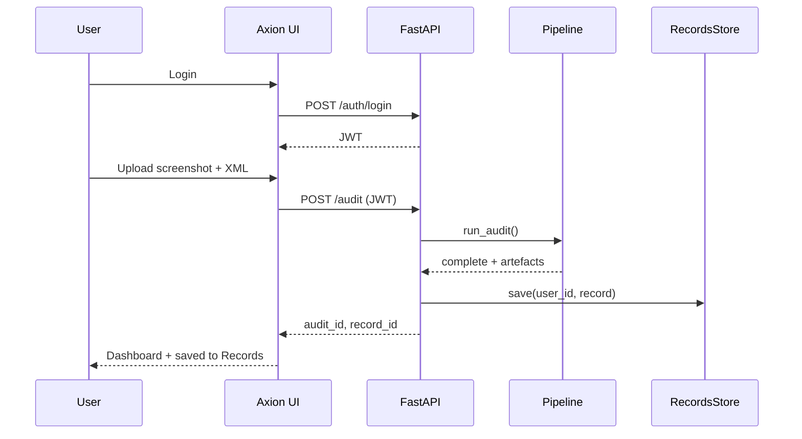
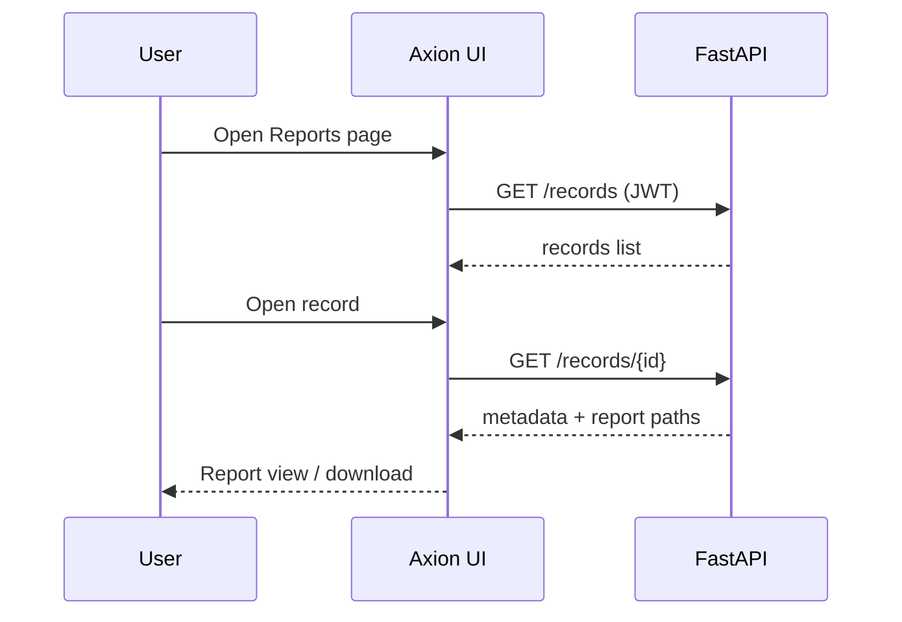

# Software Design Specification

## Agentic Accessibility Auditor (Axion)
### for Android Mobile Application UIs

| Field | Value |
|-------|-------|
| **Document version** | 2.0 |
| **Status** | Implementation reference |
| **Prepared by** | Muhammad Noor (Lead), Salar (Parser/Rules/Docker), Ayesha (Frontend/Schemas) |
| **Institution** | FAST-NUCES |
| **Related SRS** | `SRS_Agentic_Accessibility_Auditor_v2.0.md` (v2.0) |
| **Repository** | [MuhammadNoor7/agentic-accessibility-auditor](https://github.com/MuhammadNoor7/agentic-accessibility-auditor) |

---

## Document history

| Version | Date | Author | Changes |
|---------|------|--------|---------|
| 1.0 | 2026 | Team | Initial SDS from merged SRS v1.x |
| **2.0** | 2026 | Team | Aligned to SRS v2.0 with embedded Figma screenshots; auth, Records, Dashboard flows |

---

## Table of contents

1. [Introduction](#1-introduction)
2. [System architecture](#2-system-architecture)
3. [Module design](#3-module-design)
4. [Data design](#4-data-design)
5. [API design](#5-api-design)
6. [Rule engine design](#6-rule-engine-design)
7. [Agentic layer design](#7-agentic-layer-design)
8. [Report generator design](#8-report-generator-design)
9. [Frontend design (Axion)](#9-frontend-design-axion)
10. [Authentication and Records design](#10-authentication-and-records-design)
11. [Deployment design](#11-deployment-design)
12. [Security design](#12-security-design)
13. [Testing design](#13-testing-design)
14. [SRS traceability](#14-srs-traceability)
- [Appendix A: OpenAPI specification](#appendix-a-openapi-specification)
- [Appendix B: File and directory map](#appendix-b-file-and-directory-map)
- [Appendix C: Sequence diagrams](#appendix-c-sequence-diagrams)
- [Appendix D: UI component map (Figma)](#appendix-d-ui-component-map-figma)

---

## 1. Introduction

### 1.1 Purpose

This Software Design Specification (SDS) describes **how** the Agentic Accessibility Auditor is designed and implemented. It is the technical companion to **SRS v2.0**, which defines **what** the system must do.

This document provides:

- Architecture and module boundaries
- Class/function design and algorithms
- Normative JSON schema usage
- REST API contracts (OpenAPI)
- Frontend component structure (Axion)
- Auth and per-user Records storage design
- Deployment, security, and test design

### 1.2 Design scope

| In scope | Out of scope |
|----------|--------------|
| Parser, rule engine, agent, report generator | Business case / internship planning |
| FastAPI orchestrator + Axion React UI | Clinical accessibility research |
| Auth + Records persistence | Production HIPAA / enterprise SSO |
| Docker Compose topology | Play Store / APK crawling |
| R01–R10 rule pseudocode (R11+ summarized) | Full R21–R30 implementation detail |

### 1.3 Design principles

| ID | Principle | Rationale |
|----|-----------|-----------|
| D1 | Pipeline isolation via JSON artefacts | Interns integrate through agreed files/API |
| D2 | Deterministic rule engine | Same input → same `violations.json` |
| D3 | LLM explains only | Agent never creates violations |
| D4 | Schema-first contracts | `auditor_schema.json` validated in CI |
| D5 | Hybrid parser, single traversal | UIAutomator + MASC + Rico in one pass |
| D6 | Fail gracefully | Bad XML, LLM timeout → structured errors |
| D7 | User-scoped Records | Each audit linked to authenticated `user_id` |

### 1.4 Implementation status

| Module | Path | Owner | Status |
|--------|------|-------|--------|
| Hybrid XML parser | `src/parser.py` | Salar | **Done** |
| Schema helpers | `src/schema_documents.py` | Salar | **Done** |
| JSON Schema | `docs/schemas/auditor_schema.json` | Ayesha | **Done** |
| Validation script | `scripts/validate_output.py` | Salar | **Done** |
| FastAPI shell | `backend/main.py` | Salar | **Partial** |
| Rule engine | `src/rules.py` | Salar | Planned |
| Agent layer | `src/agent.py` | Noor | Planned |
| Report generator | `src/report.py` | Noor | Planned |
| Auth service | `backend/services/auth.py` | Salar | Planned |
| Records store | `backend/services/records.py` | Salar / Ayesha | Planned |
| Axion React UI | `frontend/` | Ayesha | Planned |
| Docker Compose | `docker-compose.yml` | Salar | **Partial** |

---

## 2. System architecture

### 2.1 Logical architecture

```
┌──────────────────────────────────────────────────────────────────────────┐
│                    Axion React Dashboard (frontend/)                      │
│  Auth │ Upload │ Dashboard │ Report │ Records │ Generate Report Modal    │
└───────────────────────────────┬──────────────────────────────────────────┘
                                │ HTTPS + JWT
┌───────────────────────────────▼──────────────────────────────────────────┐
│                   FastAPI Orchestrator (backend/)                           │
│  /auth/* │ /audit/* │ /records/* │ PipelineService │ RecordsService        │
└───┬─────────┬──────────┬──────────┬──────────┬─────────────────────────────┘
    │         │          │          │          │
    ▼         ▼          ▼          ▼          ▼
 Parser   RuleEngine   Agent    ReportGen   RecordsStore
 src/     src/rules    src/     src/report  outputs/records/
          agent
    │         │          │          │
    ▼         ▼          ▼          ▼
components  violations  report.json  audit_record.json
  .json       .json                  + HTML/PDF paths
```

### 2.2 Pipeline data flow

```
Screenshot + UIAutomator XML
  → Parser          → components.json
  → Rule Engine     → violations.json
  → Agent           → report.json
  → Report Generator → audit_report.html / .pdf
  → Records Service  → outputs/records/{user_id}/{record_id}/
  → Axion UI         → Dashboard + Records list
```

### 2.3 Physical deployment (Docker Compose)

| Service | Image | Port | Role |
|---------|-------|------|------|
| `frontend` | `./frontend/Dockerfile` | 5173 | Axion React (Vite) |
| `backend` | `./backend/Dockerfile` | 8000 | FastAPI + pipeline |
| `auditor` | `./Dockerfile` | — | Batch parser worker |

Network: `auditor-network` (bridge). Repo root mounted at `/app`.

### 2.4 Per-audit run directory

```
outputs/runs/{audit_id}/
├── input/
│   ├── screenshot.png
│   └── window.xml
├── components.json
├── violations.json
├── report.json
├── audit_report.html
└── audit_report.pdf
```

### 2.5 Per-user Records directory

```
outputs/records/{user_id}/
├── index.json                 # list of record summaries
└── {record_id}/
    ├── metadata.json          # screen_id, score, dates, paths
    ├── report.json
    ├── audit_report.html
    └── audit_report.pdf
```

---

## 3. Module design

### 3.1 Parser module (`src/parser.py`)

**SRS:** FR-PS.1–FR-PS.9 | **Owner:** Salar | **Status:** Implemented

#### 3.1.1 Responsibilities

- Sanitize XML (strip `\x00`)
- Traverse hierarchy; emit flat `components[]`
- Infer `screen_id`, `image_path`, `xml_path`
- Write schema-compliant `components.json`

#### 3.1.2 Public API

| Function | Input | Output |
|----------|-------|--------|
| `load_xml_root(path)` | Path | lxml root |
| `parse_xml_tree(root)` | Element | `list[dict]` |
| `build_screen_document(...)` | paths + components | JSON dict |
| `parse_xml_file(xml_path, ...)` | Path | output Path |
| `parse_dataset_folder(...)` | dataset root | batch stats |

#### 3.1.3 Bounds parsing algorithm

```
parse_bounds(raw):
  if matches "[l,t][r,b]" → return [l,t,r,b]      # UIAutomator
  if matches "l t r b"    → return [l,t,r,b]      # Rico
  return None

extract_bounds(element):
  b = parse_bounds(element.@bounds)
  if b: return b
  b = parse_masc_wrapper_bounds(element)
  if b: return b
  if is_uiautomator_node(element):
    return [0,0,0,0]                               # TC-01
  return None
```

#### 3.1.4 Screenshot pairing

Mirror XML path under `screenshots/` with same stem; try `.jpg`, `.jpeg`, `.png`.

---

### 3.2 Rule engine module (`src/rules.py` — planned)

**SRS:** FR-RU.1–FR-RU.18 | **Owner:** Salar

#### 3.2.1 Class design

```python
@dataclass
class RuleContext:
    components: list[dict]
    screen_density: float = 2.0
    image_path: str | None = None

class Rule(Protocol):
    rule_id: str
    def evaluate(self, ctx: RuleContext) -> list[ViolationDict]: ...

class RuleEngine:
    def __init__(self, rules: list[Rule]): ...
    def run(self, components_doc: dict) -> dict: ...
```

#### 3.2.2 Processing flow

1. Build `RuleContext` from `components.json`
2. Run enabled rules (R01–R10 MVP)
3. Denormalize `class`, `bounds` on each violation
4. Sort by `(rule_id, component_id)`
5. Write `violations.json`; assert `total_violations == len(violations)`

#### 3.2.3 dp conversion

```
width_dp  = (bounds[2] - bounds[0]) / density
height_dp = (bounds[3] - bounds[1]) / density
```

Default `density = 2.0` when ADB metadata absent.

#### 3.2.4 Severity mapping (engine → UI)

| Engine | Axion badge |
|--------|-------------|
| Critical | Critical |
| High | Serious |
| Medium | Moderate |
| Low | Minor |

---

### 3.3 Agent module (`src/agent.py` — planned)

**SRS:** FR-AG.1–FR-AG.8 | **Owner:** Noor

```python
class AgenticEnricher:
    def enrich(
        self,
        violations_doc: dict,
        components_doc: dict,
    ) -> dict: ...
```

- One LLM call per violation (MVP)
- JSON response: `agent_explanation`, `agent_why_it_matters`, `agent_developer_fix`
- Fallback template on timeout

---

### 3.4 Report module (`src/report.py` — planned)

**SRS:** FR-RP.1–FR-RP.7 | **Owner:** Noor

- Jinja2 HTML template
- PIL bounding-box annotation
- WeasyPrint or pdfkit for PDF
- Accessibility score (see §8.2)

---

### 3.5 API orchestrator (`backend/`)

**Owner:** Salar + Noor

```
backend/
├── main.py                 # FastAPI app, CORS, routers
├── config.py               # env settings
├── routers/
│   ├── auth.py
│   ├── audit.py
│   └── records.py
├── services/
│   ├── pipeline.py         # stage orchestration
│   ├── auth.py             # JWT, OTP
│   └── records.py          # user-scoped persistence
├── models/
│   ├── auth.py             # Pydantic models
│   ├── audit.py
│   └── records.py
└── dependencies.py         # get_current_user
```

#### 3.5.1 Pipeline service

```python
async def run_audit(audit_id: str, user_id: str) -> None:
    set_status(audit_id, "parsing")
    components = parse_xml_file(...)
    set_status(audit_id, "checking")
    violations = rule_engine.run(components)
    set_status(audit_id, "explaining")
    report = agent.enrich(violations, components)
    set_status(audit_id, "reporting")
    paths = report_gen.render(report, run_dir)
    set_status(audit_id, "complete")
    records_service.save(user_id, audit_id, report, paths)
```

Statuses: `pending` → `parsing` → `checking` → `explaining` → `reporting` → `complete` | `error`

---

## 4. Data design

Normative schema: `docs/schemas/auditor_schema.json`

### 4.1 Entity relationship

```
User (user_id)
  └── has many AuditRecord (record_id)
        ├── has one Screen (screen_id, image_path, xml_path)
        ├── has many Violations
        └── has report artefacts (json, html, pdf)
```

### 4.2 components.json

| Field | Type | Required |
|-------|------|----------|
| `schema_version` | string `"1.0"` | Recommended |
| `screen_id` | string | Yes |
| `image_path` | string | Yes |
| `xml_path` | string | Yes |
| `components` | array | Yes |

**Component:** `component_id`, `class`, `text`, `content_desc`, `resource_id`, `clickable`, `enabled`, `focusable`, `bounds[4]`

Pattern: `component_id` matches `^c_\d{3,}$`

### 4.3 violations.json

**Screen level:** `schema_version`, `screen_id`, `image_path`, `xml_path`, `total_violations`, `violations[]`

**Violation:** `rule_id`, `issue`, `component_id`, `class`, `bounds`, `guideline`, `severity`, `recommendation`, optional `related_component`

**Invariant:** `total_violations == len(violations)`

### 4.4 report.json

Adds `summary` object and agent fields per violation:

- `agent_explanation`
- `agent_why_it_matters`
- `agent_developer_fix`

### 4.5 records metadata (`metadata.json`)

| Field | Type | Description |
|-------|------|-------------|
| `record_id` | string | UUID |
| `user_id` | string | Owner |
| `audit_id` | string | Pipeline run ID |
| `screen_id` | string | e.g. `screen_014` |
| `score` | int | 0–100 |
| `total_issues` | int | Violation count |
| `severity_summary` | object | `{critical, high, medium, low}` |
| `created_at` | ISO datetime | Audit timestamp |
| `report_html_path` | string | Relative path |
| `report_pdf_path` | string | Relative path |

### 4.6 index.json (per user)

```json
{
  "user_id": "u_001",
  "records": [
    {
      "record_id": "rec_abc123",
      "screen_id": "screen_014",
      "score": 78,
      "total_issues": 7,
      "created_at": "2026-07-01T12:00:00Z"
    }
  ]
}
```

### 4.7 Validation

```bash
python scripts/validate_output.py path/to/artifact.json
```

Run after each pipeline stage.

---

## 5. API design

Base URL: `http://localhost:8000`  
Prefix: `/api/v1`  
Auth: `Authorization: Bearer <JWT>` (except auth endpoints)

### 5.1 Auth endpoints

| Method | Path | Description |
|--------|------|-------------|
| POST | `/auth/signup` | Email + password (≥ 8 chars) |
| POST | `/auth/login` | Returns JWT |
| POST | `/auth/google` | Google OAuth token exchange |
| POST | `/auth/forgot-password` | Send 6-digit OTP |
| POST | `/auth/verify-otp` | Validate OTP |
| POST | `/auth/reset-password` | Set new password |

### 5.2 Audit endpoints

| Method | Path | Description |
|--------|------|-------------|
| POST | `/audit` | Upload screenshot + XML; start pipeline |
| GET | `/audit/{audit_id}/status` | Pipeline status |
| GET | `/audit/{audit_id}/violations` | Violations JSON |
| GET | `/audit/{audit_id}/report` | Report JSON |
| GET | `/audit/{audit_id}/report/download?format=html\|pdf` | File download |
| POST | `/audit/batch` | Batch over dataset path (Should) |

### 5.3 Records endpoints

| Method | Path | Description |
|--------|------|-------------|
| GET | `/records` | List current user's audits |
| GET | `/records/{record_id}` | Record detail + artefact paths |
| GET | `/records/{record_id}/download?format=html\|pdf` | Re-download report |
| DELETE | `/records/{record_id}` | Delete record (Stretch) |

### 5.4 Example: POST /audit

**Request:** `multipart/form-data` — `screenshot`, `xml`

**Response 201:**

```json
{
  "audit_id": "a1b2c3d4",
  "record_id": "rec_xyz789",
  "status": "pending",
  "screen_id": "screen_014"
}
```

### 5.5 Example: GET /audit/{id}/status

```json
{
  "audit_id": "a1b2c3d4",
  "status": "checking",
  "stage_progress": {
    "parsing": "complete",
    "checking": "in_progress",
    "explaining": "pending",
    "reporting": "pending"
  },
  "error": null
}
```

### 5.6 Example: GET /records

```json
{
  "user_id": "u_001",
  "records": [
    {
      "record_id": "rec_xyz789",
      "screen_id": "screen_014",
      "score": 78,
      "total_issues": 7,
      "severity_summary": {"critical": 4, "high": 3, "medium": 0, "low": 0},
      "created_at": "2026-07-01T12:00:00Z"
    }
  ]
}
```

---

## 6. Rule engine design

Pseudocode for **MVP rules R01–R10**. Full catalogue: SRS §7.2.

### 6.1 Shared helpers

```python
def is_empty(s: str) -> bool:
    return not s or not s.strip()

def is_clickable(c: dict) -> bool:
    return c["clickable"] is True
```

### 6.2 R01 — Missing accessible label

```
for c in components:
  if c.clickable and is_empty(c.text) and is_empty(c.content_desc):
    emit(R01, c, severity=High, guideline=G01)
```

### 6.3 R02 — Image button without description

```
for c in components:
  if is_image_class(c.class) and c.clickable and is_empty(c.content_desc):
    emit(R02, c, severity=High, guideline=G02)
```

### 6.4 R03 — Duplicate labels

Group clickable components by `(text or content_desc)`; flag groups with ≥ 2 distinct component IDs.

### 6.5 R04 — Small touch target

```
if width_dp < 48 or height_dp < 48:
  emit(R04, c, severity=High, guideline=G04)
```

### 6.6 R05 — Unlabeled input

```
if "EditText" in c.class and all empty(text, content_desc, hint):
  emit(R05, c, severity=High, guideline=G05)
```

### 6.7 R06 — Disabled important control

`clickable and not enabled` without nearby explanation TextView.

### 6.8 R07 — Zero-size element

`width <= 0 or height <= 0 or invalid rect`

### 6.9 R08 — Layout overlap

Pairwise overlap ratio > 0.5 over smaller element area.

### 6.10 R09 — Low contrast (Stretch)

Screenshot crop + WCAG contrast ratio; requires `src/contrast.py`.

### 6.11 R10 — Text overflow

Heuristic: TextView height < estimated text height (MVP: height < 24px with non-empty text).

---

## 7. Agentic layer design

### 7.1 LLM configuration

| Setting | Default | Env var |
|---------|---------|---------|
| Model | `gpt-4o-mini` | `OPENAI_MODEL` |
| Timeout | 30s | `OPENAI_TIMEOUT` |
| Temperature | 0.2 | — |
| Retries | 2 | — |

### 7.2 Prompt template (per violation)

```
System: Explain accessibility violations only. Never invent new violations.

User:
  rule_id: {rule_id}
  issue: {issue}
  component: {class, bounds, resource_id}
  guideline: {guideline}
  recommendation: {recommendation}

Return JSON: {agent_explanation, agent_why_it_matters, agent_developer_fix}
```

### 7.3 Fallback on failure

Use `issue` + `recommendation` as template fields; log API error.

---

## 8. Report generator design

### 8.1 HTML sections

1. Cover — screen ID, date, score, total issues
2. Summary — severity counts
3. Annotated screenshot — PIL boxes colour-coded by severity
4. Violation details — grouped Critical → High → Medium → Low
5. Footer — schema version, WCAG 2.2 AA

### 8.2 Accessibility score formula

```
score = 100
score -= critical * 20 + high * 10 + medium * 5 + low * 2
score = clamp(score, 0, 100)
```

Maps to Axion score gauge on Dashboard (SRS FR-UI.21).

### 8.3 PDF generation

Primary: WeasyPrint from HTML. Fallback: pdfkit + wkhtmltopdf.

---

## 9. Frontend design (Axion)

**Owner:** Ayesha | **SRS:** FR-UI.*, Appendix F

### 9.1 Technology stack

| Layer | Choice |
|-------|--------|
| Framework | React 18 + Vite |
| Styling | Tailwind CSS |
| Routing | React Router v6 |
| HTTP | axios + JWT interceptor |
| State | React Context (MVP) |

### 9.2 Directory structure

```
frontend/src/
├── api/
│   ├── authClient.ts
│   ├── auditClient.ts
│   └── recordsClient.ts
├── components/
│   ├── layout/          # Sidebar, Header, FloatingActionBar
│   ├── auth/            # SignUp, Login, ForgotPassword, OTP, Reset
│   ├── upload/          # UploadZone, ValidationPanel, FilesMatchedModal
│   ├── dashboard/       # ScoreCards, PriorityChart, ViolationsTable
│   ├── report/          # IssueCard, DownloadModal
│   └── records/         # RecordsTable, EmptyState
├── pages/
│   ├── UploadPage.tsx
│   ├── DashboardPage.tsx
│   ├── ReportPage.tsx
│   └── RecordsPage.tsx
└── theme/tokens.ts      # #0b1929, #1bc99a
```

### 9.3 Key UI flows

| Flow | Route | Components |
|------|-------|--------------|
| Auth | `/login`, `/signup` | Auth forms per Figma |
| Upload | `/upload` | Sequential upload → Files Matched → Start Audit |
| Audit progress | modal overlay | Audit Complete step checklist |
| Dashboard | `/dashboard/:auditId` | Score cards, table, Issue Detail drawer |
| Report | `/report/:auditId` | Guideline breakdown, Generate Report |
| Records | `/records` | User audit history, search, re-download |

### 9.4 TypeScript interfaces

Mirror JSON schema types: `Component`, `Violation`, `ReportSummary`, `AuditRecord`.

### 9.6 Figma reference screenshots

Visual source of truth: SRS Appendix F. Screenshots live in `docs/assets/figma/` (same paths as SRS).

| Screen group | Asset file | React route(s) |
|--------------|------------|----------------|
| Sign Up + Log In | `figma-01-signup-login.png` | `/signup`, `/login` |
| Forgot + OTP | `figma-02-forgot-verify-otp.png` | `/forgot-password`, `/verify-otp` |
| Reset + Success | `figma-03-reset-password-success.png` | `/reset-password`, `/reset-success` |
| Upload states | `figma-04-upload-progress-states.png` | `/upload` |
| Files Matched | `figma-08-upload-files-matched.png` | modal on `/upload` |
| Audit Complete + Dashboard | `figma-05-audit-complete-dashboard.png` | modal; `/dashboard/:id` |
| Detail drawer + Report | `figma-06-dashboard-detail-report.png` | drawer; `/report/:id` |
| Generate modal + PDF | `figma-07-generate-report-modal-pdf.png` | modal; PDF template |
| Records | *(no screenshot — match Dashboard styling)* | `/records` |


---

## 10. Authentication and Records design

**SRS:** FR-AUTH.*, FR-REC.*, FR-UI.40–45

### 10.1 Auth model (prototype)

| Component | Design |
|-----------|--------|
| Password storage | bcrypt hash in `data/users.json` or SQLite |
| Session | JWT (HS256), 24h expiry |
| OTP | 6-digit code, 5 min TTL, stored in memory or Redis (prototype: JSON file) |
| Google OAuth | Verify ID token server-side; create/link user |

### 10.2 Records lifecycle

1. User completes audit pipeline
2. `RecordsService.save(user_id, audit_artifacts)` copies HTML/PDF + metadata
3. Append summary to `outputs/records/{user_id}/index.json`
4. Records page reads index; detail view loads `metadata.json` + report

### 10.3 Access control

- All `/records/*` queries filter by JWT `user_id`
- No cross-user record access
- File paths validated to stay under `outputs/records/{user_id}/`

---

## 11. Deployment design

### 11.1 docker-compose.yml (target)

```yaml
services:
  frontend:
    build: ./frontend
    ports: ["5173:5173"]
    environment:
      VITE_API_BASE: http://backend:8000
    depends_on: [backend]

  backend:
    build: ./backend
    ports: ["8000:8000"]
    env_file: .env
    volumes: [".:/app"]
    working_dir: /app/backend

  auditor:
    build: .
    command: python /app/test_run.py
    environment:
      DATASET_ROOT: /app/data/data-masc
```

### 11.2 Environment variables

| Variable | Service | Purpose |
|----------|---------|---------|
| `OPENAI_API_KEY` | backend | LLM |
| `JWT_SECRET` | backend | Token signing |
| `CORS_ORIGINS` | backend | `http://localhost:5173` |
| `DATASET_ROOT` | auditor | Batch parse path |

### 11.3 Startup

```bash
docker-compose up --build
# Frontend: http://localhost:5173
# API docs:  http://localhost:8000/docs
# Health:    http://localhost:8000/health
```

---

## 12. Security design

| Threat | Mitigation |
|--------|------------|
| API key exposure | LLM calls server-side only |
| JWT theft | httpOnly cookie option (Stretch); HTTPS in prod |
| XXE | Safe XML parsing; no external entities |
| Upload abuse | 20 MB limit, MIME validation |
| Path traversal | Sanitize paths in Records service |
| Cross-user access | JWT `user_id` scoping on all records |
| OTP brute force | Rate limit + expiry countdown (Figma: 04:50) |

---

## 13. Testing design

| Layer | Tool | Scope |
|-------|------|-------|
| Unit | pytest | Parser bounds, R01–R05 |
| Schema | `validate_output.py` | All JSON artefacts |
| API | pytest + TestClient | Auth, audit, records |
| Integration | pytest | Full pipeline golden files |
| E2E | Manual / Playwright | Axion upload → Records |
| Evaluation | Scripts | MASC val, Rico holdout |

### 13.1 Golden files

```
tests/fixtures/rules/
├── r01_missing_label.xml
├── r04_small_target.xml
└── expected/
    └── r01_violations.json
```

### 13.2 Sign-off tests (from SRS §10)

- TC-01: missing bounds → no crash
- R01–R05 on 10–15 controlled cases
- Zero hallucinated violations from agent
- Records saved per user after audit
- Docker `/health` responds

---

## 14. SRS traceability

| SRS requirement | SDS section | Implementation |
|-----------------|-------------|----------------|
| FR-PS.1–9 | §3.1, §4 | `src/parser.py` |
| FR-RU.1–10 | §3.2, §6 | `src/rules.py` |
| FR-AG.1–8 | §7 | `src/agent.py` |
| FR-RP.1–7 | §8 | `src/report.py` |
| FR-UI.* | §9, Appendix D | `frontend/` |
| FR-AUTH.* | §10.1, §5.1 | `backend/routers/auth.py` |
| FR-REC.* | §10.2, §5.3 | `backend/services/records.py` |
| FR-DK.* | §11 | `docker-compose.yml` |
| NFR-1–20 | §2, §7, §11, §12 | Cross-cutting |
| §8 JSON schemas | §4 | `auditor_schema.json` |
| §9 REST API | §5, Appendix A | `backend/routers/` |

---

## Appendix A: OpenAPI specification

```yaml
openapi: 3.0.3
info:
  title: Agentic Accessibility Auditor API
  version: 2.0.0
servers:
  - url: http://localhost:8000/api/v1

paths:
  /auth/login:
    post:
      summary: Login and receive JWT
      requestBody:
        required: true
        content:
          application/json:
            schema:
              type: object
              required: [email, password]
              properties:
                email: { type: string, format: email }
                password: { type: string, minLength: 8 }
      responses:
        "200":
          description: JWT token

  /audit:
    post:
      summary: Upload screenshot + XML and start audit
      security: [{ bearerAuth: [] }]
      requestBody:
        content:
          multipart/form-data:
            schema:
              type: object
              required: [screenshot, xml]
              properties:
                screenshot: { type: string, format: binary }
                xml: { type: string, format: binary }
      responses:
        "201": { description: Audit created }

  /audit/{audit_id}/status:
    get:
      summary: Get pipeline status
      security: [{ bearerAuth: [] }]
      parameters:
        - name: audit_id
          in: path
          required: true
          schema: { type: string }
      responses:
        "200": { description: Status object }

  /records:
    get:
      summary: List user's saved audits
      security: [{ bearerAuth: [] }]
      responses:
        "200": { description: Records list }

  /records/{record_id}:
    get:
      summary: Get record detail
      security: [{ bearerAuth: [] }]
      parameters:
        - name: record_id
          in: path
          required: true
          schema: { type: string }
      responses:
        "200": { description: Record detail }

components:
  securitySchemes:
    bearerAuth:
      type: http
      scheme: bearer
      bearerFormat: JWT
```

---

## Appendix B: File and directory map

| Path | Role |
|------|------|
| `src/parser.py` | Hybrid XML parser (**Done**) |
| `src/schema_documents.py` | JSON envelope builders |
| `src/rules.py` | Rule engine (planned) |
| `src/agent.py` | LLM enricher (planned) |
| `src/report.py` | HTML/PDF generator (planned) |
| `backend/main.py` | FastAPI entry |
| `backend/routers/` | REST routes (planned) |
| `frontend/src/` | Axion React app (planned) |
| `docs/schemas/auditor_schema.json` | Normative JSON Schema |
| `docs/json_schemas.md` | Schema documentation |
| `outputs/runs/` | Ephemeral audit runs |
| `outputs/records/` | Per-user saved audits |
| `data/data-masc/` | Primary dataset |
| `data/data-rico-holdout/` | Unseen evaluation |

---

## Appendix C: Sequence diagrams

### C.1 Authenticated audit with Records save



### C.2 View past audit from Records



---

## Appendix D: UI component map (Figma)

Maps Figma frames to React components (SRS Appendix F). Screenshot assets in `docs/assets/figma/`.

| Figma frame | Screenshot | Route / trigger | React component(s) |
|-------------|------------|-----------------|-------------------|
| Sign Up | `figma-01-signup-login.png` | `/signup` | `SignUpPage` |
| Log In | `figma-01-signup-login.png` | `/login` | `LoginPage` |
| Forgot Password | `figma-02-forgot-verify-otp.png` | `/forgot-password` | `ForgotPasswordPage` |
| Verify Code | `figma-02-forgot-verify-otp.png` | `/verify-otp` | `OtpVerificationPage` |
| Set Password | `figma-03-reset-password-success.png` | `/reset-password` | `ResetPasswordPage` |
| Password Reset Success | `figma-03-reset-password-success.png` | `/reset-success` | `ResetSuccessPage` |
| Upload (progress) | `figma-04-upload-progress-states.png` | `/upload` | `UploadPage`, `UploadZone` |
| Files Matched Modal | `figma-08-upload-files-matched.png` | after validation | `FilesMatchedModal` |
| Audit Complete Modal | `figma-05-audit-complete-dashboard.png` | after pipeline | `AuditCompleteModal` |
| Dashboard | `figma-05-audit-complete-dashboard.png` | `/dashboard/:id` | `DashboardPage`, `ViolationsTable`, `ScoreGauge` |
| Issue Detail Drawer | `figma-06-dashboard-detail-report.png` | View action | `IssueDetailDrawer` |
| Audit Report | `figma-06-dashboard-detail-report.png` | `/report/:id` | `ReportPage` |
| Generate Report Modal | `figma-07-generate-report-modal-pdf.png` | footer CTA | `DownloadModal` |
| PDF layout | `figma-07-generate-report-modal-pdf.png` | export | `report.py` HTML template |
| Records / Reports | — | `/records` | `RecordsPage`, `RecordsTable` |

Design tokens: background `#0b1929`, primary `#1bc99a`, sidebar nav **Upload | Dashboard | Reports**.

---

**— End of Software Design Specification v2.0 —**
