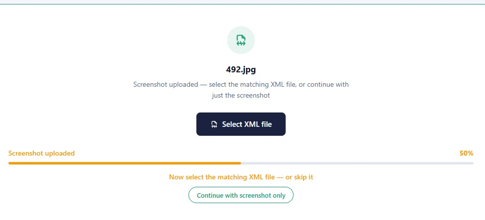
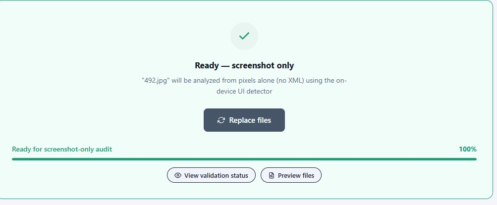
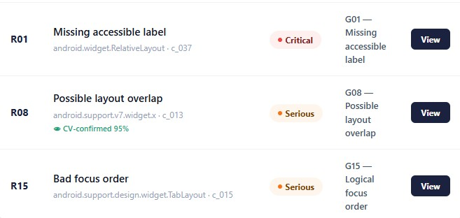
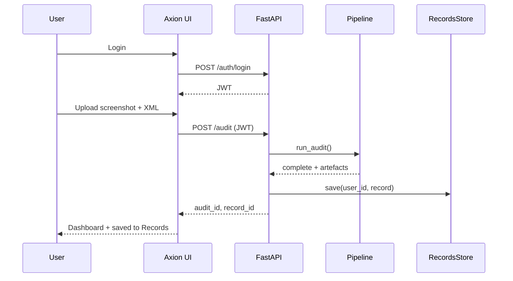
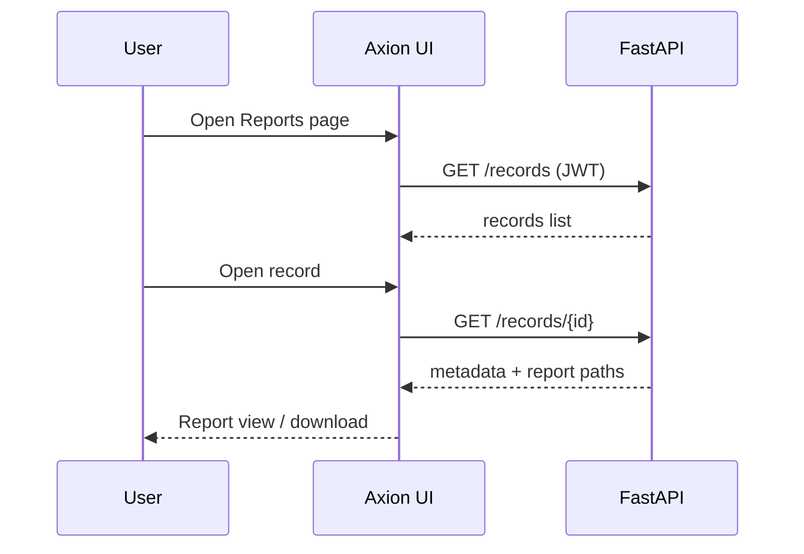

# Software Design Specification

## Agentic Accessibility Auditor (Axion)
### for Android Mobile Application UIs

| Field | Value |
|-------|-------|
| **Document version** | 2.16 |
| **Status** | Implementation reference |
| **Prepared by** | Muhammad Noor (Lead — primary author); Salar + Ayesha (SRS inputs, parser/UI design) |
| **Institution** | FAST-NUCES |
| **Related SRS** | `SRS_Agentic_Accessibility_Auditor_v2.12.md` (v2.12) |
| **Repository** | [MuhammadNoor7/agentic-accessibility-auditor](https://github.com/MuhammadNoor7/agentic-accessibility-auditor) |

---

## Document history

| Version | Date | Author | Changes |
|---------|------|--------|---------|
| 1.0 | 2026 | Team | Initial SDS from merged SRS v1.x |
| **2.0** | 2026 | Team | Aligned to SRS v2.0 with embedded Figma screenshots; auth, Records, Dashboard flows |
| **2.1** | 2026-07-06 | Noor / Salar | Parser R13–R20 fields; rules R01–R20; MASC re-parse sign-off; audit API violations-only |
| **2.2** | 2026-07-09 | Noor / Salar | Rules R01–R30; explainer + agent API wiring; `GET …/report`; visibility filter |
| **2.3** | 2026-07-12 | Noor | Week 5: `src/report.py` HTML/PDF + download API; R09–R20 fixtures; team ownership alignment |
| **2.4** | 2026-07-13 | Noor | Rules ownership → Salar + Noor + Ayesha (reviewed by all) |
| **2.5** | 2026-07-13 | Noor | Figma screenshots restored from formatted DOCX into `docs/assets/figma/`; DOCX export embeds images |
| **2.6** | 2026-07-14 | Noor | `POST /audit` requires `screenshot` + `xml`; server-side pair validation; tests updated |
| **2.7** | 2026-07-15 | Noor | Week 6: JWT auth + records routers synced from Salar; Records UI live; eval sheet (40 stratified-random); validation logs; `.gitignore` from Salar |
| **2.8** | 2026-07-16 | Noor | OTP/SMTP/Google OAuth design implemented; env credentials documented; report export persistence + autoescape; eval 40/40; auth suite 22 tests |
| **2.9** | 2026-07-16 | Noor | API mount accuracy (`/auth`, `/records`, `/api/v1/audit`); records store `records.db.json`; docker = backend+auditor; 146 tests; drop planned/stretch leftovers |
| **2.10** | 2026-07-20 | Noor | Week 7 QA scripts (`run_week7_eval_analysis.py`, `noor_week7_validate.py`); tracked outputs `outputs/week7_eval/`; Rico holdout script ready (`run_rico_holdout_eval.py`) — batch deferred |
| **2.11** | 2026-07-27 | Noor | §3.6 added: YOLO UI-element detector module design (training config, dataset split, class taxonomy, results, `src/yolo_ui_detector.py`); Appendix B file map + §14 traceability updated; SRS FR-CV.4–7 cross-reference; Progress Report v1.23 comprehensive embedded visuals + outputs sync (§15D–15F) |
| **2.12–2.13** | 2026-07-29 | Noor | §3.2 Rule engine + §6 Rule engine design updated with three false-positive fixes and one parser fix, verified against real data: `check_zero_size` (R07) gains `_is_a11y_relevant` gate; `check_layout_overlap` (R08) gains `_is_ancestor` helper skipping clickable ancestor/descendant pairs — root-caused on a real Rico screen where a clickable `ListView` was flagged against all 8 of its own clickable rows; `check_icon_only_no_label` (R30) gains `_dedupe_repeated`; §3.1 Parser `_get_hint` gains a `text-hint` attribute alias, unblocking R20 (0 → 749 hits) and fixing an R05 false-positive pattern (2,117 → 717). Full pytest 130/130; full MASC + Rico holdout re-verification, 0 failures. **§3.7 added:** complete crop-violation classifier module design — backbone selection rationale (MobileNetV3-Small vs. Large/EfficientNet-B0/ResNet-50/ViT), data/training design, 20-epoch results (best val macro-F1 0.265 at epoch 17, documented overfitting pattern confirmed), test classification report, `classify_crop()` inference module design — mirroring §3.6's YOLO treatment. §3.6.4 and §1.4 corrected: `src/yolo_ui_detector.py` does **not** exist (previously misreported as scaffolded). Progress Report v1.24–1.25 sync. |
| **2.14** | 2026-07-30 | Noor | §3.6 YOLO detector fully updated: teammate Salar completed the full 60-epoch training run and Rico holdout zero-shot-vs-fine-tuned eval on the `salar` branch (mAP50-95 0.322 final; Rico mAP50 0.0258 → 0.2546); his checkpoint (`models/yolo_ui_detector_best.pt`, 51.2 MB) and `src/yolo_ui_detector.py` merged into `noor`, **correcting the 29 Jul "does not exist" claim** — module now exists and works, still deliberately not pipeline-wired (Stretch requirement). §3.7 crop classifier: added §3.7.4 Rico holdout eval (9,343 crops, weighted F1 0.43 vs. 0.63 MASC test). Appendix B (FR-CV.4–7) and §2.1 artifact table updated to match. Progress Report v1.26 / SRS v2.10 sync. Filename bumped from v2.12 to v2.14 to match content version (previous filename had drifted behind the 2.12–2.13 combined content update). |
| **2.15** | 2026-08-05 | Noor | **§3.7 backbone changed:** a 33-model comparison sweep (all ImageNet-1k pretrained, evaluated on MASC test + full Rico holdout — `docs/crop_classifier_comparison_findings.md`) found the original `mobilenet_v3_small` pick mid-pack (Rico macro-F1 0.18); replaced with **`swin_tiny_patch4_window7_224`**, the sweep's best result (Rico macro-F1 0.22, best val macro-F1 0.274 at epoch 8) — §3.7.2 backbone-selection table, §3.7.3 training design, and §3.7.4 results fully rewritten with real Swin numbers. **Both §3.6 (YOLO) and §3.7 (crop classifier) now wired into the backend pipeline** (`backend/routers/audit.py`): `confirm_violations()` runs after `check_rules()` attaching `cv_confidence` to R08/R17/R04; `xml` is optional on `POST /api/v1/audit` with `_run_pipeline` falling back to `detect_ui()` → new `detections_to_components()` converter on missing/malformed/empty-hierarchy XML. §3.6.4/§3.7.5 "not yet done" wiring notes removed accordingly. **§2.3 / §11.1 Docker:** `frontend` service added to Compose (own `Dockerfile`, port 5173) — the "not packaged, no frontend/Dockerfile yet" note no longer applies; two real Docker bugs found and fixed by actually building/running the containers — `backend/requirements.txt` synced with torch/torchvision/timm/ultralytics (was missing, caused a startup crash), and `backend/Dockerfile` now installs `libgl1`/`libglib2.0-0`/`libsm6`/`libxext6`/`libxrender1` (a second crash, `ImportError: libxcb.so.1`, surfaced only after fix 1 — `ultralytics` pulls in full `opencv-python`, not headless); backend now loads `.env` via `env_file` instead of a hardcoded dev `JWT_SECRET`. Both fixes' image rebuilds succeeded; live `/health` re-verification pending (Docker Desktop instability interrupted the check). SRS v2.11 sync. |
| **2.16** | 2026-08-08 | Noor | `src/` docstring coverage 57% → 100% (no design changes, all public functions/classes documented). **§3.6.4/§3.7.5 GPU wiring:** both inference modules now select CUDA when available instead of defaulting silently to CPU — `crop_violation_classifier.py` gained a module-level `DEVICE` moving both the loaded model and every inference tensor onto it (previously had zero device handling); `yolo_ui_detector.py` now passes `device=DEVICE` explicitly to `model.predict()`. Verified on the lab GPU deployment PC: `torch.cuda.is_available()` → `True` inside the container, `nvidia-smi` utilization confirmed during a live audit. **§9.6 Figma reference screenshots:** three new implementation screenshots added (`figma-09/10/11`) documenting the screenshot-only flow and CV-confidence badge — see below. **§10.2 Records lifecycle — real gap found and fixed:** step 2 ("Frontend calls `POST /records` after every audit") was design intent documented since SDS v2.0 but **never actually implemented** — no code anywhere in the frontend called it; audits completed and reported correctly but silently never appeared in Audit History. The 5 pre-existing rows in `records.db.json` all clustered within one ~2-hour window (15–16 Jul), consistent with manual `/docs` Swagger testing at the time, not real usage. Now wired into `Dashboard.jsx`, guarded against duplicate records on SPA re-navigation to the same audit (a component-local `useRef` guard was tried first and found not to survive React Router unmounting/remounting `Dashboard` — moved to the module-level `state/auditFiles.js` store instead, which does survive route changes). **§11.1 Docker, rewritten to match the actual current `docker-compose.yml`:** `backend`'s build `context` changed from `./backend` to `.` (repo root) — the previous context never actually included `src/`/`models/` despite the code importing them, working only via the dev bind-mount; the image is now self-contained. GPU reservation block added. External port changed to `8001:8000` (container stays on 8000 internally) for the lab GPU PC, which had port 8000 already taken by other lab members' work — `VITE_API_BASE` must match whichever external port is live. New `docker-compose.deploy.yml` for pulling pre-built images from a registry instead of building from source. The "live `/health` re-verification pending" note from v2.15 is resolved — live containers, GPU access, and full audits (including the frontend screenshot-only flow) have since been verified working end-to-end on the lab PC. SRS v2.12 sync. |

---

## Table of contents

1. [Introduction](#1-introduction)
2. [System architecture](#2-system-architecture)
3. [Module design](#3-module-design)
4. [Data design](#4-data-design)
5. [API design](#5-api-design)
6. [Rule engine design](#6-rule-engine-design)
7. [Agentic layer design](#7-agentic-layer-design)
8. [Report generator design](#8-report-generator-design)
9. [Frontend design (Axion)](#9-frontend-design-axion)
10. [Authentication and Records design](#10-authentication-and-records-design)
11. [Deployment design](#11-deployment-design)
12. [Security design](#12-security-design)
13. [Testing design](#13-testing-design)
14. [SRS traceability](#14-srs-traceability)
- [Appendix A: OpenAPI specification](#appendix-a-openapi-specification)
- [Appendix B: File and directory map](#appendix-b-file-and-directory-map)
- [Appendix C: Sequence diagrams](#appendix-c-sequence-diagrams)
- [Appendix D: UI component map (Figma)](#appendix-d-ui-component-map-figma)

---

## 1. Introduction

### 1.1 Purpose

This Software Design Specification (SDS) describes **how** the Agentic Accessibility Auditor is designed and implemented. It is the technical companion to **SRS v2.0**, which defines **what** the system must do.

This document provides:

- Architecture and module boundaries
- Class/function design and algorithms
- Normative JSON schema usage
- REST API contracts (OpenAPI)
- Frontend component structure (Axion)
- Auth and per-user Records storage design
- Deployment, security, and test design

### 1.2 Design scope

| In scope | Out of scope |
|----------|--------------|
| Parser, rule engine, agent, report generator | Business case / internship planning |
| FastAPI orchestrator + Axion React UI | Clinical accessibility research |
| Auth + Records persistence | Production HIPAA / enterprise SSO |
| Docker Compose topology | Play Store / APK crawling |
| R01–R20 rule pseudocode + parser extensions | Full R21–R30 implementation detail |

### 1.3 Design principles

| ID | Principle | Rationale |
|----|-----------|-----------|
| D1 | Pipeline isolation via JSON artefacts | Interns integrate through agreed files/API |
| D2 | Deterministic rule engine | Same input → same `violations.json` |
| D3 | LLM explains only | Agent never creates violations |
| D4 | Schema-first contracts | `auditor_schema.json` validated in CI |
| D5 | Hybrid parser, single traversal | UIAutomator + MASC + Rico in one pass |
| D6 | Fail gracefully | Bad XML, LLM timeout → structured errors |
| D7 | User-scoped Records | Each audit linked to authenticated `user_id` |

### 1.4 Implementation status

| Module | Path | Owner | Status |
|--------|------|-------|--------|
| Hybrid XML parser | `src/parser.py` | Salar / Noor | **Done** (R13–R20 fields + visibility) |
| Schema helpers | `src/schema_documents.py` | Noor | **Done** (JSON envelope builders) |
| JSON Schema | `docs/schemas/auditor_schema.json`, `docs/json_schemas.md` | Noor | **Done** |
| Validation scripts | `scripts/validate_output.py`, `scripts/noor_week3_validate.py`, `scripts/noor_week4_validate.py`, `scripts/noor_week5_validate.py`, `scripts/noor_week6_validate.py`, `scripts/noor_week7_validate.py`, `scripts/noor_week8_validate.py`, `scripts/masc_parse_signoff.py`, `scripts/run_rico_holdout_eval.py`, `scripts/run_week7_eval_analysis.py` | Noor / Salar | **Done** |
| FastAPI audit API | `backend/routers/audit.py` | Noor | **Done** (paired upload + violations + report + download) |
| Auth (JWT + OTP + OAuth) | `backend/auth.py`, `otp_store.py`, `email_service.py`, `routers/auth_router.py` | Salar + **Noor (OTP/SMTP/Google)** | **Done** on `noor` Week 6 |
| Records API | `backend/routers/records_router.py` | Salar / Noor | **Done** (list/create/get/delete + score/filename fields) |
| Rule engine | `src/rules.py` | Salar + Noor + Ayesha | **Done** (R01–R30; reviewed by all; R07/R08/R30/R20/R05 accuracy fixes verified 29 Jul against full MASC + Rico holdout) |
| Agent layer | `src/agent.py`, `src/explainer.py`, `src/llm_providers.py` | Noor | **Done** (API-wired; template + live LLM) |
| Report generator | `src/report.py` | Noor | **Done** (Jinja2 HTML + PIL + Playwright PDF) |
| Axion React UI | `frontend/` | Ayesha / Salar / Noor | **Done** for MVP screens including Forgot/OTP/Reset + Google Sign-In + profile initials |
| pytest suite | `tests/`, `backend/tests/` | Salar / Ayesha / Noor | **Done** (**152** collected; auth 22, rules 82, parser 12, audit 9, …) |
| YOLO UI detector (screenshot-only fallback) | `src/yolo_ui_detector.py`, `notebooks/train_yolo_ui_detector.ipynb`, `runs/` | Salar (notebook, full train, Rico eval) / Noor (Colab train, merge, backend wiring) | **Done** — full 60-epoch run (mAP50-95 0.322); `best.pt` exported (51.2 MB); wired into pipeline (05 Aug) |
| Crop-violation classifier (pixel-level rule confirmation) | `src/crop_violation_classifier.py`, `notebooks/train_crop_violation_classifier.ipynb`, `runs/crop_violation_classifier/` | Noor (Colab train + Rico eval + backend wiring) | **Done** — backbone `swin_tiny_patch4_window7_224` (after 33-model sweep), best val macro-F1 0.274 (epoch 8); MASC test macro-F1 0.25, Rico holdout macro-F1 0.22 (best in sweep); `crop_violation_classifier_best.pt` exported; wired into pipeline (05 Aug) |

---

## 2. System architecture

### 2.1 Logical architecture

```
┌──────────────────────────────────────────────────────────────────────────┐
│                    Axion React Dashboard (frontend/)                      │
│  Auth │ Upload │ Dashboard │ Report │ Records │ Generate Report Modal    │
└───────────────────────────────┬──────────────────────────────────────────┘
                                │ HTTPS + JWT
┌───────────────────────────────▼──────────────────────────────────────────┐
│                   FastAPI Orchestrator (backend/)                           │
│  /auth/* │ /audit/* │ /records/* │ PipelineService │ RecordsService        │
└───┬─────────┬──────────┬──────────┬──────────┬─────────────────────────────┘
    │         │          │          │          │
    ▼         ▼          ▼          ▼          ▼
 Parser   RuleEngine   Agent    ReportGen   RecordsStore
 src/     src/rules    src/     src/report  outputs/records/
          agent
    │         │          │          │
    ▼         ▼          ▼          ▼
components  violations  report.json  audit_record.json
  .json       .json                  + HTML/PDF paths
```

### 2.2 Pipeline data flow

```
Screenshot + UIAutomator XML
  → Parser          → components.json
  → Rule Engine     → violations.json
  → Agent           → report.json
  → Report Generator → audit_report.html / .pdf
  → Records Service  → outputs/records/{user_id}/{record_id}/
  → Axion UI         → Dashboard + Records list
```

### 2.3 Physical deployment (Docker Compose)

| Service | Image | Port | Role |
|---------|-------|------|------|
| `backend` | `./backend/Dockerfile` | 8000 | FastAPI + JWT (`JWT_SECRET`) + pipeline |
| `auditor` | `./Dockerfile` | — | Batch parser worker (`DATASET_ROOT`) |
| `frontend` | `./frontend/Dockerfile` | 5173 | Vite dev server (`npm run dev -- --host`) |

Network: `auditor-network` (bridge). Repo root mounted at `/app` (backend/auditor); `frontend/` mounted at `/app` for the frontend service, with an anonymous volume on `/app/node_modules` so the host's Windows-built `node_modules` never shadows the container's own Linux-built copy.

### 2.4 Per-audit run directory

```
outputs/runs/{audit_id}/
├── input/
│   ├── screenshot.png
│   └── window.xml
├── components.json
├── violations.json
├── report.json
├── audit_report.html
└── audit_report.pdf
```

### 2.5 Per-user Records storage (prototype)

MVP persistence is a **flat JSON store**, not per-user folders:

- Records: `backend/data/records.db.json` — each row includes `record_id`, `user_id`, `screen_id`, `created_at`, `total_violations`, `violations_by_severity`, `accessibility_score`, `screenshot_name`, `xml_name`, artefact paths
- Report reopen: `GET /records/{id}/report` loads `outputs/reports/{screen_id}_report.json` when present

(Folder design `outputs/records/{user_id}/…` remains a Should/future layout; not required for current Axion Records UI.)

---

## 3. Module design

### 3.1 Parser module (`src/parser.py`)

**SRS:** FR-PS.1–FR-PS.9 | **Owner:** Salar / Noor | **Status:** Implemented

#### 3.1.1 Responsibilities

- Sanitize XML (strip `\x00`)
- Traverse hierarchy; emit flat `components[]`
- Infer `screen_id`, `image_path`, `xml_path`
- Write schema-compliant `components.json`

#### 3.1.2 Public API

| Function | Input | Output |
|----------|-------|--------|
| `load_xml_root(path)` | Path | lxml root |
| `parse_xml_tree(root)` | Element | `list[dict]` |
| `build_screen_document(...)` | paths + components | JSON dict |
| `parse_xml_file(xml_path, ...)` | Path | output Path |
| `parse_dataset_folder(...)` | dataset root | batch stats |

#### 3.1.3 Bounds parsing algorithm

```
parse_bounds(raw):
  if matches "[l,t][r,b]" → return [l,t,r,b]      # UIAutomator
  if matches "l t r b"    → return [l,t,r,b]      # Rico
  return None

extract_bounds(element):
  b = parse_bounds(element.@bounds)
  if b: return b
  b = parse_masc_wrapper_bounds(element)
  if b: return b
  if is_uiautomator_node(element):
    return [0,0,0,0]                               # TC-01
  return None
```

#### 3.1.5 Extended component fields (R13–R20)

Depth-first traversal preserves `parent_id` and assigns `focus_order` in document order. MASC `<wrapper>` nodes are descended into (widgets are nested inside wrappers).

| Field | Used by | Notes |
|-------|---------|-------|
| `focus_order` | R15 | 1-based traversal index |
| `parent_id` | R15, hierarchy | `component_id` of parent or `""` |
| `long_clickable`, `scrollable` | R18 | Gesture heuristics |
| `media_type` | R12, R13 | `""`, `video`, `audio`, `animation` |
| `is_dialog` | R19 | Confirmation dialog detection |
| `label_for`, `hint`, `input_type`, `password` | R05, R20 | Input labelling |
| `important_for_accessibility` | R16 | Decorative vs focusable |

Also emitted: `selected`, `checked`, `text_all_caps`, `device_info.dpi` on screen document.

#### 3.1.4 Screenshot pairing

Mirror XML path under `screenshots/` with same stem; try `.jpg`, `.jpeg`, `.png`.

---

### 3.2 Rule engine module (`src/rules.py`)

**SRS:** FR-RU.1–FR-RU.30 | **Owner:** Salar + Noor + Ayesha (reviewed by all) | **Status:** Implemented (R01–R30)

#### 3.2.1 Public API

| Function | Input | Output |
|----------|-------|--------|
| `check(components_json)` | `components.json` dict | `violations.json` dict |
| `check_*` per rule | `list[dict]` components | `list[dict]` violations |

Implementation uses plain functions (not a `RuleEngine` class). Entry point `check()` filters hidden components (`visibility`), then chains R01–R30 checkers, reads `device_info.dpi` for dp rules (R04, R17, R28), and returns schema-shaped output.

#### 3.2.2 Processing flow

1. Load `components[]` and `device_info.dpi` (default 160)
2. Drop components with `visibility=false` (MASC `gone` / `visible-to-user=False`)
3. Run R01–R30 check functions in order
4. Each violation includes denormalized `class`, `bounds`; pair rules add `related_component` (R03, R08, R17)
5. Return dict with `total_violations == len(violations)` plus component/hidden counts

#### 3.2.3 Rule status (Week 4)

| Rules | Status |
|-------|--------|
| R01–R08, R10–R30 | Implemented |
| R09 | Implemented when declared colors present; otherwise inactive |
| R28 | Implemented when declared text size present; otherwise inactive |

#### 3.2.4 dp conversion

```
width_dp  = (bounds[2] - bounds[0]) / density
height_dp = (bounds[3] - bounds[1]) / density
```

Default `dpi = 160` when `device_info` absent (TBD-03).

#### 3.2.5 Severity mapping (engine → UI)

| Engine | Axion badge |
|--------|-------------|
| Critical | Critical |
| High | Serious |
| Medium | Moderate |
| Low | Minor |

---

### 3.3 Agent module (`src/agent.py` + `src/explainer.py`)

**SRS:** FR-AG.1–FR-AG.8 | **Owner:** Noor | **Status:** Done (API-wired Week 4)

```python
def build_audit_report(
    violations_doc: dict,
    components_doc: dict | None = None,
    *,
    use_llm: bool | None = None,
) -> dict: ...

class AgenticEnricher:
    def enrich(self, violations_doc: dict, components_doc: dict | None = None) -> dict: ...
```

- `build_audit_report()` produces `report.json` with `accessibility_score`, `summary`, and per-violation agent fields
- Live path: `src/explainer.py` → `src/llm_providers.py` (Anthropic / OpenAI / Gemini / Groq), batched, anti-hallucination match
- Fallback: template enrichment when no API key or `use_llm=false` (FR-AG.6)
- Wired in `backend/routers/audit.py` → `GET /api/v1/audit/{id}/report`

---

### 3.4 Report module (`src/report.py`)

**SRS:** FR-RP.1–FR-RP.7 | **Owner:** Noor | **Status:** Implemented (12 Jul 2026)

- Jinja2 HTML template (`src/templates/audit_report.html.j2`)
- PIL bounding-box annotation on screenshots
- Playwright Chromium for HTML → PDF (`render_pdf_report`)
- `GET /api/v1/audit/{id}/report/download?format=html|pdf`
- Accessibility score from agent layer (see §8.2)

---

### 3.5 API orchestrator (`backend/`)

**Owner:** Noor

```
backend/
├── main.py                 # FastAPI app, CORS, routers
├── config.py               # env settings
├── routers/
│   ├── auth.py
│   ├── audit.py
│   └── records.py
├── services/
│   ├── pipeline.py         # stage orchestration
│   ├── auth.py             # JWT, OTP
│   └── records.py          # user-scoped persistence
├── models/
│   ├── auth.py             # Pydantic models
│   ├── audit.py
│   └── records.py
└── dependencies.py         # get_current_user
```

#### 3.5.1 Pipeline service

```python
async def run_audit(audit_id: str, user_id: str) -> None:
    set_status(audit_id, "parsing")
    components = parse_xml_file(...)
    set_status(audit_id, "checking")
    violations = rule_engine.run(components)
    set_status(audit_id, "explaining")
    report = agent.enrich(violations, components)
    set_status(audit_id, "reporting")
    paths = report_gen.render(report, run_dir)
    set_status(audit_id, "complete")
    records_service.save(user_id, audit_id, report, paths)
```

Statuses: `pending` → `parsing` → `checking` → `explaining` → `reporting` → `complete` | `error`

---

### 3.6 YOLO UI-element detector module (screenshot-only fallback)

**SRS:** FR-CV.4–FR-CV.7 | **Owner:** Salar (training notebook, full 60-epoch train, Rico eval) / Noor (Colab training, merge, inference module, backend wiring) | **Status:** Done — trained (full 60-epoch run), Rico-evaluated, and wired into the backend pipeline (05 Aug 2026)

#### 3.6.1 Purpose

The primary pipeline (§2.2) requires a **paired screenshot + XML** and derives `components.json` from the XML hierarchy. The YOLO module exists to make the auditor **degrade gracefully** when the XML view hierarchy is unavailable, malformed, or intentionally blocked (e.g. some hardened apps suppress the accessibility tree) — the detector infers UI element boxes and coarse types directly from screenshot pixels, so the rest of the pipeline (rule engine → agent → report) can still run on a best-effort `components.json`.

#### 3.6.2 Data and training design

| Decision | Detail |
|----------|--------|
| Train / val / test | **MASC only**, via existing stratified splits (`data/data-masc/splits/`) — never Rico |
| Rico holdout | Reserved for **generalization eval only** (zero-shot / fine-tuned comparison); enforced by a separate `rico_yolo_dataset/dataset.yaml` whose `train`/`val`/`test` all point at `images/test` so it can never accidentally be used to train |
| Label source | Generated from XML bounds at **label-generation time only** — the trained model sees pixels only at inference, never XML |
| Base architecture | Ultralytics YOLO (`yolo11s.pt` pretrained checkpoint as starting weights, per `notebooks/train_yolo_ui_detector.ipynb`) |
| Runtime | Google Colab **T4** GPU (~16 GB) |
| Key hyperparameters | `epochs=60` (early-stop `patience=10`), `batch=8`, `imgsz=960`, `optimizer=auto` (`lr0=0.01`, `lrf=0.01`, `cos_lr=true`), `seed=42`, `deterministic=true` — full config in `runs/runs/yolo_ui_detector/runs/yolo_ui_detector/args.yaml` |
| Class taxonomy (9) | `text`, `image`, `icon`, `button_labeled`, `button_icon_only`, `input_field`, `checkbox_toggle`, `tab_item`, `list_item` |
| Smoke test mode | `LOCAL_MODE=True` (~20 images, 1 epoch) validates paths before the full Colab run |

#### 3.6.3 Results (full run, updated 30 Jul 2026)

The full 60/60-epoch run — completed by Salar on the `salar` branch and merged into `noor` — is logged in `runs/runs/yolo_ui_detector/runs/yolo_ui_detector/results.csv`:

| Metric | Epoch 1 (superseded) | Epoch 60/60 (final) |
|--------|------:|------:|
| Precision | 0.4711 | **0.5349** |
| Recall | 0.4196 | **0.4469** |
| mAP50 | 0.3971 | **0.4342** |
| mAP50-95 | 0.2846 | **0.3217** |
| Train box/cls/dfl loss | 0.987 / 1.390 / 1.194 | 0.900 / 1.335 / 1.186 |
| Val box/cls/dfl loss | 1.095 / 1.604 / 1.285 | 1.012 / 1.551 / 1.282 |

Full run artifacts (PR/F1/confusion-matrix plots, prediction samples) are documented in the Supplementary Progress Report §15C / §15C.7. Best checkpoint exported to `runs/runs/yolo_ui_detector/export/yolo_ui_detector_best.pt` and `models/yolo_ui_detector_best.pt` (both 51.2 MB, hash-identical).

**Rico holdout generalization eval (30 Jul 2026):** `model.val()` run against all 1,698 Rico holdout screens (1,683 usable), comparing the pretrained base weights (zero-shot) against the fine-tuned checkpoint:

| Model | mAP50 | mAP50-95 |
|---|---:|---:|
| Zero-shot (base weights) | 0.0258 | 0.0116 |
| Fine-tuned (`best.pt`) | **0.2546** | **0.1732** |

Fine-tuning gives roughly a 10x lift in mAP50 over the untrained base on apps never seen during training, confirming the training signal transfers beyond MASC — though absolute accuracy (~0.25 mAP50) remains moderate on unseen layouts. Full per-class breakdown: Progress Report §15C.9.

#### 3.6.4 Inference module design

```python
# src/yolo_ui_detector.py — exists (ported from Salar's `salar` branch, 30 Jul 2026;
# previously reported as not existing, corrected here)
def detect_ui(image_path: str, weights_path: str = DEFAULT_WEIGHTS, conf: float = 0.25) -> list[dict]:
    """Run the fine-tuned YOLO detector on a screenshot and return a list of
    {"bbox": [x1, y1, x2, y2], "class": str, "conf": float} dicts, one per
    detected UI element, built purely from pixel detections."""
```

| Design point | Detail |
|---------------|--------|
| Output shape | List of per-detection dicts (bbox, class, confidence) |
| Confidence | Default `conf=0.25` threshold, configurable per call |
| Rule-engine impact | Rules that depend on XML-only fields (`content-desc`, `focus_order`, `hint`, etc. — see §3.1.5) are expected to under-fire on YOLO-only input; this is a known, documented limitation, not silently hidden (FR-CV.7) |

**Wired into the backend pipeline (05 Aug 2026).** A new converter, mirroring `detect_ui()`'s role:

```python
CLICKABLE_CLASSES = {"button_labeled", "button_icon_only", "input_field",
                      "checkbox_toggle", "tab_item", "list_item"}

def detections_to_components(detections: list[dict]) -> list[dict]:
    """Map detect_ui() output into components.json-shaped entries, tagged
    inferred: true (FR-CV.7) so rule confidence can be adjusted downstream."""
```

`backend/routers/audit.py` changes: `xml` is now optional on `POST /api/v1/audit` (`xml: UploadFile | None = File(None)`). `_run_pipeline` tries XML first when provided, catching `(OSError, etree.XMLSyntaxError)` plus an explicit empty-components check; on any of missing / malformed / empty-hierarchy XML, it falls back to `detect_ui(screenshot_path)` → `detections_to_components(...)`, wrapped into a components document with `xml_path=""`. `docs/schemas/auditor_schema.json`'s `xml_path` no longer requires `minLength: 1` (a screenshot-only audit has no real XML path to report), and `component` gained an optional `inferred: boolean` field. Verified end-to-end: real YOLO detections (13 elements, correct classes/confidence) on an actual MASC screenshot with no XML supplied; zero detections on a blank test image (no hallucination).

**GPU device selection (08 Aug 2026).** `DEVICE = "cuda:0" if torch.cuda.is_available() else "cpu"`, passed explicitly to `model.predict(source=..., conf=conf, device=DEVICE, verbose=False)` — previously relied on Ultralytics' own implicit default rather than a module-level, explicit choice. Verified on the lab GPU deployment PC.

**Frontend completion (08 Aug 2026).** This module was backend-complete since 05 Aug, but `frontend/src/pages/Upload.jsx` still hard-required an XML file before unlocking "Start Audit" — there was no UI path to actually reach this fallback. A "Continue with screenshot only" action was added (progress bar reaches 100%, audit runs through `detect_ui()` exactly as designed here). See SDS §9.6 and SRS Appendix F.12 for screenshots.

### 3.7 Crop-violation classifier module (pixel-level rule confirmation)

**SRS:** FR-CV.1–FR-CV.3 (supplementary CV signal, R09 contrast, never silently override rule results) | **Owner:** Noor (Colab training + inference module + backend wiring) | **Status:** Done — trained, Rico-evaluated, and wired into the backend pipeline (05 Aug 2026)

#### 3.7.1 Purpose

`src/rules.py` is XML-only: most rules read straight from the parsed hierarchy, but six rules describe something that only really exists once the layout is **rendered** — a contrast ratio, a rendered touch-target size, a rendered gap, clipped text, or a visual overlap. This module is a **multi-label crop classifier**: given a cropped region of a screenshot, predict which of `[R09, R04, R17, R10, R28, R08]` apply, so the pipeline can eventually confirm or downgrade an XML-only rule's verdict with a pixel-level signal instead of trusting bounds math alone.

| Rule | Violation | Why it needs pixels |
|---|---|---|
| R09 | Low contrast (text/background ratio) | Needs actual foreground/background pixel colors |
| R04 | Small touch target (< 48dp) | XML gives raw bounds; a crop confirms real on-screen tap size |
| R17 | Insufficient spacing (< 8dp) | Visual crop confirms actual rendered gap |
| R10 | Text overflow | Needs to see if rendered text is visually clipped |
| R28 | Font-scale overflow (200% scale) | Visual confirmation of clipping |
| R08 | Layout overlap | Bounding-box math catches some cases; a crop reduces false positives |

Multi-label (not single-softmax) because one crop can trigger more than one rule at once — e.g. a button that is both too small **and** too close to its neighbor.

#### 3.7.2 Backbone selection

`mobilenet_v3_small` was the original pick (§3.7.2 rationale in prior versions: dataset size, 4,943 train screens, favored a low-capacity regularizer over raw accuracy). That reasoning was never empirically tested against alternatives — so on 30 Jul–03 Aug 2026, a **33-backbone comparison sweep** was run to check it: same training/eval pipeline (`notebooks/train_crop_violation_classifier.ipynb`) rerun once per candidate, all ImageNet-1k pretrained, every candidate evaluated on both the MASC test split and the full 1,698-screen Rico holdout. Tooling: `scripts/run_backbone_sweep.py`, `scripts/overnight_sweep.py` (unattended multi-hour runner with per-backbone failure isolation and resume logic), `scripts/eval_masc_test.py`, `scripts/extract_notebook_results.py`. Full results for all 33: `docs/crop_classifier_comparison_findings.md`; architecture/year/paper reference for each: `docs/crop_classifier_model_reference.md`.

**Result: the original pick was mid-pack.** `mobilenet_v3_small` scored Rico holdout macro-F1 **0.18**, beaten by 10+ of the other 32 candidates. Attention-based architectures won cleanly and consistently:

| Model | Attention type | Params | Rico macro-F1 |
|---|---|---:|---:|
| `convnext_tiny` (control) | none (pure CNN, modern design) | 27.8M | 0.18 (pack-level) |
| `vit_b_16` | global (full self-attention) | 86.6M | 0.21 |
| `mobilevitv2_200` | hybrid CNN + separable self-attention | 17.4M | 0.21 |
| **`swin_tiny_patch4_window7_224`** | windowed/hierarchical self-attention | 27.5M | **0.22 (best in sweep)** |

`convnext_tiny` was run as a deliberate control — same modern-CNN design tricks as the top performers (LayerNorm, patchify stem, inverted bottlenecks) but zero attention — and landed back at plain pack-level (0.18), confirming it's **attention specifically**, not capacity or modern design, driving the gap. Among the three attention mechanisms tested, Swin's windowed/hierarchical variant won outright, at roughly a third the parameter count of `vit_b_16` and with a more evenly-distributed per-rule profile (R04 0.40, R17 0.38, R08 0.51 on Rico — no single rule carrying the whole score, unlike the other two attention-based candidates' narrower R04-only spikes). One clean failure in the sweep: `squeezenet1_1` collapsed to predicting positive on everything — an architecture-specific failure, not a "too small" issue (smaller healthy models like `mobilenetv2_050` disproved that explanation).

**Final pick: `swin_tiny_patch4_window7_224`**, replacing `mobilenet_v3_small`.

#### 3.7.3 Data and training design

| Decision | Detail |
|----------|--------|
| Train / val / test | **MASC only** (`data/data-masc/splits/`), same splits as the parser/YOLO tracks |
| Label source | Generated at crop-build time by running the **existing, already-tested rule checker** (`src.rules.check()`) on each screen and keeping only the 6 target rules — reuses `src/rules.py` rather than re-implementing contrast/overlap/spacing math |
| Crop extraction | Each flagged component becomes one positive crop (224×224, resized, ~15% context padding); `negatives_per_screen=3` non-violating clickable/text elements sampled per screen as negatives |
| Backbone | `swin_tiny_patch4_window7_224`, ImageNet-1k pretrained, final layer replaced with a 6-way linear head (27,523,968 total params) — changed from `mobilenet_v3_small` after the 33-backbone sweep (§3.7.2) |
| Two-phase fine-tune | Phase 1 (epochs 1–3): backbone frozen, head-only at `lr=1e-3`. Phase 2 (epochs 4–20 budget): full unfreeze at `lr=1e-4` |
| Loss | `BCEWithLogitsLoss`, per-rule `pos_weight` capped at 20.0 (severe class imbalance — R09/R04/R10/R28 hit the cap, R17=7.75, R08=2.12) |
| Early stopping | `patience=5` epochs without val macro-F1 improvement — **triggered at epoch 13** (best epoch 8) |
| Checkpoint policy | Only the single best-val-F1 checkpoint is ever saved (`torch.save` overwrites the same path each time a new best is found) — no per-epoch snapshots, by design |

**Dataset build (Colab, 28 Jul 2026):**

| Split | Total crops | Positive | Negative | Screens |
|---|---:|---:|---:|---:|
| train | 25,202 | 10,549 | 14,653 | 4,943/4,943 |
| val | 5,558 | 2,433 | 3,125 | 1,056/1,056 |
| test | 5,541 | 2,367 | 3,174 | 1,069/1,069 |

Per-rule train positives: R08 = 8,089 (77% of all positives), R17 = 2,879, R04 = 288, R09/R10/R28 = 0 (same MASC data-coverage gap as §6.10/§6.21 — no declared color/text-size attributes in the corpus, so the rule checker that generates these labels never flags them on MASC either).

#### 3.7.4 Results (Swin-Tiny, verified against the executed Colab notebook + `scripts/plot_crop_classifier_curves.py`, 04–05 Aug 2026)

| Metric | Value |
|--------|------:|
| Best checkpoint | Epoch 8 (early-stopped at 13, patience 5) |
| Best val macro-F1 | 0.274 |
| Train loss (epoch 1 → 13) | 0.353 → 0.110 |
| Val loss (epoch 1 → 13) | 0.326 → 0.415 |

Phase 1 (frozen backbone, epochs 1–3) plateaus at val macro-F1 ~0.20 (0.195 → 0.202 → 0.199) — ImageNet features plus a freshly-trained head alone stall out there. Phase 2 (backbone unfrozen, epoch 4 on) climbs to 0.274 by epoch 8, a **+37% relative gain** from actually adapting the backbone rather than only training a linear probe on top of frozen features — then oscillates/overfits (0.274 → 0.244 → 0.257 → 0.258 → 0.243) until early stopping triggers at epoch 13. Only the best-val-F1 epoch's weights are kept (`torch.save` overwrites on each new best), not the final epoch's.

**MASC test-split classification report:**

```
              precision    recall  f1-score   support
         R09       0.00      0.00      0.00         0
         R04       0.22      0.49      0.31        45
         R17       0.39      0.64      0.49       660
         R10       0.00      0.00      0.00         0
         R28       0.00      0.00      0.00         0
         R08       0.63      0.84      0.72      1805
   micro avg       0.55      0.78      0.64      2510
   macro avg       0.21      0.33      0.25      2510
weighted avg       0.56      0.78      0.65      2510
```

R08 (0.72 F1, recall 0.84) is the strongest signal by a wide margin — the rule with by far the most positive training examples (§3.7.3). R17 (0.49) is usable. R04 (0.31) is data-starved (45 test examples). R09/R10/R28 show `support=0` — undefined metrics, not a trained-and-failed result; there was nothing in MASC to evaluate against (same data-coverage gap as §6.10/§6.21). Confusion matrices and PR/P/R/F1-vs-threshold curves for R04/R17/R08 (mirroring Ultralytics' auto-generated YOLO plots): `runs/crop_violation_classifier/crop_classifier/swin_tiny_patch4_window7_224_{confusion_matrices,pr_curves,p_curve,r_curve,f1_curve}.png`, generated by `scripts/plot_crop_classifier_curves.py`.

**Rico holdout generalization eval:** same checkpoint, no retraining, run against 9,343 crops built from all 1,698 Rico holdout screens (never used in training):

```
              precision    recall  f1-score   support
         R09       0.00      0.00      0.00         0
         R04       0.31      0.56      0.40       145
         R17       0.32      0.46      0.38      1419
         R10       0.00      0.00      0.00         0
         R28       0.00      0.00      0.00         0
         R08       0.50      0.53      0.51      3418
   micro avg       0.43      0.51      0.47      4982
   macro avg       0.19      0.26      0.22      4982
weighted avg       0.44      0.51      0.47      4982
```

Rico macro-F1 (0.22) is the **best result in the full 33-backbone sweep** — and the tightest MASC→Rico gap among the top performers (R08: 0.72 → 0.51; R17: 0.49 → 0.38; R04: 0.31 → 0.40, the one rule that actually improves on Rico). Real generalization, not memorization, consistent with the sweep's broader finding that attention-based backbones (Swin, ViT, MobileViTv2) all generalize measurably better than pure-CNN candidates on unseen apps. Full breakdown: `docs/crop_classifier_comparison_findings.md`.

#### 3.7.5 Inference module design

```python
# src/crop_violation_classifier.py
def classify_crop(
    image_path: str | Path,
    bounds: list[int] | None = None,
    weights_path: str | Path = DEFAULT_WEIGHTS,
    threshold: float = 0.5,
) -> dict[str, float]:
    """Classify one crop (or region of a larger screenshot, if bounds given).
    Returns {rule_id: probability} for every rule predicted above threshold,
    plus every rule's raw probability under "_all"."""

CV_CONFIRMABLE_RULES = {"R08", "R17", "R04"}  # the 3 rules with real positive training signal

def confirm_violations(violations_doc: dict, screenshot_path: str | Path) -> dict:
    """Attach cv_confidence to eligible violations in violations_doc, in place.
    Wrapped in try/except internally so a CV failure never breaks the audit."""
```

| Design point | Detail |
|---------------|--------|
| Model loading | Lazily cached per `weights_path` in `_model_cache` — one load per process, not per call |
| Output shape | `{"_all": {rule: prob, ...}, rule_above_threshold: prob, ...}` — raw probabilities always available, thresholded hits called out separately |
| Weights default | `models/crop_violation_classifier_best.pt`, resolved relative to the module's own path |
| Integration point | `backend/routers/audit.py`'s `_run_pipeline` calls `confirm_violations(violations_doc, screenshot_path)` immediately after `check_rules()` (§3.2). Only R08/R17/R04 are eligible (`CV_CONFIRMABLE_RULES`) — R09/R10/R28 have zero positive training examples (§3.7.3) so are excluded rather than given a meaningless confidence score |

**Wired into the backend pipeline (05 Aug 2026).** `docs/schemas/auditor_schema.json`'s `violation` definition gained an optional `cv_confidence: number | null` field (0–1). Verified against real pipeline output: real `cv_confidence` values (e.g. 0.4515) attached to R08 violations from an actual audit run. `confirm_violations()` never overrides or removes a rule-detected violation (FR-CV.2) — it only annotates. No automated tests exist yet for this module specifically, beyond the integration tests in `tests/test_audit.py` covering the pipeline-level behavior (`test_audit_pipeline_attaches_cv_confidence_to_r08`).

**GPU device selection (08 Aug 2026).** Previously had no device handling at all — model and every inference tensor stayed on CPU unconditionally regardless of GPU availability. Added a module-level `DEVICE = torch.device("cuda" if torch.cuda.is_available() else "cpu")`; the loaded model is moved onto it in `_get_model()` (`model.to(DEVICE)`), and each inference tensor in `classify_crop()` is moved onto it before the forward pass. Verified on the lab GPU deployment PC.

**Frontend display (08 Aug 2026).** `cv_confidence` had been computed and attached to violations since 05 Aug but never rendered anywhere in the UI. `Dashboard.jsx` now shows a "👁 CV-confirmed NN%" badge on eligible violations (R08/R17/R04) in both the violations table and the Issue Detail drawer — hidden entirely for violations without a `cv_confidence` value, so it never implies confirmation for rules the classifier wasn't trained on. See SRS Appendix F.12 for a real screenshot (R08, 45–95% range observed across real audits).

---

## 4. Data design

Normative schema: `docs/schemas/auditor_schema.json`

### 4.1 Entity relationship

```
User (user_id)
  └── has many AuditRecord (record_id)
        ├── has one Screen (screen_id, image_path, xml_path)
        ├── has many Violations
        └── has report artefacts (json, html, pdf)
```

### 4.2 components.json

| Field | Type | Required |
|-------|------|----------|
| `schema_version` | string `"1.0"` | Recommended |
| `screen_id` | string | Yes |
| `image_path` | string | Yes |
| `xml_path` | string | Yes |
| `components` | array | Yes |

**Component (required):** `component_id`, `class`, `text`, `content_desc`, `resource_id`, `clickable`, `enabled`, `focusable`, `bounds[4]`

**Component (optional, R13–R20):** `hint`, `focus_order`, `parent_id`, `long_clickable`, `scrollable`, `selected`, `checked`, `password`, `text_all_caps`, `input_type`, `important_for_accessibility`, `media_type`, `is_dialog`, `label_for`

**Screen:** optional `device_info` with `dpi`, `width_px`, `height_px`

Pattern: `component_id` matches `^c_\d{3,}$`

### 4.3 violations.json

**Screen level:** `schema_version`, `screen_id`, `image_path`, `xml_path`, `total_violations`, `violations[]`

**Violation:** `rule_id`, `issue`, `component_id`, `class`, `bounds`, `guideline`, `severity`, `recommendation`, optional `related_component`

**Invariant:** `total_violations == len(violations)`

### 4.4 report.json

Adds `summary` object and agent fields per violation:

- `agent_explanation`
- `agent_why_it_matters`
- `agent_developer_fix`

### 4.5 records store (`backend/data/records.db.json`)

| Field | Type | Description |
|-------|------|-------------|
| `record_id` | string | UUID |
| `user_id` | string | Owner |
| `screen_id` | string | e.g. `r01_missing_label_fail` |
| `created_at` | ISO datetime | Audit timestamp |
| `total_violations` | int | Violation count |
| `violations_by_severity` | object | Severity histogram |
| `accessibility_score` | int/null | 0–100 score from agent |
| `screenshot_name` | string/null | Original upload filename |
| `xml_name` | string/null | Original upload filename |
| `components_path` / `violations_path` | string/null | Artefact paths when available |
| `report_html_path` | string | Relative path |
| `report_pdf_path` | string | Relative path |

### 4.6 index.json (per user)

```json
{
  "user_id": "u_001",
  "records": [
    {
      "record_id": "rec_abc123",
      "screen_id": "screen_014",
      "score": 78,
      "total_issues": 7,
      "created_at": "2026-07-01T12:00:00Z"
    }
  ]
}
```

### 4.7 Validation

```bash
python test_run.py --dataset masc          # batch parse + rules → parsed/ + outputs/violations/
python scripts/validate_output.py          # JSON Schema spot-check
python scripts/masc_parse_signoff.py       # train/val/test parse sign-off + R13–R20 counts
python scripts/noor_week3_validate.py      # full pipeline: re-parse, pytest, API smoke, MASC scan
```

MASC artefacts:

| Path | Purpose |
|------|---------|
| `data/data-masc/parsed/*_components.json` | Re-parsed components (all categories) |
| `data/data-masc/parsed/batch_parse_masc_full.log` | Full batch parse terminal log |
| `data/data-masc/parsed/masc_parse_signoff_report.json` | Parse sign-off + R01–R20 aggregate counts |
| `outputs/violations/*_violations.json` | Per-screen rule output |
| `outputs/validation_logs/noor_week3_validation_log.txt` | Noor validation run log (appended) |

Run after each pipeline stage or via `python scripts/noor_week3_validate.py`.

---

## 5. API design

Base URL: `http://localhost:8000` (or `8002` in local multi-server demos)  
**Mounts:** audit pipeline under `/api/v1/audit/*`; auth under `/auth/*`; records under `/records/*` (no `/api/v1` on auth/records).  
Auth: `Authorization: Bearer <JWT>` (except public auth endpoints and `/health`).

### 5.1 Auth endpoints

| Method | Path | Description |
|--------|------|-------------|
| POST | `/auth/register` | Email + password (≥ 8, letter+digit); optional `name` |
| POST | `/auth/login` | Returns JWT + user profile |
| GET | `/auth/me` | Current user (JWT) |
| POST | `/auth/google` | Google OAuth ID-token exchange |
| GET | `/auth/config` | Public flags (Google client configured?) |
| POST | `/auth/forgot-password` | Send 6-digit OTP via SMTP |
| POST | `/auth/resend-otp` | Resend OTP |
| POST | `/auth/verify-otp` | Validate OTP |
| POST | `/auth/reset-password` | Set new password |

### 5.2 Audit endpoints

| Method | Path | Description |
|--------|------|-------------|
| POST | `/api/v1/audit` | Upload **screenshot + XML** (`multipart`: `screenshot`, `xml`); validates PNG/JPG + matching pair; optional `use_llm` query; start pipeline |
| GET | `/api/v1/audit/{audit_id}/status` | Pipeline status (`pending` → `parsing` → `checking` → `explaining` → `complete`) |
| GET | `/api/v1/audit/{audit_id}/violations` | Violations JSON (**implemented**) |
| GET | `/api/v1/audit/{audit_id}/report` | Report JSON with score + agent fields (**implemented** Week 4) |
| GET | `/api/v1/audit/{audit_id}/report/download?format=html\|pdf` | File download (HTML or PDF); upload pair persisted under `outputs/runs/{audit_id}/input/` |
| POST | `/api/v1/audit/batch` | Batch over dataset path (Should) |

### 5.3 Records endpoints

| Method | Path | Description |
|--------|------|-------------|
| POST | `/records` | Create record for current user (JWT) — optional `accessibility_score`, `screenshot_name`, `xml_name` |
| GET | `/records` | List current user's audits |
| GET | `/records/{record_id}` | Record detail + artefact paths |
| GET | `/records/{record_id}/report` | Re-open persisted `outputs/reports/{screen_id}_report.json` |
| DELETE | `/records/{record_id}` | Delete record |

Auth endpoints (implemented Week 6 on `noor`): `POST /auth/register`, `POST /auth/login`, `GET /auth/me`, `POST /auth/forgot-password`, `POST /auth/resend-otp`, `POST /auth/verify-otp`, `POST /auth/reset-password`, `POST /auth/google`, `GET /auth/config`.

### 5.4 Example: POST /audit

**Request:** `multipart/form-data` — required fields `screenshot` (PNG/JPG), `xml` (.xml). Filenames must match as a pair (same stem, or shared numeric ID with matching prefix — mirrors `filesMatch()` in `Upload.jsx`).

**Response 202:**

```json
{
  "audit_id": "a1b2c3d4",
  "status": "complete"
}
```

**Errors:** `422` if `screenshot` missing; `400` if invalid image type, non-XML upload, or filename pair mismatch.

### 5.5 Example: GET /audit/{id}/status

```json
{
  "audit_id": "a1b2c3d4",
  "status": "checking",
  "stage_progress": {
    "parsing": "complete",
    "checking": "in_progress",
    "explaining": "pending",
    "reporting": "pending"
  },
  "error": null
}
```

### 5.6 Example: GET /records

```json
{
  "records": [
    {
      "record_id": "8d3b7853-2aab-4f1a-8fc3-8a7cc9e20baa",
      "user_id": "…",
      "screen_id": "week6_smoke",
      "created_at": "2026-07-15T00:00:00+00:00",
      "total_violations": 2,
      "violations_by_severity": {"High": 1, "Medium": 1, "Low": 0},
      "components_path": "",
      "violations_path": "outputs/violations/week6_smoke_violations.json",
      "accessibility_score": 85,
      "screenshot_name": "week6_smoke.png",
      "xml_name": "week6_smoke.xml"
    }
  ],
  "total": 1
}
```

---

## 6. Rule engine design

Pseudocode for **all 30 rules, R01–R30**. Full catalogue: SRS §7.2.

### 6.1 Shared helpers

```python
def is_empty(s: str) -> bool:
    return not s or not s.strip()

def is_clickable(c: dict) -> bool:
    return c["clickable"] is True
```

### 6.2 R01 — Missing accessible label

```
for c in components:
  if c.clickable and is_empty(c.text) and is_empty(c.content_desc):
    emit(R01, c, severity=High, guideline=G01)
```

### 6.3 R02 — Image button without description

```
for c in components:
  if is_image_class(c.class) and c.clickable and is_empty(c.content_desc):
    emit(R02, c, severity=High, guideline=G02)
```

### 6.4 R03 — Duplicate labels

Group clickable components by `(text or content_desc)`; flag groups with ≥ 2 distinct component IDs.

### 6.5 R04 — Small touch target

```
if width_dp < 48 or height_dp < 48:
  emit(R04, c, severity=High, guideline=G04)
```

### 6.6 R05 — Unlabeled input

```
if "EditText" in c.class and all empty(text, content_desc, hint):
  emit(R05, c, severity=High, guideline=G05)
```

### 6.7 R06 — Disabled important control

`clickable and not enabled` without nearby explanation TextView.

### 6.8 R07 — Zero-size element

`width <= 0 or height <= 0 or invalid rect`

### 6.9 R08 — Layout overlap

Pairwise overlap ratio > 0.5 over smaller element area.

### 6.10 R09 — Low contrast (Stretch)

**Corrected 30 Jul (was stale — previously described a pixel-sampling design that was never built):** `check_low_contrast` is a declared-attribute check — flags a component when its declared `text_color`/`background_color` XML attributes produce a contrast ratio below WCAG thresholds (< 4.5:1 text, < 3:1 large text/icons). `src/contrast.py` (real pixel sampling from the rendered screenshot) **does not exist**. Reports 0 hits on both MASC and Rico — neither dataset ever declares these attributes (confirmed: 0/7,068 MASC files). This is a correct implementation with a data-coverage gap, not a bug. The only real pixel-level signal for R09 today comes from the crop classifier (§3.7), which trains R09 as one of its 6 labels — currently 0 positive examples for the same underlying reason.

### 6.11 R10 — Text overflow

Heuristic: TextView height < estimated text height (MVP: height < 24px with non-empty text).

### 6.12 R11 — Color-only information

**Corrected 30 Jul (was stale — previously described as a stub):** `check_color_only_info()` is fully implemented, not a stub. Flags checkable-state widgets (`CheckBox`/`Switch`/`ToggleButton`/`RadioButton`-class components) with empty `text` **and** empty `content_desc` — these widgets convey on/off state almost entirely through a fill/track color change, so with no text fallback a screen reader user gets nothing. Per G11 (WCAG 1.4.1), color alone must never be the sole carrier of meaning. Scope note: this covers "no non-visual indicator exists at all"; it does **not** cover true before/after color-diffing (e.g. a form border flipping red/green with no icon/message on an otherwise-labeled field) — that still needs paired snapshots or screenshot diffing, neither of which exists today (`docs/r11_r12_design.md`).

### 6.13 R12 — Missing captions

`media_type in (video, audio)` and no nearby caption/subtitle token in sibling text.

### 6.14 R13 — Audio without transcript

`media_type == audio` and no transcript/caption affordance nearby.

### 6.15 R14 — Audio-only notification

Notification-style text with no visible icon/banner nearby.

### 6.16 R15 — Bad focus order

Focusable components: `focus_order` traversal disagrees with top-to-bottom `bounds` order.

### 6.17 R16 — Decorative in focus tree

Likely decorative `ImageView` (no text/desc) remains `focusable`.

### 6.18 R17 — Insufficient spacing

Adjacent clickables with edge gap `< 8dp`; emit `related_component` for the paired control.

### 6.19 R18 — Multi-gesture only

Text/content describes pinch/zoom/multi-touch-only interaction without single-finger alternative.

### 6.20 R19 — Destructive without confirmation

Clickable destructive token (delete/remove) and no `is_dialog` / confirm text on screen.

### 6.21 R20 — Hint-only label

`EditText` with `hint` but no `text`, `content_desc`, `label_for`, or nearby label TextView. **Corrected 29 Jul:** `_get_hint` originally only checked `hint`/`android:hint`, which MASC never emits — R20 was structurally unable to fire (0 hits). Added a `text-hint` attribute alias (MASC's real attribute name), unblocking R20 to 749 hits on full MASC; this also corrected an R05 false-positive pattern as a side effect (2,117 → 717).

### 6.22 R21 — Vague error message

Error-bearing labels (identified by `resource_id`/`class` naming an error/validation message) with no `text` and no `content_desc` — the presence of an error is structurally implied but never communicated to a screen reader.

### 6.23 R22 — No password toggle

Password `EditText` fields (by `inputType`/`resource_id`/`content_desc` token) with no adjacent show/hide toggle control.

### 6.24 R23 — Unlabeled nav control

Nav-style `ImageButton`s (back/close/home/menu, identified by `resource_id`/`content_desc` token before falling back to class-only matching) with empty `content_desc`.

### 6.25 R24 — Missing screen title

Empty topmost/toolbar-region `TextView` (missing screen title) — at most one violation per screen; `height_px` from `device_info` (defaults to 0/unknown when absent) bounds the "toolbar region" search.

### 6.26 R25 — Uncontrolled animation

Auto-playing animation-class widgets with no pause/stop control (by `resource_id`/`content_desc` token) nearby — WCAG 2.2.2 (Pause, Stop, Hide).

### 6.27 R26 — No timeout warning

Countdown/session-timeout message text/`resource_id` token present on screen with no enabled Extend/OK control nearby — WCAG 2.2.1 (Timing Adjustable).

### 6.28 R27 — Complex label language

`content_desc`/`hint` text longer than a configured word-count threshold with a high average word length (jargon heuristic) — WCAG 3.1.5 (Reading Level).

### 6.29 R28 — Font-scale overflow (Stretch)

Declared text size (`text_size_sp`) wouldn't fit its bounds at ~200% system font scale. Same data-coverage gap as R09: neither MASC nor Rico XML ever declares `text_size_sp`, so this correctly-implemented check reports 0 hits on both datasets — a data gap, not a code gap.

### 6.30 R29 — All-caps body text

`textAllCaps` text longer than a short label (word count > 3, distinguishing body/instructional text from legitimate all-caps labels like button text). Same underlying sp/attribute data-coverage gap as R28 — 0 declared `textAllCaps` occurrences across the full 7,068-file MASC corpus.

### 6.31 R30 — Icon-only, no label (repeated-instance dedup)

Clickable icon-only elements with no `text` and no `content_desc`. **Corrected 29 Jul:** added `_dedupe_repeated`, which collapses same-`resource_id`-and-bounds-size repeats (e.g. every row's icon in a list/grid) into a single violation carrying an instance count, instead of one violation per repeated row — fixes over-counting one design decision as N separate issues.

---

## 7. Agentic layer design

### 7.1 LLM configuration

| Setting | Default | Env var |
|---------|---------|---------|
| Model | `gpt-4o-mini` | `OPENAI_MODEL` |
| Timeout | 30s | `OPENAI_TIMEOUT` |
| Temperature | 0.2 | — |
| Retries | 2 | — |

### 7.2 Prompt template (per violation)

```
System: Explain accessibility violations only. Never invent new violations.

User:
  rule_id: {rule_id}
  issue: {issue}
  component: {class, bounds, resource_id}
  guideline: {guideline}
  recommendation: {recommendation}

Return JSON: {agent_explanation, agent_why_it_matters, agent_developer_fix}
```

### 7.3 Fallback on failure

Use `issue` + `recommendation` as template fields; log API error.

---

## 8. Report generator design

### 8.1 HTML sections

1. Cover — screen ID, date, score, total issues
2. Summary — severity counts
3. Annotated screenshot — PIL boxes colour-coded by severity
4. Violation details — grouped Critical → High → Medium → Low
5. Footer — schema version, WCAG 2.2 AA

### 8.2 Accessibility score formula

```
score = 100
score -= critical * 20 + high * 10 + medium * 5 + low * 2
score = clamp(score, 0, 100)
```

Maps to Axion score gauge on Dashboard (SRS FR-UI.21).

### 8.3 PDF generation

Primary: Jinja2 renders standalone HTML; Playwright Chromium prints HTML to PDF (`page.pdf()`). Requires `playwright install chromium` once per environment.

---

## 9. Frontend design (Axion)

**Owner:** Ayesha | **SRS:** FR-UI.*, Appendix F

### 9.1 Technology stack

| Layer | Choice |
|-------|--------|
| Framework | React 18 + Vite |
| Styling | Tailwind CSS |
| Routing | React Router v6 |
| HTTP | axios + JWT interceptor |
| State | React Context (MVP) |

### 9.2 Directory structure

```
frontend/src/
├── api/
│   ├── authClient.ts
│   ├── auditClient.ts
│   └── recordsClient.ts
├── components/
│   ├── layout/          # Sidebar, Header, FloatingActionBar
│   ├── auth/            # SignUp, Login, ForgotPassword, OTP, Reset
│   ├── upload/          # UploadZone, ValidationPanel, FilesMatchedModal
│   ├── dashboard/       # ScoreCards, PriorityChart, ViolationsTable
│   ├── report/          # IssueCard, DownloadModal
│   └── records/         # RecordsTable, EmptyState
├── pages/
│   ├── UploadPage.tsx
│   ├── DashboardPage.tsx
│   ├── ReportPage.tsx
│   └── RecordsPage.tsx
└── theme/tokens.ts      # #0b1929, #1bc99a
```

### 9.3 Key UI flows

| Flow | Route | Components |
|------|-------|--------------|
| Auth | `/login`, `/signup` | Auth forms per Figma |
| Upload | `/upload` | Sequential upload → Files Matched → Start Audit |
| Audit progress | modal overlay | Audit Complete step checklist |
| Dashboard | `/dashboard/:auditId` | Score cards, table, Issue Detail drawer |
| Report | `/report/:auditId` | Guideline breakdown, Generate Report |
| Records | `/records` | User audit history, search, re-download |

### 9.4 TypeScript interfaces

Mirror JSON schema types: `Component`, `Violation`, `ReportSummary`, `AuditRecord`.

### 9.6 Figma reference screenshots

Visual source of truth: SRS Appendix F. Screenshots were restored from the legacy formatted DOCX export into `docs/assets/figma/` and are embedded below for implementation reference.

| Screen group | Asset file | React route(s) |
|--------------|------------|----------------|
| Sign Up + Log In | `figma-01-signup-login.png` | `/signup`, `/login` |
| Forgot + OTP | `figma-02-forgot-verify-otp.png` | `/forgot-password`, `/verify-otp` |
| Reset + Success | `figma-03-reset-password-success.png` | `/reset-password`, `/reset-success` |
| Upload states | `figma-04-upload-progress-states.png` | `/upload` |
| Files Matched | `figma-08-upload-files-matched.png` | modal on `/upload` |
| Audit Complete + Dashboard | `figma-05-audit-complete-dashboard.png` | modal; `/dashboard/:id` |
| Detail drawer + Report | `figma-06-dashboard-detail-report.png` | drawer; `/report/:id` |
| Generate modal + PDF | `figma-07-generate-report-modal-pdf.png` | modal; PDF template |
| Records | *(no screenshot — match Dashboard styling)* | `/records` |
| Screenshot-only flow (implemented, not Figma-sourced) | `figma-09-screenshot-only-waiting.jpg`, `figma-10-screenshot-only-ready.jpg` | `/upload` |
| CV-confidence badge (implemented, not Figma-sourced) | `figma-11-cv-confidence-badge.jpg` | `/dashboard/:id` |


**Implementation screenshots (08 Aug 2026, not Figma-sourced — captured from the running app):**







---

## 10. Authentication and Records design

**SRS:** FR-AUTH.*, FR-REC.*, FR-UI.40–45

### 10.1 Auth model (implemented Week 6)

| Component | Design |
|-----------|--------|
| Password storage | bcrypt hash in flat JSON user store (`data/` scratch / prototype DB path) |
| Session | JWT (HS256); secret from `JWT_SECRET` |
| Sign up / login | Email + password (min 8, letter+digit); optional display `name`; **any valid email domain** (Yahoo, Outlook, education/university, …) |
| OTP | 6-digit code, TTL + resend; purposes: email verify + password reset; store in `backend/otp_store.py` (JSON file prototype) |
| SMTP delivery | `backend/email_service.py` — Gmail SMTP App Password (`SMTP_HOST`, `SMTP_PORT`, `SMTP_USER`, `SMTP_FROM`, `SMTP_PASSWORD`); sender is Gmail, recipients are unrestricted domains |
| Dev flag | `AUTH_DEV_SHOW_OTP=0` when real mail works (hides debug OTP in API/UI) |
| Google OAuth | GIS frontend + `POST /auth/google`; verify ID token with `GOOGLE_CLIENT_ID` |
| Profile UI | Frontend `UserAvatar` shows initials from name/email |

**Credentials:** copy `.env.example` → `.env`. Never commit `SMTP_PASSWORD` or `JWT_SECRET`. `GOOGLE_CLIENT_ID` is the public OAuth Web client ID from Google Cloud Console.

### 10.2 Records lifecycle

1. User completes audit pipeline (`POST /api/v1/audit` …)
2. Frontend (when logged in) calls `POST /records` with score + screenshot/XML names
3. Row appended to `backend/data/records.db.json` (user-scoped)
4. Records page calls `GET /records`; detail/reopen uses `GET /records/{id}` / `…/report`

**Step 2 gap found and fixed (08 Aug 2026).** This step was documented design intent since v2.0 but had never actually been implemented — nothing in the frontend called `POST /records` anywhere. Audits completed and their reports displayed correctly, but never appeared in Audit History; the endpoint itself worked fine (confirmed by the 5 pre-existing rows in `records.db.json`, all created within one ~2-hour window on 15–16 Jul, consistent with manual `/docs` Swagger testing rather than real app usage). Now wired into `Dashboard.jsx`, called once per audit right after its report loads. Duplicate-record prevention was attempted first with a component-local `useRef` (`recordedAuditIds`) — tested live and found to **not** work, since React Router unmounts/remounts `Dashboard` on every navigation away and back, resetting the ref each time (3 dashboard revisits for one audit produced 3 duplicate records in testing). Fixed by moving the "already recorded" tracking into the same module-level store `state/auditFiles.js` already uses for the current `auditId` — that store persists across route changes within a session, unlike component-local state.

### 10.3 Access control

- All `/records/*` queries filter by JWT `user_id`
- No cross-user record access
- Prototype rows live in `backend/data/records.db.json` (user-scoped by `user_id`)

---

## 11. Deployment design

### 11.1 docker-compose.yml (as implemented, updated 08 Aug 2026)

```yaml
services:
  frontend:
    build:
      context: ./frontend
      dockerfile: Dockerfile
    ports: ["5173:5173"]
    volumes:
      - ./frontend:/app
      - /app/node_modules       # anonymous volume: shields the container's own
                                 # Linux-built node_modules from the host bind mount
    depends_on: [backend]
    networks: [auditor-network]

  backend:
    build:
      context: .                 # repo root -- changed from ./backend (see below)
      dockerfile: backend/Dockerfile
    ports: ["8001:8000"]         # external:internal -- see port note below
    volumes: [".:/app"]
    working_dir: /app/backend
    env_file: [.env]            # real secrets (JWT_SECRET, SMTP_*, LLM keys) —
                                 # no hardcoded dev placeholder anymore
    networks: [auditor-network]
    deploy:
      resources:
        reservations:
          devices:
            - driver: nvidia
              count: all
              capabilities: [gpu]

  auditor:
    build: .
    command: python /app/test_run.py
    volumes: [".:/app"]
    environment:
      PYTHONUNBUFFERED: "1"
      PARSER_MAX_FILES: "0"
      DATASET_ROOT: "/app/data/data-masc"
    networks: [auditor-network]

networks:
  auditor-network:
    driver: bridge
```

`frontend/Dockerfile`: `node:20-slim`, installs from `package.json`/`package-lock.json`, runs `npm run dev -- --host 0.0.0.0` (Vite's default dev server only binds `localhost`, unreachable from outside the container without `--host`). Two real bugs found by actually building and running the containers, not by reading the Dockerfile: (1) `backend/requirements.txt` was missing torch/torchvision/timm/ultralytics (present only in the root `requirements.txt`) — the backend container crashed on startup importing `src.crop_violation_classifier`/`src.yolo_ui_detector` at module level; fixed by syncing the dependency list. (2) Even after fix (1), the rebuilt container still crashed — `ImportError: libxcb.so.1: cannot open shared object file` — because `ultralytics` pulls in the full GUI-capable `opencv-python`, not the headless build, which needs system libraries `python:3.10-slim` doesn't ship. Fixed by adding `RUN apt-get install libgl1 libglib2.0-0 libsm6 libxext6 libxrender1` to `backend/Dockerfile` before `pip install`. **Status: resolved.** The v2.15 "live `/health` re-verification pending" note is closed out — live containers, GPU access (`torch.cuda.is_available()` → `True` inside the container), and full audits including the frontend screenshot-only flow have since been verified end-to-end on the lab GPU deployment PC.

**Self-contained image, build context change (08 Aug 2026).** `backend/Dockerfile`'s build context was `./backend`, so `COPY . .` never actually included the repo-root `src/` and `models/` that `backend/routers/audit.py` imports — the container only ever worked in practice because `docker-compose.yml` bind-mounts the entire repo over `/app` at runtime, silently papering over the gap. A standalone `docker run` (no bind mount — e.g. an image pulled on a different machine) would have crashed immediately with `ModuleNotFoundError: No module named 'src'`. Fixed by changing the build `context` to `.` (repo root) and `COPY`-ing `src/`, `models/`, and `backend/` explicitly — the image is now genuinely self-contained.

**GPU reservation.** Added `deploy.resources.reservations.devices` (`driver: nvidia`) to the `backend` service, required for the CUDA device selection described in SDS §3.6.4/§3.7.5. This is honored by both plain `docker compose up` (not swarm-only) and Docker Desktop's WSL2 backend.

**Port change for the lab GPU deployment PC.** That machine already had other lab members' services on port 8000, so `backend`'s ports mapping changed from `"8000:8000"` to `"8001:8000"` — the container's internal port is unchanged (`EXPOSE 8000`, uvicorn still listens on 8000 inside the container), only the externally published port differs. This is a compose-level config change, not a Dockerfile change, so it needed a container recreate (`docker compose up -d`) rather than a rebuild. `VITE_API_BASE` (§11.2) must be set to match whichever external port is live for a given environment — `:8000` for ordinary local dev, `:8001` specifically on the lab PC.

**`docker-compose.deploy.yml` (new).** A second compose file for pulling pre-built `backend`/`frontend` images from a registry (`docker compose -f docker-compose.deploy.yml pull && ... up -d`) instead of building from source — supports a laptop-builds/pushes → lab-PC-pulls workflow as an alternative to `git clone` + local build. Carries the same port mapping and GPU reservation as the main compose file. In practice, the lab PC ended up using the `git clone` + local-build path instead, after extended local troubleshooting on that machine (Docker Desktop disk-space exhaustion on `C:`, then a corrupted WSL2 virtual disk requiring a full `docker-desktop-data` reset) — the deploy file remains available for environments where pushing pre-built images is preferable.

### 11.2 Environment variables

| Variable | Service | Purpose |
|----------|---------|---------|
| `JWT_SECRET` | backend | Token signing |
| `GOOGLE_CLIENT_ID` | backend | Google Sign-In |
| `SMTP_HOST` / `SMTP_PORT` / `SMTP_TLS` | backend | OTP mail transport |
| `SMTP_USER` / `SMTP_FROM` / `SMTP_PASSWORD` | backend | Gmail App Password sender |
| `AUTH_DEV_SHOW_OTP` | backend | Hide/show debug OTP |
| `LLM_PROVIDER` / provider keys | backend | Default `groq` (TBD-01); optional live explanations |
| `CORS_ORIGINS` | backend | e.g. `http://localhost:5173` |
| `DATASET_ROOT` | auditor | Batch parse path |
| `VITE_API_BASE` | frontend | Points Axion at the API. Must match whatever port `backend` is *externally* published on for that environment — `http://127.0.0.1:8000` for ordinary local dev (unset falls back to this), `http://<lab-pc-ip>:8001` on the lab GPU PC (see §11.1's port note) |

### 11.3 Startup

```bash
docker compose up --build
# API docs:  http://localhost:8000/docs   (8001 on the lab GPU PC -- see §11.1)
# Health:    http://localhost:8000/health (8001 on the lab GPU PC -- see §11.1)
# Frontend:  http://localhost:5173   (now containerized — no separate `npm run dev` needed)
```

Code edits (Python or React) need no rebuild — everything is bind-mounted; `docker compose restart <service>` (or the dev server's own reload) picks them up. Dependency changes (`requirements.txt`, `package.json`) need `docker compose up --build` again for that service. `auditor` runs `test_run.py` once per `up` and exits — expected, not a crash.

---

## 12. Security design

| Threat | Mitigation |
|--------|------------|
| API key exposure | LLM calls server-side only |
| JWT theft | httpOnly cookie option (Stretch); HTTPS in prod |
| XXE | Safe XML parsing; no external entities |
| Upload abuse | 20 MB limit, MIME validation |
| Path traversal | Sanitize paths in Records service |
| Cross-user access | JWT `user_id` scoping on all records |
| OTP brute force | Rate limit + expiry countdown (Figma: 04:50) |

---

## 13. Testing design

| Layer | Tool | Scope |
|-------|------|-------|
| Unit | pytest | Parser (incl. MASC wrappers), R01–R20 |
| Schema | `validate_output.py` | `components.json` / `violations.json` artefacts |
| API | pytest + TestClient | Audit violations + report (`test_audit.py`) |
| Integration | `noor_week3_validate.py`, `noor_week4_validate.py`, `noor_week5_validate.py`, `masc_parse_signoff.py` | Full pipeline + report download smoke |
| E2E | Manual demo | Axion signup/login → upload pair → report download → Records (**working**; walkthrough for Friday) |
| Evaluation | MASC train/val/test splits | 7,068 screens, sign-off JSON |

### 13.1 Golden files

```
tests/fixtures/rules/          # 57 controlled XML screens
├── r01_missing_label_fail.xml / r01_missing_label_pass.xml
├── r02_image_button_fail.xml / r02_image_button_pass.xml
├── … (R03–R20 pass/fail where applicable)
├── r21–r30 pass/fail fixtures
└── clean_no_violations.xml

tests/test_parser.py       # extended fields + MASC wrapper nesting
tests/test_rules.py        # R01–R30 pass/fail fixture regression (78 tests)
tests/test_audit.py        # API violations + report + download
tests/test_report.py       # HTML/PDF export unit tests
tests/test_agent.py        # score formula + template report
tests/test_explainer.py    # anti-hallucination / batching (mocked LLM)
```

### 13.2 Sign-off tests (from SRS §10)

- TC-01: missing bounds → no crash
- R01–R30 on controlled fail/pass fixtures
- R13–R20 on controlled component dicts + MASC full-dataset scan (Week 3+)
- `masc_parse_signoff_report.json` → PASS (7,068 screens, 0 extended-field misses)
- API `POST /audit` → `GET .../violations` matches CLI on R01 fixture
- API `GET .../report` returns score + agent fields (`enrichment_mode`: `template` or `llm`)
- API `GET .../report/download?format=html|pdf` returns attachment bytes (Playwright PDF requires `playwright install chromium`)
- Explainer unit tests mock LLM; anti-hallucination guard covered in `tests/test_explainer.py`

---

## 14. SRS traceability

| SRS requirement | SDS section | Implementation |
|-----------------|-------------|----------------|
| FR-PS.1–9 | §3.1, §4 | `src/parser.py` |
| FR-RU.1–20 | §3.2, §6 | `src/rules.py` |
| FR-AG.1–8 | §7 | `src/agent.py`, `src/explainer.py` (**Done**; API-wired) |
| FR-RP.1–7 | §8 | `src/report.py` |
| FR-UI.* | §9, Appendix D | `frontend/` |
| FR-AUTH.* | §10.1, §5.1 | `backend/routers/auth_router.py` + `auth.py` / `otp_store.py` / `email_service.py` (**Done**) |
| FR-REC.* | §10.2, §5.3 | `backend/routers/records_router.py` (**Done**; flat `backend/data/records.db.json`) |
| Audit API (violations + report) | §5.2 | `backend/routers/audit.py` |
| FR-DK.* | §11 | `docker-compose.yml` |
| NFR-1–20 | §2, §7, §11, §12 | Cross-cutting |
| §8 JSON schemas | §4 | `auditor_schema.json` |
| §9 REST API | §5, Appendix A | `backend/routers/` |
| FR-CV.4–7 | §3.6 | `src/yolo_ui_detector.py`, `notebooks/train_yolo_ui_detector.ipynb` (**Done — trained, Rico-evaluated, wired into backend**) |

---

## Appendix A: OpenAPI specification

```yaml
openapi: 3.0.3
info:
  title: Agentic Accessibility Auditor API
  version: 2.0.0
servers:
  - url: http://localhost:8000/api/v1

paths:
  /auth/login:
    post:
      summary: Login and receive JWT
      requestBody:
        required: true
        content:
          application/json:
            schema:
              type: object
              required: [email, password]
              properties:
                email: { type: string, format: email }
                password: { type: string, minLength: 8 }
      responses:
        "200":
          description: JWT token

  /audit:
    post:
      summary: Upload screenshot + XML and start audit
      security: [{ bearerAuth: [] }]
      requestBody:
        content:
          multipart/form-data:
            schema:
              type: object
              required: [screenshot, xml]
              properties:
                screenshot: { type: string, format: binary }
                xml: { type: string, format: binary }
      responses:
        "201": { description: Audit created }

  /audit/{audit_id}/status:
    get:
      summary: Get pipeline status
      security: [{ bearerAuth: [] }]
      parameters:
        - name: audit_id
          in: path
          required: true
          schema: { type: string }
      responses:
        "200": { description: Status object }

  /records:
    get:
      summary: List user's saved audits
      security: [{ bearerAuth: [] }]
      responses:
        "200": { description: Records list }

  /records/{record_id}:
    get:
      summary: Get record detail
      security: [{ bearerAuth: [] }]
      parameters:
        - name: record_id
          in: path
          required: true
          schema: { type: string }
      responses:
        "200": { description: Record detail }

components:
  securitySchemes:
    bearerAuth:
      type: http
      scheme: bearer
      bearerFormat: JWT
```

---

## Appendix B: File and directory map

| Path | Role |
|------|------|
| `src/parser.py` | Hybrid XML parser (**Done**) |
| `src/schema_documents.py` | JSON envelope builders |
| `src/rules.py` | Rule engine R01–R30 (**Done**; R09/R28 limited without colors/text-size) |
| `src/agent.py` | Score + `build_audit_report` (**Done**; API-wired) |
| `src/explainer.py` | Live LLM recommendations (**Done**) |
| `src/llm_providers.py` | Multi-provider LLM client |
| `src/guidelines.py` | G01–G30 + R→G mapping |
| `src/report.py` | HTML/PDF generator (Jinja2 + Playwright) |
| `backend/main.py` | FastAPI entry |
| `backend/routers/audit.py` | Violations + report + download API (**Done**) |
| `backend/auth.py` / `otp_store.py` / `email_service.py` / `routers/auth_router.py` | JWT + OTP/SMTP + Google OAuth (**Done** — Salar base + Noor Week 6) |
| `backend/routers/records_router.py` | Per-user records CRUD + report reopen (**Done**; store `backend/data/records.db.json`) |
| `scripts/noor_week6_validate.py` | Week 6 auth/records + eval sheet validation |
| `scripts/run_week7_eval_analysis.py` | Week 7 MASC 40-screen rule/guideline QA analysis |
| `scripts/noor_week7_validate.py` | Week 7 eval + pytest + artifact checks + validation logs |
| `scripts/noor_week8_validate.py` | Week 8 Rico holdout batch + pytest + R07/R08/R30/R20/R05 fix verification |
| `scripts/run_rico_holdout_eval.py` | Rico holdout batch eval (**Done** — 1,698 screens, 0 failures, re-run post rule-fix) |
| `tests/test_parser.py` | Parser unit tests |
| `tests/test_rules.py` | Rules R01–R30 unit tests |
| `tests/test_audit.py` | Audit API tests (violations + report + download) |
| `tests/test_report.py` | Report HTML/PDF export tests |
| `tests/test_explainer.py` | Explainer anti-hallucination tests |
| `backend/tests/test_auth.py` | Auth/OTP/Google/records suite (**22** tests) |
| `frontend/src/` | Axion React app (**Done** for Upload/Dashboard/Report/Records/Login/SignUp/Forgot/OTP/Reset + Google Sign-In) |
| `docs/schemas/auditor_schema.json` | Normative JSON Schema |
| `docs/json_schemas.md` | Schema documentation |
| `docs/week6/` | 40-screen eval sheet + R26–R30 design + assisted FP/miss notes |
| `docs/week7/` | Rule/guideline coverage reports (MASC sample) + `holdout_*` Rico variants (Week 8) |
| `outputs/reports/` | Agent-enriched `*_report.json` + generated `.html` / `.pdf` |
| `outputs/validation_logs/` | `noor_week1`–`week8` validation logs + summaries (16 files) |
| `backend/data/records.db.json` | Prototype per-user audit history (score + screenshot/XML names) |
| `src/yolo_ui_detector.py` | Screenshot-only YOLO fallback inference (**Done**; trained, Rico-evaluated, wired into backend pipeline) |
| `notebooks/train_yolo_ui_detector.ipynb` | YOLO training notebook (Salar → Noor Colab T4 run, full 60-epoch, merged 30 Jul) |
| `runs/runs/yolo_ui_detector/export/yolo_ui_detector_best.pt` | Exported best checkpoint (51.2 MB) |
| `runs/runs/yolo_ui_detector/runs/yolo_ui_detector/{args.yaml,results.csv,*.png,*.jpg}` | Full local training run config, metrics, and plots (see SDS §3.6.3, Progress Report §15C.7) |
| `runs/runs/yolo_ui_detector/{yolo_dataset,rico_yolo_dataset}/dataset.yaml` | MASC train config vs Rico holdout eval-only config |
| `src/crop_violation_classifier.py` | Pixel-level crop classifier inference (`classify_crop()`, `confirm_violations()`) (**Done**; `swin_tiny_patch4_window7_224`, trained, Rico-evaluated, wired into backend pipeline) |
| `notebooks/train_crop_violation_classifier.ipynb` | Crop classifier training notebook (Noor Colab T4 run, incl. §9 Rico holdout eval) |
| `models/crop_violation_classifier_best.pt`, `runs/crop_violation_classifier/export/crop_violation_classifier_best.pt` | Exported best checkpoint (6.2 MB, epoch 17) |
| `runs/crop_violation_classifier/{crops,rico_crops}/` | Train/test/Rico-holdout crop PNGs (§15G.8 for exact per-split coverage) |
| `runs/crop_violation_classifier/{manifests,rico_manifest}/*.csv` | Per-split crop labels (train/val/test/holdout) |

---

## Appendix C: Sequence diagrams

### C.1 Authenticated audit with Records save



### C.2 View past audit from Records



---

## Appendix D: UI component map (Figma)

Maps Figma frames to React components (SRS Appendix F). Screenshot assets in `docs/assets/figma/`.

| Figma frame | Screenshot | Route / trigger | React component(s) |
|-------------|------------|-----------------|-------------------|
| Sign Up | `figma-01-signup-login.png` | `/signup` | `SignUpPage` |
| Log In | `figma-01-signup-login.png` | `/login` | `LoginPage` |
| Forgot Password | `figma-02-forgot-verify-otp.png` | `/forgot-password` | `ForgotPasswordPage` |
| Verify Code | `figma-02-forgot-verify-otp.png` | `/verify-otp` | `OtpVerificationPage` |
| Set Password | `figma-03-reset-password-success.png` | `/reset-password` | `ResetPasswordPage` |
| Password Reset Success | `figma-03-reset-password-success.png` | `/reset-success` | `ResetSuccessPage` |
| Upload (progress) | `figma-04-upload-progress-states.png` | `/upload` | `UploadPage`, `UploadZone` |
| Files Matched Modal | `figma-08-upload-files-matched.png` | after validation | `FilesMatchedModal` |
| Audit Complete Modal | `figma-05-audit-complete-dashboard.png` | after pipeline | `AuditCompleteModal` |
| Dashboard | `figma-05-audit-complete-dashboard.png` | `/dashboard/:id` | `DashboardPage`, `ViolationsTable`, `ScoreGauge` |
| Issue Detail Drawer | `figma-06-dashboard-detail-report.png` | View action | `IssueDetailDrawer` |
| Audit Report | `figma-06-dashboard-detail-report.png` | `/report/:id` | `ReportPage` |
| Generate Report Modal | `figma-07-generate-report-modal-pdf.png` | footer CTA | `DownloadModal` |
| PDF layout | `figma-07-generate-report-modal-pdf.png` | export | `report.py` HTML template |
| Records / Reports | — | `/records` | `RecordsPage`, `RecordsTable` |

Design tokens: background `#0b1929`, primary `#1bc99a`, sidebar nav **Upload | Dashboard | Reports**.

---

**— End of Software Design Specification v2.16 —**
