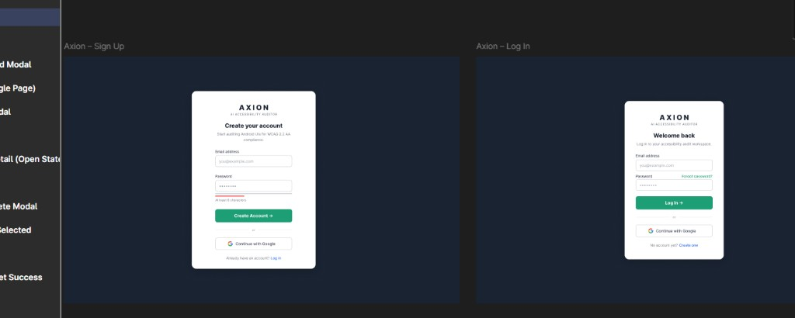
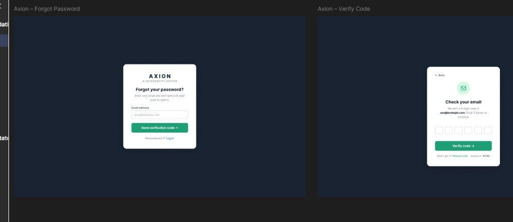
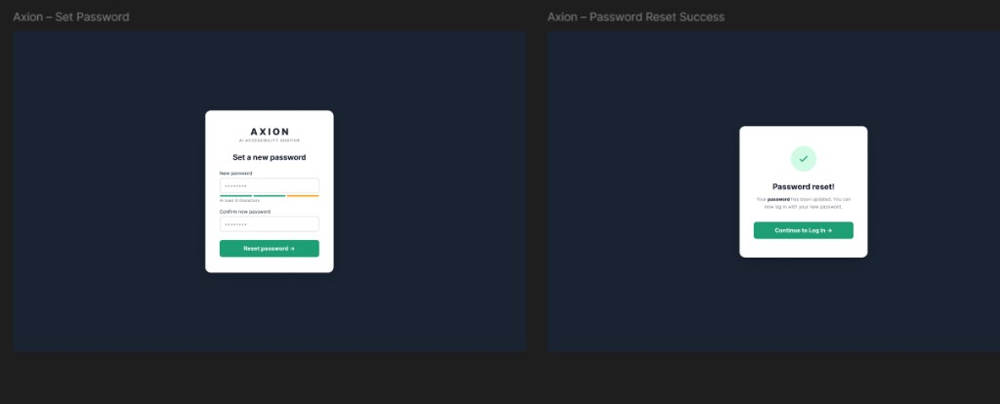
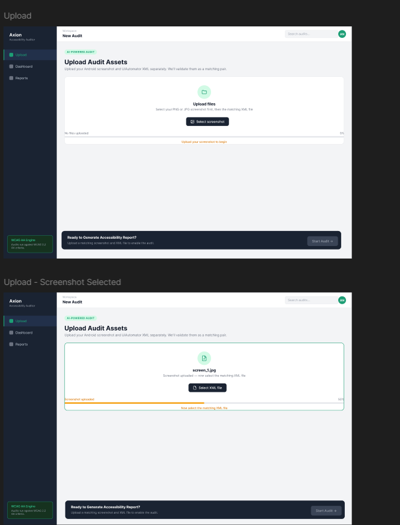
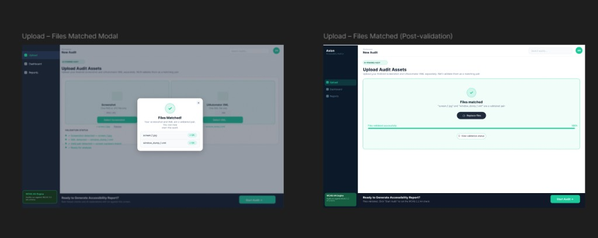
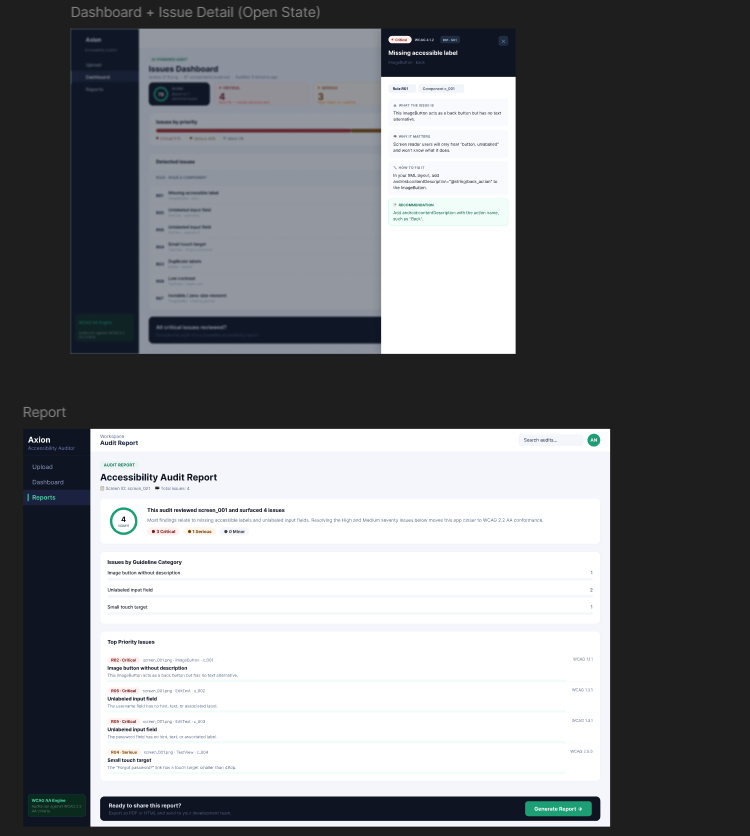

# Software Requirements Specification

## Agentic Accessibility Auditor (Axion)
### for Android Mobile Application UIs

| Field | Value |
|-------|-------|
| **Document version** | 2.0 |
| **Status** | Draft for SDS handoff |
| **Prepared by** | Muhammad Noor (Lead, i233068), Ayesha Naveed (UI/Schemas), Salar (Parser/Rules/Docker) |
| **Institution** | National University of Computer and Emerging Sciences (FAST-NUCES) |
| **Internship duration** | 8 weeks (Summer 2026) |
| **Standards basis** | IEEE 830-style SRS structure |
| **Supersedes** | SRS v1.0 documents (Axion + Agentic) |

---

## Document history

| Version | Date | Author | Changes |
|---------|------|--------|---------|
| 1.0 (Axion) | 2026 | Ayesha Naveed | Initial Axion UI-focused SRS with G01–G30, R01–R30, Figma screen specs |
| 1.0 (Agentic) | 2026 | Team | Module-based SRS with Docker, R1–R10 core, stretch goals |
| **2.0** | 2026 | Team | Unified SRS combining both documents, repo reality (MASC/Rico), JSON schemas, API contract, evaluation plan |

> **Note on UI specifications:** Screen layouts, branding, and interaction flows in Section 3.1 and **Appendix F** are derived from **Ayesha Naveed's Figma designs** shared in `#tem-all-dynamo` Slack. Reference screenshots are embedded in Appendix F (`docs/assets/figma/`). Screens covered: Sign Up, Log In, Forgot Password, OTP Verify, Reset Password, Upload (all states), Audit Complete modal, Dashboard, Issue Detail drawer, Audit Report, Generate Report modal, and **Records (Reports)** page.

---

## Table of contents

1. [Introduction](#1-introduction)
2. [Overall description](#2-overall-description)
3. [External interface requirements](#3-external-interface-requirements)
4. [System features and functional requirements](#4-system-features-and-functional-requirements)
5. [Non-functional requirements](#5-non-functional-requirements)
6. [Data collection and storage](#6-data-collection-and-storage)
7. [Accessibility guidelines and detection rules](#7-accessibility-guidelines-and-detection-rules)
8. [JSON schema contracts](#8-json-schema-contracts)
9. [REST API requirements](#9-rest-api-requirements)
10. [Module-level acceptance criteria](#10-module-level-acceptance-criteria)
11. [Evaluation plan](#11-evaluation-plan)
12. [Deliverables](#12-deliverables)
13. [Other requirements](#13-other-requirements)
- [Appendix A: Use cases](#appendix-a-use-cases)
- [Appendix B: Requirements traceability matrix](#appendix-b-requirements-traceability-matrix)
- [Appendix C: Glossary](#appendix-c-glossary)
- [Appendix D: TBD list](#appendix-d-tbd-list)
- [Appendix E: Docker and deployment](#appendix-e-docker-and-deployment)
- [Appendix F: Axion UI screen specifications (Figma / Slack)](#appendix-f-axion-ui-screen-specifications-figma--slack)

---

## 1. Introduction

### 1.1 Purpose

This Software Requirements Specification (SRS) defines the **functional and non-functional requirements** for the **Agentic Accessibility Auditor** — a two-month summer internship prototype developed at FAST-NUCES.

The system accepts an Android UI **screenshot** and a **UIAutomator XML hierarchy dump**, detects accessibility violations against **WCAG 2.2 AA**–aligned guidelines using a **deterministic rule engine**, generates **AI-powered explanations and developer fix recommendations** via an **agentic LLM layer**, and produces structured **HTML/PDF audit reports** through a React web dashboard branded **Axion**.

This document is the **single authoritative requirements reference** for:

- Development and testing by the three-intern team
- Integration against agreed JSON data contracts
- Supervisor evaluation and SDS (Software Design Specification) authoring
- Acceptance criteria at module and system level

**What this document specifies:** *what* the system must do.  
**What the SDS specifies:** *how* modules are designed, class diagrams, algorithms, and normative schema validation rules.

### 1.2 Document conventions

This document follows IEEE 830-style SRS conventions:

| Convention | Meaning |
|------------|---------|
| **shall** | Mandatory requirement |
| **should** | Desirable requirement; may be deferred to stretch if schedule requires |
| **Stretch** | Explicitly lower priority; not required for minimum prototype acceptance |
| `FR-<MODULE>.<n>` | Functional requirement ID (module-grouped, from Agentic SRS) |
| `FR-AAA-<nn>` | Legacy functional requirement ID (from Axion SRS; mapped in Appendix B) |
| `NFR-<n>` | Non-functional requirement ID |
| `G01`–`G30` | Accessibility guideline identifiers |
| `R01`–`R30` | Detection rule identifiers |
| **Must Have** | Required for internship sign-off |
| **Should Have** | Expected if schedule permits |
| **Stretch** | Optional enhancement |
| **TBD-xx** | Open item; see Appendix D |

Higher-level requirement priority propagates to sub-requirements unless stated otherwise.

### 1.3 Intended audience and reading suggestions

| Audience | Focus sections |
|----------|----------------|
| **Salar (Intern 1)** — Parser, rules, Docker, datasets | §4.2, §4.3, §6, §7, §8, Appendix E |
| **Ayesha (Intern 2)** — Figma, React dashboard, JSON schemas | §3.1, §4.1, §4.5, §8, Appendix F |
| **Muhammad Noor (Lead, Intern 3)** — LLM agent, reports, evaluation | §4.4, §4.6, §11, §12 |
| **Supervisor / Evaluator** | All sections; §10–§12 for acceptance |
| **Future maintainers** | §2, §7, §8, §9, Appendix C |

All readers should begin with **Section 2 (Overall Description)** before detailed requirements.

### 1.4 Product scope

#### 1.4.1 In scope

The Agentic Accessibility Auditor is a **standalone prototype tool** targeting **Android mobile UI accessibility evaluation**. The system shall:

1. Accept paired inputs: one Android UI screenshot (PNG/JPG) and one UIAutomator XML hierarchy file
2. Parse XML to extract structured component attributes (`class`, `bounds`, `text`, `content-desc`, `clickable`, `enabled`, `focusable`, `resource-id`)
3. Run **deterministic rule-based accessibility checks** mapped to guidelines **G01–G30** and rules **R01–R30**
4. Use an **agentic LLM layer** to generate human-readable explanations, impact descriptions, and developer fix suggestions **per violation already detected by the rule engine**
5. Generate developer-facing **HTML/PDF audit reports** with severity scores, guideline mappings, annotated screenshots, and recommendations
6. Provide a **React-based web frontend (Axion)** for file upload, issues dashboard, and report download
7. Deploy via **Docker Compose** with documented single-command startup
8. Evaluate on **MASC** (development/tuning) and **Rico holdout** (unseen final evaluation) datasets

#### 1.4.2 Priority tiers (merged resolution)

| Tier | Scope |
|------|-------|
| **Must Have (MVP)** | Parser → R01–R10 rule engine → LLM explanations → HTML/PDF report → Axion Upload + Issues + Report screens → Docker Compose → evaluation on 25–40 screens |
| **Should Have** | R11–R20 rules; Issues dashboard filtering; batch CLI/API; annotated screenshot regions in UI; Figma-approved Axion branding |
| **Stretch** | R21–R30 rules; CV contrast (R09); legacy CNN classifier signal; interactive click-to-highlight in HTML report; full auth flow (Sign Up / OTP); benchmark dataset export |

#### 1.4.3 Out of scope

The following are **explicitly excluded** from this prototype:

- Automated APK or Play Store crawling
- Full WCAG conformance certification or legal compliance audit
- Clinical disability studies or user testing with disabled participants
- Real-device ADB integration for **automated capture at runtime** (manual/offline collection only)
- iOS, web, or desktop UI hierarchy support
- Production-grade SSO, enterprise IAM, or HIPAA-grade user management (prototype uses JWT + local/SQLite store)
- Lab pathology / NDA-covered code, data, or infrastructure reuse

#### 1.4.4 Scope clarifications (resolving prior SRS conflicts)

| Topic | Axion SRS said | Agentic SRS said | **Merged decision** |
|-------|----------------|------------------|---------------------|
| Rule count MVP | R1–R10 required; R11–R20 stretch; doc also lists R01–R30 | R1–R10 only | **R01–R10 Must**; R11–R20 Should; R21–R30 Stretch |
| Contrast (R09) | Required in rules table; also "advanced contrast out of scope" | Optional CV stretch | **R09 Stretch** — requires screenshot crop + contrast computation |
| Auth / OTP UI | Required | Not mentioned | **Must Have** — Figma-approved Sign Up, Log In, Forgot Password, OTP, Reset Password (Appendix F) |
| Records page | Not in v1 | Not mentioned | **Must Have** — per-user audit history on sidebar **Reports** nav |
| Dataset | Rico only | Rico / public sources | **MASC primary** (7,068 screens); **Rico holdout** for unseen eval; Rico source corpus in `final_rico/` |
| Docker | Not required | Required | **Required** |
| CNN classifier | Not mentioned | Stretch | **Stretch** — supplementary signal only; never overrides rule engine |

### 1.5 Definitions, acronyms, and abbreviations

See **Appendix C: Glossary**.

### 1.6 References

| # | Reference |
|---|-----------|
| R1 | Agentic Accessibility Auditor Internship Plan, Version 1.0, FAST-NUCES, 2026 |
| R2 | Agentic Accessibility Auditor Internship Plan & Final Report Template (8-week plan: Docker, React/Tailwind, Figma, CNN) |
| R3 | GitHub Repository: [MuhammadNoor7/agentic-accessibility-auditor](https://github.com/MuhammadNoor7/agentic-accessibility-auditor) |
| R4 | WCAG 2.2 AA Guidelines — W3C Web Accessibility Initiative (WAI) |
| R5 | MASC Dataset — Mobile App Dataset for Building Classification Applications ([Google Drive](https://drive.google.com/file/d/1kx8qRbOtdQbbewZgfBTeCIj7lNvabFTF/view?usp=sharing)) |
| R6 | Rico Dataset — Android UI screenshots and view hierarchies |
| R7 | UIAutomator2 Documentation — Android Developers |
| R8 | IEEE Std 830-1998 — Recommended Practice for Software Requirements Specifications |
| R9 | FastAPI Documentation — https://fastapi.tiangolo.com |
| R10 | React 18 + Vite + Tailwind CSS Documentation |
| R11 | Project docs: `docs/json_schemas.md`, `docs/accessibility_guidelines_report.md`, `docs/qa_test_plan.md` |
| R12 | Ayesha Naveed — Axion Figma designs (shared via `#tem-all-dynamo` Slack) |

---

## 2. Overall description

### 2.1 Product perspective

The Agentic Accessibility Auditor is an **independent prototype system**, not a sub-module of a larger existing platform. It is developed as an **8-week internship deliverable** under team-lead supervision.

The system is structured as a **six-layer pipeline**:

```
Input Layer → Parsing Layer → Rule Checker (+ optional CV/CNN) → Agentic Layer → Report Layer → Evaluation Layer
```

Each layer produces a **structured JSON artefact** consumed by the next, enabling the three interns to develop independently against agreed data contracts.

The frontend (**Axion**) interacts with the backend pipeline via a **FastAPI REST API**. The React frontend serves as both the user-facing demo tool and the primary deliverable for the UI intern.

**High-level data flow:**

```
Screenshot + UIAutomator XML
    → XML Parser (components.json)
    → Rule Engine + optional CV/CNN (violations.json)
    → Agentic Explanation Layer (report.json / recommendations.json)
    → Report Generator (audit_report.html / .pdf)
    → React Dashboard (Axion) + Evaluation summary
```

All stages are orchestrated behind Docker-managed backend services (Appendix E).

### 2.2 Product functions

| # | Function | Priority |
|---|----------|----------|
| F1 | **File upload** — Accept paired PNG/JPG screenshot and UIAutomator XML via web interface | Must |
| F2 | **Pair validation** — Verify screenshot and XML share matching screen IDs before analysis | Must |
| F3 | **XML parsing** — Extract UI component attributes into structured `components.json` | Must |
| F4 | **Rule-based checking** — Detect violations across R01–R30 (R01–R10 minimum) | Must (R01–R10) |
| F5 | **Agentic explanation** — LLM generates per-violation explanation, impact, and fix | Must |
| F6 | **Audit report generation** — HTML/PDF with scores, severity, annotated screenshots | Must |
| F7 | **Issues dashboard** — Filterable violation table in web UI | Must |
| F8 | **Report download** — PDF and HTML from interface | Must |
| F9 | **Batch evaluation** — Run pipeline across curated dataset screens | Should |
| F10 | **Optional CV contrast + CNN signal** — Supplementary visual analysis | Stretch |
| F11 | **User authentication (Axion)** — Sign up, login, forgot password + OTP reset flow | Must |
| F12 | **Records page** — Per-user audit history; store and retrieve reports against authenticated account | Must |

### 2.3 User classes and characteristics

| User class | Description | Technical level | Primary functions |
|------------|-------------|-----------------|-------------------|
| **Android Developer** | Developer integrating accessibility into their Android app | Medium–High | Upload files, review violations, apply fix suggestions |
| **QA / Accessibility Tester** | Tester running audits on multiple screens | Medium | Batch uploads, download reports, review severity breakdown |
| **Intern / Developer** | Team member building or testing the pipeline | High | All functions; backend debugging; rule authoring |
| **Supervisor / Evaluator** | Team lead or academic evaluator reviewing outputs | Low–Medium | View reports; assess output quality and rule correctness |

### 2.4 Operating environment

| Component | Requirement |
|-----------|-------------|
| **Client** | Modern desktop browser (Chrome, Firefox, Edge); JavaScript enabled |
| **Frontend** | React 18 + Vite + Tailwind CSS; dev server `localhost:5173` |
| **Backend** | Python 3.11+ with FastAPI |
| **Deployment** | Docker + Docker Compose on Linux/macOS/Windows (Docker Desktop) |
| **Database** | No persistent database for prototype; file-system JSON storage per audit run |
| **LLM** | OpenAI API (GPT-4o or equivalent) via HTTPS; API key in environment variables only |
| **Datasets (local)** | MASC (`data/data-masc/`), Rico holdout (`data/data-rico-holdout/`), generic uploads (`data/xml/`, `data/screenshots/`) |
| **Offline capture** | Android emulator or physical device with ADB + UIAutomator (dataset collection only) |

### 2.5 Design and implementation constraints

| # | Constraint |
|---|------------|
| C1 | Prototype must be completed within **8 weeks** |
| C2 | Team size is **three interns**; each owns a primary module (see §2.6) |
| C3 | All code shall be pushed to GitHub **at least 3 times per week** |
| C4 | Only open-source tools except **OpenAI API** (team-provisioned) |
| C5 | The LLM agent **shall not invent violations**; it only explains rule-detected issues |
| C6 | All inter-module communication uses structured JSON following agreed schemas (§8) |
| C7 | Rule engine output **shall be deterministic** — identical input → identical `violations.json` |
| C8 | CNN outputs (if used) **shall never silently override** rule-based results |
| C9 | Axion UI shall follow approved **Figma designs** (Appendix F) |
| C10 | Lab computational pathology / NDA-covered assets are **out of scope** |

### 2.6 Team responsibilities (module ownership)

| Intern | Branch | Primary ownership |
|--------|--------|-------------------|
| **Salar** | `salar` | Data collection, hybrid XML parser, rule checker (R01–R30), Docker, batch scripts |
| **Ayesha** | `ayesha` | JSON schemas, Figma design, React/Tailwind Axion dashboard |
| **Muhammad Noor (Lead)** | `noor` | LLM agent layer, report generation (HTML/PDF), evaluation plan, project coordination |

### 2.7 User documentation

The following documentation shall be maintained:

| Document | Location | Owner |
|----------|----------|-------|
| README with setup, folder structure, module descriptions | Repository root | All |
| FastAPI Swagger UI | `/docs` on backend | Salar |
| Windows setup guide | `docs/windows_setup.md` | All |
| JSON schemas | `docs/json_schemas.md` | Ayesha / Noor |
| Accessibility guidelines report | `docs/accessibility_guidelines_report.md` | Ayesha / Noor |
| QA test plan | `docs/qa_test_plan.md` | Noor |
| Weekly progress notes | `docs/progress/` | Each intern |
| Final internship report | `docs/` | All |

### 2.8 Assumptions and dependencies

**Assumptions:**

- Users supply valid, matching screenshot/XML pairs with consistent screen IDs in filenames
- OpenAI API is accessible with a valid team API key for the project duration
- MASC and Rico holdout datasets are downloaded and stored in the agreed folder structure
- All three interns develop modules concurrently and integrate against agreed JSON schemas
- Figma designs in `#tem-all-dynamo` represent the approved Axion UI baseline

**Dependencies:**

| Dependency | Purpose |
|------------|---------|
| MASC Dataset | Primary development and tuning corpus (7,068 paired screens) |
| Rico holdout | Unseen final evaluation (1,698 screens, MASC-disjoint) |
| OpenAI GPT-4o API | Agentic explanation and fix suggestion layer |
| WeasyPrint / pdfkit | HTML-to-PDF report conversion |
| PIL / OpenCV | Screenshot annotation and bounding box rendering |
| lxml / xml.etree | XML hierarchy parsing |
| Docker / Docker Compose | Containerized deployment |
| Legacy CNN classifier (Stretch) | Optional supplementary visual signal |

---

## 3. External interface requirements

### 3.1 User interfaces — Axion web dashboard

The system shall provide a **React-based web interface (Axion)** designed in **Figma** and implemented to match approved designs. Full per-screen specifications are in **Appendix F**.

#### 3.1.1 Global UI requirements

| ID | Requirement | Priority |
|----|-------------|----------|
| FR-UI.1 | All authenticated screens shall display consistent **Axion branding**: sunburst-ring logo, **AXION** wordmark, **AI ACCESSIBILITY AUDITOR** subtitle, **WCAG AA Engine** badge | Must |
| FR-UI.2 | Color theme: dark navy background `#0b1929`; primary action teal `#1bc99a`; white card surfaces for forms and content panels | Must |
| FR-UI.3 | All primary action buttons shall use fill color `#1bc99a` and remain **always visible** (not hover-dependent) — consistent with accessibility best practice for the auditor's own UI | Must |
| FR-UI.4 | Layout shall include a persistent **sidebar** with: Axion logo, **Workspace / New Audit** header, navigation links (**Upload**, **Dashboard**, **Reports**), WCAG AA Engine badge at bottom; top header shows search bar ("Search audits…") and user profile avatar (initials) | Must |
| FR-UI.5 | Responsive design targeting desktop browsers; reference width **1440px** | Must |
| FR-UI.6 | Dashboard UI shall be **designed in Figma first** and implemented to match approved design before final delivery | Must |
| FR-UI.7 | UI shall meet basic keyboard navigability and sufficient contrast on primary controls | Should |

#### 3.1.2 Screen inventory

| Screen | Description | Priority |
|--------|-------------|----------|
| **Sign Up** | Email + password; password strength hint; Continue with Google | **Must** |
| **Log In** | Email + password; Forgot password link; Continue with Google | **Must** |
| **Forgot Password** | Email → 6-digit OTP → Set password → Success confirmation | **Must** |
| **Upload** | Sequential screenshot/XML upload, validation panel, Files Matched modal, Start Audit | **Must** |
| **Audit Complete modal** | Pipeline step checklist; **View issues dashboard →** | **Must** |
| **Dashboard** | Score gauge, severity summary cards, issues-by-priority bar, violations table, Issue Detail drawer | **Must** |
| **Audit Report** | Score, guideline breakdown, top priority issues, Generate Report action | **Must** |
| **Generate Report modal** | PDF and HTML download options | **Must** |
| **Records (Reports)** | Per-user table of past audits with score, date, severity summary; open/download past reports | **Must** |

#### 3.1.3 Upload screen (Must Have)

| ID | Requirement |
|----|-------------|
| FR-UI.10 | **Sequential upload flow** in a unified drop zone: first select PNG/JPG screenshot, then select matching UIAutomator XML (.xml); show progress at 0% → 50% → 100% |
| FR-UI.11 | Display selected filenames; show **screenshot preview** thumbnail/link when image selected |
| FR-UI.12 | **Validation Status** panel with four real-time checks: (1) screenshot detected, (2) XML detected, (3) valid pair detected, (4) ready for analysis |
| FR-UI.13 | **Files Matched** success modal when pair validates; lists both filenames with OK badges; dismiss to show validated state with **Replace files** action |
| FR-UI.14 | Floating bottom bar with **"Start Audit →"** button (teal); disabled until all four validation checks pass |
| FR-UI.15 | Display upload progress, helper text, and error/loading states (invalid file type, oversized file, parsing failure) |
| FR-UI.16 | Reject mismatched pairs with clear error message |
| FR-UI.17 | **Audit Complete** modal after pipeline finishes: checklist of seven pipeline steps with checkmarks; primary action **View issues dashboard →** |

#### 3.1.4 Dashboard (Must Have)

| ID | Requirement |
|----|-------------|
| FR-UI.20 | Page title **Issues Dashboard** with screen filename, component count, and audit timestamp |
| FR-UI.21 | **Accessibility Score** circular gauge (0–100) and summary cards: Critical, Serious, Moderate/Minor counts |
| FR-UI.22 | **Issues by Priority** horizontal segmented bar (percentage by severity) |
| FR-UI.23 | Violations table columns: **Rule**, **Issue & Component**, **Severity**, **Guideline**, **Action (View)** |
| FR-UI.24 | Severity badges: **Critical / Serious / Moderate / Minor** (colour-coded per Figma) |
| FR-UI.25 | **Re-run Audit** action in header |
| FR-UI.26 | Clicking **View** opens **Issue Detail drawer** (right overlay) with: WHAT THE ISSUE IS, WHY IT MATTERS, HOW TO FIX IT (code block), RECOMMENDATION panel |
| FR-UI.27 | Floating bottom bar: **Generate Report →** (teal, always visible) |

#### 3.1.5 Audit Report screen (Must Have)

| ID | Requirement |
|----|-------------|
| FR-UI.30 | Display **Accessibility Score**, total issues, severity breakdown, **Issues by Guideline Category** |
| FR-UI.31 | **Top Priority Issues** list: rule ID, severity badge, component path, issue title, WCAG guideline |
| FR-UI.32 | Per-violation detail blocks with AI explanation, why it matters, developer fix code block (as in exported PDF layout) |
| FR-UI.33 | Floating bottom bar **"Generate Report →"** (teal, always visible) |
| FR-UI.34 | Clicking Generate Report opens **modal** with **Download as PDF**, **Download as HTML**, and Cancel |
| FR-UI.35 | Exported PDF shall match Figma layout: header metadata (screen ID, total issues, schema version, severity summary), screenshot, XML snippet, violation blocks with fix highlights |

#### 3.1.6 Records page — Reports (Must Have)

Each authenticated user shall have a **Records** page (sidebar nav: **Reports**) listing all audits completed under their account.

| ID | Requirement |
|----|-------------|
| FR-UI.40 | Records page shall display a table/list of past audits for the **logged-in user only** |
| FR-UI.41 | Each record row: **screen ID / filename**, **audit date**, **accessibility score**, **total issues**, **severity summary** (Critical / Serious / Moderate / Minor counts) |
| FR-UI.42 | User shall open a past record to view Audit Report or re-download PDF/HTML |
| FR-UI.43 | Empty state when user has no saved audits with CTA to **Upload** new audit |
| FR-UI.44 | Search/filter audits by screen ID or date (uses header search bar) |
| FR-UI.45 | Records UI shall follow same Axion design system as Dashboard (sidebar, header, teal CTAs) |

### 3.2 Hardware interfaces

The system does not directly interface with hardware at runtime.

| Assumption | Detail |
|------------|--------|
| Client devices | Modern web browser with JavaScript |
| Server | Sufficient RAM for LLM API calls and optional CV processing |
| Android device | Used **offline only** during dataset collection via ADB; not required for deployed prototype |

### 3.3 Software interfaces

| Component | Version | Purpose | Interface type |
|-----------|---------|---------|----------------|
| React + Vite + Tailwind | 18+ / 5+ | Frontend UI | Internal |
| FastAPI | 0.110+ | Backend REST API | Internal |
| Python | 3.11+ | Core pipeline | Internal |
| lxml / xml.etree | 5+ / stdlib | XML parsing | Internal |
| PIL / OpenCV | 10+ / 4+ | Screenshot annotation | Internal |
| OpenAI API (GPT-4o) | v1 | Agentic layer | REST HTTPS |
| WeasyPrint / pdfkit | Latest | HTML → PDF | Internal |
| Docker / Compose | Latest | Deployment | Internal |
| MASC / Rico datasets | — | Evaluation data | File system |
| Legacy CNN (Stretch) | TBD | Visual supplementary signal | Internal model file |

**Inter-module JSON contracts:**

| Producer | Consumer | Artifact |
|----------|----------|----------|
| XML Parser | Rule Engine | `components.json` |
| Rule Engine | Agentic Layer | `violations.json` |
| Agentic Layer | Report Generator / UI | `report.json` |
| Report Generator | UI / user | `audit_report.html`, `audit_report.pdf` |

### 3.4 Communications interfaces

| ID | Requirement |
|----|-------------|
| FR-COM.1 | Client-server communication shall use **HTTP/HTTPS** |
| FR-COM.2 | FastAPI endpoints shall return **JSON** responses (except file downloads) |
| FR-COM.3 | Frontend communicates via fetch/axios to FastAPI |
| FR-COM.4 | OpenAI API called **server-side only**; API key never exposed to client |
| FR-COM.5 | CORS configured for frontend origin (`localhost:5173` in development) |
| FR-COM.6 | Standard HTTP status codes: 200, 201, 400, 422, 500 |
| FR-COM.7 | Docker internal network for frontend ↔ backend ↔ auditor service (Appendix E) |

---

## 4. System features and functional requirements

Requirements are grouped by module. Legacy `FR-AAA-xx` IDs from the Axion SRS are mapped in Appendix B.

### 4.1 Input layer — file upload and pair validation

**Description:** Accept paired screenshot and XML through Axion; validate matching screen IDs before analysis.  
**Priority:** High — all downstream features depend on this.  
**Owner:** Ayesha (UI) + Salar (backend validation)

**Stimulus/response:**

1. User navigates to Upload screen → system displays upload drop zone and Validation Status panel
2. User selects PNG/JPG → filename shown; progress 50%; prompt to select XML
3. User selects XML → filenames shown; pair validation runs
4. Valid pair → **Files Matched** modal; Validation Status all green; progress 100%
5. All checks pass → **Start Audit →** activates in bottom bar
6. User clicks Start Audit → pipeline runs → **Audit Complete** modal → navigate to Dashboard

| ID | Requirement | Priority | Maps to |
|----|-------------|----------|---------|
| FR-IN.1 | Web UI allowing upload of screenshot (.png/.jpg) and matching UIAutomator XML (.xml) | Must | FR-AAA-01, 02, 26 |
| FR-IN.2 | Validate matching screen identifier; reject mismatched pairs with clear error | Must | FR-AAA-03, 05 |
| FR-IN.3 | Validation Status panel: screenshot detected, XML detected, valid pair, ready for analysis | Must | FR-AAA-04, 27 |
| FR-IN.4 | Screenshot preview on image selection | Must | FR-AAA-06 |
| FR-IN.5 | Display upload progress and error/loading states | Should | — |
| FR-IN.6 | Trigger full pipeline (parse → rules → agent → report) with single user action | Must | — |
| FR-IN.7 | Enforce max file size **20 MB** per file | Must | NFR-10 |

**Pairing convention:** Screenshot and XML for the same screen share the same stem, e.g. `chat/49879.jpg` + `chat/49879.xml`, or `screen_001.png` + `window_001.xml`.

### 4.2 Parsing layer — XML component extraction

**Description:** Parse UIAutomator XML hierarchy; produce `components.json`.  
**Priority:** High.  
**Owner:** Salar

**Supported XML formats (hybrid parser):**

| Format | Recognition |
|--------|-------------|
| UIAutomator | `<node class="…" bounds="[l,t][r,b]">` |
| MASC | UIAutomator nodes + `<wrapper>` numeric bounds |
| Rico | Widget tags + space-separated bounds |
| Generic upload | Any element with class/widget tag + bounds |

| ID | Requirement | Priority | Maps to |
|----|-------------|----------|---------|
| FR-PS.1 | Extract for every node: `class`, `text`, `content-desc`, `resource-id`, `clickable`, `enabled`, `focusable`, `bounds` | Must | FR-AAA-07 |
| FR-PS.2 | Assign unique `component_id` (e.g. `c_001`) to each component | Must | FR-AAA-08 |
| FR-PS.3 | Convert bounds to integer array `[left, top, right, bottom]` | Must | FR-AAA-09 |
| FR-PS.4 | Handle missing attributes gracefully (`""` or `false` defaults) | Must | FR-AAA-10 |
| FR-PS.5 | Output `components.json` conforming to §8 schema | Must | FR-AAA-11 |
| FR-PS.6 | Process nested hierarchies of arbitrary depth | Must | FR-AAA-12 |
| FR-PS.7 | Link component bounds to paired screenshot region for annotation | Should | — |
| FR-PS.8 | Handle malformed/incomplete XML gracefully; report parsing error, do not crash pipeline | Must | — |
| FR-PS.9 | Strip null bytes before parse; TC-01: missing bounds → `[0,0,0,0]` or skip per tag rules | Must | TC-01 |

**Output path convention:**

| Input | Output |
|-------|--------|
| `data/xml/{screen}.xml` | `data/parsed/{screen}_components.json` |
| `data/data-masc/xml/{cat}/{id}.xml` | `data/data-masc/parsed/{cat}/{id}_components.json` |
| `data/data-rico-holdout/xml/{cat}/{id}.xml` | `data/data-rico-holdout/parsed/{cat}/{id}_components.json` |

### 4.3 Rule checker — accessibility violation detection

**Description:** Apply deterministic rules to parsed components; produce `violations.json`.  
**Priority:** High.  
**Owner:** Salar

| ID | Requirement | Priority |
|----|-------------|----------|
| FR-RU.1 | Detect **R01** — missing accessible label: clickable + empty text + empty content-desc | Must |
| FR-RU.2 | Detect **R02** — image button without description | Must |
| FR-RU.3 | Detect **R03** — duplicate labels | Must |
| FR-RU.4 | Detect **R04** — small touch target (< 48dp width or height) | Must |
| FR-RU.5 | Detect **R05** — unlabeled input field | Must |
| FR-RU.6 | Detect **R06** — disabled important control | Must |
| FR-RU.7 | Detect **R07** — invisible/zero-size component | Must |
| FR-RU.8 | Detect **R08** — layout overlap (>50% of smaller element) | Must |
| FR-RU.9 | Detect **R09** — low contrast via screenshot crop (**Stretch**) | Stretch |
| FR-RU.10 | Detect **R10** — text overflow / clipping | Must |
| FR-RU.11 | Implement **R11–R20** as **Should Have** stretch within internship | Should |
| FR-RU.12 | Implement **R21–R30** as **Stretch** | Stretch |
| FR-RU.13 | Each violation includes: `rule_id`, `issue`, `component_id`, `class`, `bounds`, `guideline`, `severity`, `recommendation` | Must |
| FR-RU.14 | Include `related_component` for pair rules R03, R08, R17 | Must |
| FR-RU.15 | Rule engine runs independently of agent; **deterministic** output for identical input | Must |
| FR-RU.16 | No false positives on components satisfying rule conditions (within defined limits) | Must |
| FR-RU.17 | Apply 48dp threshold using screen density metadata when available (ADB `wm density` or dataset metadata) | Must |
| FR-RU.18 | Output `violations.json` conforming to §8; `total_violations === violations.length` | Must |

Full rule logic: **Section 7**.

### 4.4 Computer vision and legacy CNN module (Stretch)

| ID | Requirement | Priority |
|----|-------------|----------|
| FR-CV.1 | Optionally run legacy CNN accessibility classifier on screenshot as supplementary signal | Stretch |
| FR-CV.2 | CNN outputs clearly distinguished from rule violations; never silently override rule results | Stretch |
| FR-CV.3 | R09 contrast: crop screenshot using XML bounds; compute WCAG-style ratio (< 4.5:1 text, < 3:1 large/icons) | Stretch |

### 4.5 Agentic layer — LLM explanation and fix generation

**Description:** Generate human-readable content for each rule-detected violation.  
**Priority:** High.  
**Owner:** Muhammad Noor

**Flow:** Agent receives `violations.json` + `components.json` → structured prompt per violation → LLM response merged into report.

| ID | Requirement | Priority | Maps to |
|----|-------------|----------|---------|
| FR-AG.1 | Generate `agent_explanation` — plain-English issue description (1–2 sentences) | Must | FR-AAA-19 |
| FR-AG.2 | Generate `agent_why_it_matters` — impact on users with disabilities (1–2 sentences) | Must | FR-AAA-20 |
| FR-AG.3 | Generate `agent_developer_fix` — concrete Android XML/code fix (1–3 lines) | Must | FR-AAA-21 |
| FR-AG.4 | **Shall not invent** violations beyond those in `violations.json` | Must | FR-AAA-22 |
| FR-AG.5 | Include `schema_version` in output | Must | FR-AAA-23 |
| FR-AG.6 | Handle API timeouts/errors gracefully; fallback to template explanation | Must | FR-AAA-24 |
| FR-AG.7 | System prompt explicitly instructs: do not fabricate violations | Must | FR-AAA-25 |
| FR-AG.8 | Store output in `report.json` / `recommendations.json` linked by violation and component IDs | Must | — |

### 4.6 Report layer — HTML/PDF audit report generation

**Description:** Produce developer-friendly reports from enriched violation data.  
**Priority:** High.  
**Owner:** Muhammad Noor

| ID | Requirement | Priority | Maps to |
|----|-------------|----------|---------|
| FR-RP.1 | HTML report: project header, screen ID, accessibility score, issue summary, per-issue detail, annotated screenshots | Must | FR-AAA-36 |
| FR-RP.2 | PDF version of same report (WeasyPrint or pdfkit) | Must | FR-AAA-37 |
| FR-RP.3 | Violations grouped by severity (Critical/High first) | Must | FR-AAA-38 |
| FR-RP.4 | Each section: rule ID, WCAG reference, severity, component ID, explanation, why it matters, developer fix | Must | FR-AAA-39 |
| FR-RP.5 | Cover section: audit date, screen filename, total violation count | Should | FR-AAA-40 |
| FR-RP.6 | Report traceable to `screen_id`, `image_path`, `xml_path` | Must | — |
| FR-RP.7 | Clickable issue → highlight bounding box on screenshot (**Stretch**) | Stretch | — |

### 4.7 Containerization and orchestration

**Owner:** Salar

| ID | Requirement | Priority |
|----|-------------|----------|
| FR-DK.1 | All backend components deployable as Docker containers | Must |
| FR-DK.2 | Docker Compose config: frontend, backend, auditor/batch service on internal network | Must |
| FR-DK.3 | System starts via single documented command on clean Docker-enabled host | Must |
| FR-DK.4 | FastAPI health endpoint at `/health` (port 8000) | Must |
| FR-DK.5 | Auditor service runs batch parser against MASC by default (`test_run.py`) | Should |

### 4.8 Evaluation and benchmark dataset

**Owner:** Muhammad Noor (coordination); all interns contribute

| ID | Requirement | Priority |
|----|-------------|----------|
| FR-EV.1 | End-to-end test on **25–40 distinct** Android screens minimum | Must |
| FR-EV.2 | Manual review: label each violation **Correct / False Positive / Missed** | Must |
| FR-EV.3 | Support batch pipeline across dataset folder | Should |
| FR-EV.4 | Compile validated outputs into labeled benchmark dataset (screenshot, XML, violations) | Stretch |
| FR-EV.5 | Final evaluation on **Rico holdout** (unseen, never used for tuning) | Must |
| FR-EV.6 | Controlled XML test cases (10–15) with known R01–R05 violations | Must |

### 4.9 User accounts, authentication, and Records storage

**Owner:** Ayesha (UI + API integration); Salar (backend persistence)

| ID | Requirement | Priority |
|----|-------------|----------|
| FR-AUTH.1 | **Sign Up** with email + password (min 8 characters) and optional **Continue with Google** | Must |
| FR-AUTH.2 | **Log In** with email + password; issue JWT session token | Must |
| FR-AUTH.3 | **Forgot Password** flow: email → 6-digit OTP (5-minute expiry, resend) → set new password → success screen | Must |
| FR-AUTH.4 | Password fields masked; strength indicator on sign-up and reset | Must |
| FR-AUTH.5 | Protected routes require valid JWT; unauthenticated users redirected to Log In | Must |
| FR-REC.1 | Associate each completed audit with **authenticated user_id** | Must |
| FR-REC.2 | Persist audit metadata and report artifacts for Records page retrieval | Must |
| FR-REC.3 | User shall only access their own records (no cross-user visibility) | Must |
| FR-REC.4 | API: `GET /api/v1/records` (list) and `GET /api/v1/records/{record_id}` (detail) scoped to current user | Must |
| FR-REC.5 | `DELETE /api/v1/records/{record_id}` (Stretch) | Stretch |

**Auth API (Must):**

| Endpoint | Method | Purpose |
|----------|--------|---------|
| `/api/v1/auth/signup` | POST | Register account |
| `/api/v1/auth/login` | POST | Login → JWT |
| `/api/v1/auth/forgot-password` | POST | Send OTP email |
| `/api/v1/auth/verify-otp` | POST | Verify 6-digit code |
| `/api/v1/auth/reset-password` | POST | Set new password |

---

## 5. Non-functional requirements

| ID | Category | Requirement | Priority |
|----|----------|-------------|----------|
| NFR-1 | Performance | Full report pipeline (parse → rules → agent → report) for single screen (~200 components) within **30 seconds**, excluding LLM API latency | Must |
| NFR-2 | Performance | XML parser: standard file (up to 2,000 nodes) within **5 seconds** | Must |
| NFR-3 | Performance | Rule checker R01–R10 on parsed file within **3 seconds** | Must |
| NFR-4 | Performance | Backend upload/status API within **2 seconds** (excluding LLM) | Must |
| NFR-5 | Performance | React frontend Lighthouse performance score ≥ **80** on desktop | Should |
| NFR-6 | Usability | New user uploads pair and obtains report in **≤ 5 user actions** without reading docs | Must |
| NFR-7 | Reliability | Rule engine produces **identical** `violations.json` for identical input across runs | Must |
| NFR-8 | Explainability | Agent produces **zero hallucinated violations** in manual review | Must |
| NFR-9 | Maintainability | Each module README documents input/output schema; functions have short docstrings | Must |
| NFR-10 | Security | OpenAI API key **never** exposed to client browser | Must |
| NFR-11 | Security | Validate MIME type before processing; reject non-image/non-XML | Must |
| NFR-12 | Security | HTTPS in production; XXE-safe XML parsing | Must |
| NFR-13 | Security | Max upload **20 MB** per file | Must |
| NFR-14 | Portability | Runs on Docker-enabled Linux/macOS/Windows without host-specific config | Must |
| NFR-15 | Portability | Frontend renders on Chrome, Firefox, Edge (latest) | Must |
| NFR-16 | Scalability | Architecture supports batch processing without structural changes | Should |
| NFR-17 | Interoperability | All inter-module exchange via versioned JSON schemas (§8) | Must |
| NFR-18 | Auditability | Every report violation traces to rule ID + component ID; every recommendation traces to violation | Must |
| NFR-19 | Code quality | External datasets/APIs documented with source and license | Must |
| NFR-20 | Data retention | Uploaded files not retained beyond session unless saved to dataset folder | Must |

### 5.1 Business rules

| # | Rule |
|---|------|
| BR-1 | LLM agent explains **only** rule-detected violations |
| BR-2 | Each intern owns one primary pipeline layer; cross-layer changes require lead agreement |
| BR-3 | GitHub push ≥ 3× per week; weekly demos mandatory |
| BR-4 | Evaluation dataset: ≥ 25–40 paired screens; Rico holdout reserved for final unseen eval |
| BR-5 | MASC train+val used for development; MASC test for internal regression only |

---

## 6. Data collection and storage

### 6.1 Dataset strategy

| Dataset | Path | Size | Split | Purpose |
|---------|------|------|-------|---------|
| **MASC** | `data/data-masc/` | 7,068 pairs | 70% train / 15% val / 15% test | Development, parser tuning, rule development |
| **Rico holdout** | `data/data-rico-holdout/` | 1,698 pairs | 100% held out | **Final unseen evaluation** — no tuning |
| **final_rico** | `data/final_rico/` | Source corpus | — | Build holdout only; not for direct eval |
| **Uploads** | `data/xml/`, `data/screenshots/` | Ad hoc | — | New/unknown apps via dashboard |

Regenerate splits: `python scripts/split_masc_dataset.py`  
Build holdout: `python scripts/build_rico_holdout.py`

### 6.2 Real-device collection (offline)

For supplementary collection via Android emulator or device:

```bash
adb devices
adb exec-out screencap -p > data/screenshots/screen_001.png
adb shell uiautomator dump /sdcard/window_001.xml
adb pull /sdcard/window_001.xml data/xml/window_001.xml
adb shell wm size
adb shell wm density
```

### 6.3 Folder structure

| Folder | Contents |
|--------|----------|
| `data/screenshots/` | PNG/JPG screenshots |
| `data/xml/` | Matching UIAutomator XML |
| `data/parsed/` | Generic parser output |
| `data/data-masc/xml/`, `screenshots/`, `parsed/`, `splits/` | MASC dataset tree |
| `data/data-rico-holdout/` | Holdout xml, screenshots, parsed, manifest |
| `outputs/violations/` | Rule checker JSON |
| `outputs/reports/` | HTML/PDF reports |
| `docs/examples/` | Sample JSON per pipeline stage |
| `docs/progress/` | Weekly intern notes |

### 6.4 Git policy

**Commit:** source, docs, scripts, Docker, requirements, parser artifacts on `salar`, splits, holdout manifest metadata  
**Do not commit:** `.venv/`, `.env`, raw xml/screenshots/json trees, large binary datasets

---

## 7. Accessibility guidelines and detection rules

Canonical reference: `docs/accessibility_guidelines_report.md`. Summary below.

### 7.1 Guidelines G01–G30

| ID | Issue | User group | WCAG |
|----|-------|------------|------|
| G01 | Missing accessible label | Blind / Low Vision | 4.1.2 |
| G02 | Image button without description | Blind | 1.1.1 |
| G03 | Duplicate labels | Blind / Cognitive | 4.1.2 |
| G04 | Small touch target | Motor / Elderly | 2.5.5 |
| G05 | Unlabeled input field | Blind / Cognitive | 1.3.1 |
| G06 | Disabled important control | All | 2.1.1 |
| G07 | Invisible or zero-size component | All / Blind | 1.3.1 |
| G08 | Possible layout overlap | All / Blind | 1.3.2 |
| G09 | Low contrast | Low Vision / Color Blind | 1.4.3 |
| G10 | Text overflow | Low Vision / Cognitive | 1.4.4 |
| G11 | Information by color alone | Color Blind | 1.4.1 |
| G12 | Missing captions on video | Deaf / HoH | 1.2.2 |
| G13 | Audio-only without transcript | Deaf / HoH | 1.2.1 |
| G14 | Notification audio only | Deaf / HoH | 1.3.3 |
| G15 | Logical focus / reading order | Blind / Motor | 1.3.2 / 2.4.3 |
| G16 | Non-interactive in focus tree | Blind | 1.3.1 |
| G17 | Insufficient touch target spacing | Motor | 2.5.5 |
| G18 | Multi-finger gesture required | Motor | 2.1.1 |
| G19 | No confirmation for destructive action | Motor / Cognitive | 3.3.4 |
| G20 | Input label disappears on focus | Cognitive | 3.3.2 |
| G21 | Vague or missing error messages | Cognitive / Blind | 3.3.1 / 3.3.3 |
| G22 | Password lacks show/hide toggle | Cognitive / Motor | 3.3.1 |
| G23 | Navigation control not labeled | Blind | 2.4.6 |
| G24 | Screen has no descriptive title | Blind / Cognitive | 2.4.2 |
| G25 | Uncontrolled auto-updating content | Cognitive / ADHD | 2.2.2 |
| G26 | Session timeout without warning | Cognitive | 2.2.1 |
| G27 | Complex or jargon-heavy labels | Cognitive / Low Literacy | 3.1.5 |
| G28 | Text does not scale with system font | Low Vision / Elderly | 1.4.4 |
| G29 | All-caps body content | Cognitive / Dyslexia | 3.1.5 |
| G30 | Icon-only button no text alternative | Blind / Low Literacy | 1.1.1 |

### 7.2 Detection rules R01–R30

| Rule | Detection logic | Severity | Guidelines | MVP |
|------|-----------------|----------|------------|-----|
| R01 | clickable + empty text + empty content-desc → Missing Label | High | G01,G02,G30 | **Must** |
| R02 | ImageButton/clickable ImageView + empty content-desc → No Image Desc | High | G02,G30 | **Must** |
| R03 | 2+ clickable share identical text/content-desc → Duplicate Label | Medium | G03 | **Must** |
| R04 | clickable + (width or height < 48dp) → Small Touch Target | High | G04,G17 | **Must** |
| R05 | EditText + empty hint/text/content-desc → Unlabeled Input | High | G05,G20 | **Must** |
| R06 | clickable + enabled=false + no explanation → Disabled Control | Medium | G06,G26 | **Must** |
| R07 | zero/invalid bounds → Zero-Size Element | Medium | G07,G25 | **Must** |
| R08 | overlap >50% smaller area → Layout Overlap | Medium | G08,G15 | **Must** |
| R09 | contrast < 4.5:1 (text) or < 3:1 (icons) → Low Contrast | Medium | G09,G11 | Stretch |
| R10 | TextView bounds < estimated text height → Text Overflow | Low/Med | G10,G28,G29 | **Must** |
| R11 | state change color-only → Color-Only Info | High | G11 | Should |
| R12 | VideoView + no caption toggle → Missing Captions | High | G12 | Should |
| R13 | audio-only + no transcript → No Transcript | High | G13 | Should |
| R14 | alert + no visible icon → Audio-Only Notification | Medium | G14 | Should |
| R15 | focus order ≠ visual order → Bad Focus Order | Medium | G15,G16 | Should |
| R16 | decorative + focusable → Decorative In Focus Tree | Low | G16 | Should |
| R17 | gap between clickables < 8dp → Insufficient Spacing | Medium | G17 | Should |
| R18 | multi-touch only → Multi-Gesture Only | High | G18 | Should |
| R19 | destructive button + no confirm → No Confirmation | Medium | G19 | Should |
| R20 | EditText hint-only → Hint-Only Label | Medium | G05,G20 | Should |
| R21–R30 | See `docs/accessibility_guidelines_report.md` | Various | Various | Stretch |

### 7.3 User group coverage

| Group | Primary rules |
|-------|---------------|
| Blind / Screen Reader | R01,R02,R03,R15,R16,R23,R24,R30 |
| Low Vision | R09,R10,R28 |
| Color Blind | R09,R11 |
| Deaf / HoH | R12,R13,R14 |
| Motor Impaired | R04,R06,R17,R18,R19 |
| Cognitive | R03,R20,R21,R22,R27 |
| All Users | R06,R07,R08 |

---

## 8. JSON schema contracts

Normative detail: `docs/json_schemas.md` and `docs/schemas/auditor_schema.json`. Summary:

### 8.1 components.json (Parser output)

| Field | Required | Type |
|-------|----------|------|
| `schema_version` | Recommended | string `"1.0"` |
| `screen_id` | Yes | string |
| `image_path` | Yes | string |
| `xml_path` | Yes | string |
| `components` | Yes | array |

**Per component:** `component_id`, `class`, `text`, `content_desc`, `resource_id`, `clickable`, `enabled`, `focusable`, `bounds[4]`

### 8.2 violations.json (Rule engine output)

**Screen level:** `schema_version`, `screen_id`, `image_path`, `xml_path`, `total_violations`, `violations[]`

**Per violation:** `rule_id`, `issue`, `component_id`, `class`, `bounds`, `guideline`, `severity` (`Critical|High|Medium|Low`), `recommendation`, optional `related_component`

### 8.3 report.json (Agent + report output)

Adds to violations: `summary` (counts by severity), `agent_explanation`, `agent_why_it_matters`, `agent_developer_fix`

Example files: `docs/examples/components.json`, `violations.json`, `report.json`

---

## 9. REST API requirements

Minimum API contract for Axion ↔ FastAPI (normative OpenAPI in SDS):

| Method | Endpoint | Description |
|--------|----------|-------------|
| GET | `/health` | Health check |
| POST | `/api/v1/audit` | Upload screenshot + XML; returns `{ audit_id, status }` |
| GET | `/api/v1/audit/{audit_id}/status` | Pipeline status: `pending`, `parsing`, `checking`, `explaining`, `reporting`, `complete`, `error` |
| GET | `/api/v1/audit/{audit_id}/violations` | Returns violations JSON |
| GET | `/api/v1/audit/{audit_id}/report` | Returns report JSON |
| GET | `/api/v1/audit/{audit_id}/report/download?format=html\|pdf` | File download |
| POST | `/api/v1/audit/batch` | Batch run over server-side dataset path (**Should**) |

**Error responses:** JSON body with `detail` message; 400 invalid pair; 422 validation; 500 pipeline failure.

---

## 10. Module-level acceptance criteria

| Module | Minimum acceptance | Owner |
|--------|-------------------|-------|
| **XML Parser** | Extracts all required fields for MASC/Rico/UIAutomator formats; TC-01 pass; outputs valid `components.json` | Salar |
| **Rule Checker** | R01–R05 detect on 10–15 controlled cases with zero false negatives; outputs valid `violations.json` | Salar |
| **Guideline mapping** | Every violation has WCAG guideline reference, severity, detection note | Salar |
| **Agentic layer** | Generates all three agent fields per violation; zero fabricated violations | Noor |
| **UI Dashboard (Axion)** | Upload, validation panel, issues table, report view, PDF/HTML download | Ayesha |
| **Report generator** | Readable HTML/PDF with score, summary, per-violation detail, fixes | Noor |
| **Docker** | `docker-compose up --build` starts backend + auditor; `/health` responds | Salar |
| **Evaluation** | 25–40 screens tested; Rico holdout final summary; manual validation documented | All |

---

## 11. Evaluation plan

| Aspect | How measured |
|--------|--------------|
| Rule correctness | 10–15 controlled XML examples; precision/recall for R01–R10 |
| Screen-level testing | Full pipeline on 25–40 screens (MASC val/test) |
| Unseen generalization | Rico holdout — never used during tuning |
| Manual validation | Classify each finding: Correct / Incorrect / Uncertain |
| Report quality | LLM explanations understandable to developer unfamiliar with WCAG |
| Usability | ≤ 5 actions to report without documentation |
| LLM faithfulness | No violations in output absent from `violations.json` |
| Parser regression | MASC train split batch parse without fatal errors |

Sign-off aligns with `docs/qa_test_plan.md` (TC-01–TC-06).

---

## 12. Deliverables

| Deliverable | Description | Owner |
|-------------|-------------|-------|
| Working prototype | End-to-end: upload → parse → rules → agent → report | All |
| Code repository | Clean GitHub repo with README, requirements, module docs | All |
| Sample dataset outputs | 25–40 screens with pipeline artifacts | Salar |
| Rule documentation | R01–R10 (min) implemented rules, logic, limitations | Salar |
| Agent & report docs | Prompt templates, sample reports, limitations | Noor |
| Axion UI | Figma + implemented React dashboard | Ayesha |
| JSON schemas | Documented + validated examples | Ayesha / Noor |
| Evaluation summary | Manual validation + Rico holdout results | Noor |
| Final internship report | Problem, method, implementation, results, future work | All |
| Final demo | 5–7 min live demo: problem → architecture → audit → report | All |
| Benchmark dataset (Stretch) | Labeled screenshot/XML/violation triples | All |

---

## 13. Other requirements

| Topic | Requirement |
|-------|-------------|
| Localization | English only; i18n not required |
| Versioning | All JSON outputs include `schema_version` |
| Legal | No clinical testing; production data-protection compliance out of scope |
| Streamlit | Streamlit demo (`app.py`) permitted for parser dev; Axion React is production UI target |

---

## Appendix A: Use cases

### UC-1: Upload and audit a single screen

| Field | Value |
|-------|-------|
| Actor | Android Developer / QA |
| Preconditions | User logged in; matching screenshot + XML pair |
| Main flow | Log in → Upload → validate pair → Start Audit → Audit Complete modal → Dashboard → Generate Report → audit saved to Records |
| Postconditions | HTML/PDF report available; record visible on Reports page |
| Alternate | Mismatched or malformed files → error message; pipeline does not proceed |

### UC-2: Batch evaluation

| Field | Value |
|-------|-------|
| Actor | Intern developer |
| Preconditions | Curated 25–40+ pairs in dataset folder |
| Main flow | Run batch pipeline → report per screen → manual review Correct/FP/Missed |
| Postconditions | Evaluation summary; optional benchmark dataset |

### UC-3: Review report and apply fix

| Field | Value |
|-------|-------|
| Actor | Android Developer |
| Preconditions | Report generated for a screen |
| Main flow | Open report → select issue → view highlight (Stretch) → read explanation and fix |
| Postconditions | Actionable guidance for layout/attribute changes |

### UC-4: Authenticate to Axion (Must)

| Field | Value |
|-------|-------|
| Actor | Any user |
| Main flow | Sign Up or Log In → optional Forgot Password OTP flow → access Workspace |
| Postconditions | Authenticated session; JWT stored client-side |

### UC-5: View past audits on Records page (Must)

| Field | Value |
|-------|-------|
| Actor | Authenticated user |
| Preconditions | User has completed ≥ 1 audit |
| Main flow | Open **Reports** in sidebar → browse audit list → open record → view report or download PDF/HTML |
| Postconditions | Past audit retrieved without re-running pipeline |

---

## Appendix B: Requirements traceability matrix

| Req ID | Description | Priority | Feature | Owner | Status |
|--------|-------------|----------|---------|-------|--------|
| FR-IN.1 | Accept screenshot + XML | Must | §4.1 | Ayesha | Pending |
| FR-IN.2 | Validate pair screen ID | Must | §4.1 | Salar | Pending |
| FR-PS.1 | Extract XML attributes | Must | §4.2 | Salar | **Done** |
| FR-RU.1–10 | Rules R01–R10 | Must | §4.3 | Salar | Planned |
| FR-AG.1–7 | Agent explanations | Must | §4.5 | Noor | Planned |
| FR-RP.1–2 | HTML/PDF reports | Must | §4.6 | Noor | Planned |
| FR-UI.10–17 | Upload + modals | Must | §3.1 | Ayesha | In Progress |
| FR-UI.20–27 | Dashboard + drawer | Must | §3.1 | Ayesha | In Progress |
| FR-UI.30–35 | Report screen + modal + PDF | Must | §3.1 | Ayesha | In Progress |
| FR-UI.40–45 | Records page | Must | §3.1 | Ayesha | Planned |
| FR-AUTH.1–5 | Authentication | Must | §4.9 | Ayesha / Salar | Planned |
| FR-REC.1–4 | Records storage | Must | §4.9 | Salar / Ayesha | Planned |
| FR-DK.1–3 | Docker Compose | Must | §4.7 | Salar | Partial |
| FR-EV.1–6 | Evaluation | Must | §4.8 | Noor | Planned |
| FR-CV.1–3 | CV/CNN/R09 | Stretch | §4.4 | Noor | Stretch |
| FR-AAA-01 … 40 | Legacy IDs | — | Mapped above | — | — |

---

## Appendix C: Glossary

| Term | Definition |
|------|------------|
| AAA | Agentic Accessibility Auditor |
| Axion | Brand name and React frontend for the auditor |
| ADB | Android Debug Bridge |
| Agentic Layer | LLM module explaining rule-detected violations only |
| bounds | `[left, top, right, bottom]` pixel coordinates |
| content-desc | Android `contentDescription` for screen readers |
| dp | Density-independent pixels (48dp min touch target) |
| MASC | Mobile App Screens Classification dataset (primary) |
| Rico holdout | MASC-disjoint Rico subset for unseen evaluation |
| Rule Engine | Deterministic non-AI violation detector |
| schema_version | Version field in all JSON pipeline outputs |
| UIAutomator XML | Android UI hierarchy dump |
| WCAG | Web Content Accessibility Guidelines |
| Violation | Rule-detected issue on a specific component |

---

## Appendix D: TBD list

| ID | Description | Expected resolution |
|----|-------------|---------------------|
| TBD-01 | Final LLM model (GPT-4o vs GPT-4o-mini) based on cost | Week 1 |
| TBD-02 | Accessibility score formula (0–100) | Week 2 / SDS |
| TBD-03 | dp/density strategy for R04 on static XML without ADB metadata | Week 2 |
| TBD-04 | Screenshot storage for deployed demo (local vs cloud) | Week 2 |
| TBD-05 | Severity mapping: rule High/Medium/Low → UI Critical/Serious/Moderate/Minor | Week 2 |
| TBD-06 | Auth flow in or out of MVP | Week 1 (supervisor) |
| TBD-07 | `schema_version` numbering convention | Week 1 |
| TBD-08 | OpenAPI spec publication path | SDS |

---

## Appendix E: Docker and deployment

**Services (`docker-compose.yml`):**

| Service | Role | Port |
|---------|------|------|
| `backend` | FastAPI API | 8000 |
| `auditor` | Batch parser (`test_run.py`) against MASC | internal |
| `frontend` (planned) | React Axion dashboard | 5173 |

**Startup:**

```bash
docker-compose up --build
# Health: http://localhost:8000/health
```

Environment: `DATASET_ROOT=/app/data/data-masc`, `PARSER_MAX_FILES=0` (full batch)

---

## Appendix F: Axion UI screen specifications (Figma)

> **Source:** Ayesha Naveed's Figma designs (shared in `#tem-all-dynamo` Slack). All screens below are **Must Have** unless marked otherwise. Embedded screenshots are stored in `docs/assets/figma/`.

### F.1 Design system

| Token | Value | Usage |
|-------|-------|-------|
| Background | `#0b1929` | Page background (dark navy) |
| Primary action | `#1bc99a` | Buttons, CTAs, active nav (teal) |
| Surface | `#FFFFFF` | Cards, forms, modals |
| Text primary | White on dark; dark on white cards |
| Logo | Sunburst-ring icon + **AXION** wordmark |
| Subtitle | **AI ACCESSIBILITY AUDITOR** |
| Badge | **WCAG AA Engine** (sidebar footer) |
| Sidebar nav | **Upload** · **Dashboard** · **Reports** |
| Header | Breadcrumb, search ("Search audits…"), user avatar (initials) |

**Accessibility of Axion itself:** Primary buttons must not rely on hover-only visibility; focus states required for keyboard users.

### F.2 Sign Up and Log In (Must Have)



| Screen | Elements |
|--------|----------|
| **Sign Up** | Title "Create your account"; Email; Password (min 8 chars + strength hint); **Create Account →**; **Continue with Google**; link to Log In |
| **Log In** | Title "Welcome back"; Email; Password; **Forgot password?** link; **Log In →**; **Continue with Google**; link to Sign Up |

### F.3 Forgot Password and OTP Verify (Must Have)



| Step | Elements |
|------|----------|
| **Forgot Password** | "Forgot your password?"; email field; **Send verification code →**; "Remembered it? Log in" |
| **Verify Code** | ← Back; envelope icon; "Check your email"; six OTP digit boxes; **Verify code →**; resend timer (e.g. expires in 04:50) |

### F.4 Set Password and Reset Success (Must Have)



| Step | Elements |
|------|----------|
| **Set Password** | New password + confirm; strength meter; **Reset password →** |
| **Success** | Green checkmark; "Password reset!"; **Continue to Log In →** |

### F.5 Upload — progress states (Must Have)



- **AI-POWERED AUDIT** badge; title **Upload Audit Assets**
- Unified drop zone: **Select screenshot** → then **Select XML file**
- Progress bar: 0% → 50% → 100% with helper text
- Bottom bar: disabled **Start Audit →** until pair validated

### F.6 Upload — Files Matched (Must Have)



- **Files Matched!** modal lists `screen_1.jpg` + `window_dump_1.xml` with OK badges
- Post-dismiss: green validated panel, **Replace files**, 100% progress, **View validation status**
- Validation Status checklist (all four green) visible in background

### F.7 Audit Complete modal and Dashboard (Must Have)


**Audit Complete modal:** seven pipeline steps with checkmarks; **View issues dashboard →**

**Dashboard:** score gauge (0–100); Critical / Serious / Minor cards; Issues by Priority bar; violations table (Rule, Issue & Component, Severity, Guideline, View); bottom **Generate Report →**

### F.8 Dashboard Issue Detail and Audit Report (Must Have)



**Issue Detail drawer:** Critical badge; WHAT THE ISSUE IS / WHY IT MATTERS / HOW TO FIX IT / RECOMMENDATION; tabs Rule + Component

**Audit Report:** score summary; Issues by Guideline Category; Top Priority Issues with WCAG refs; **Generate Report** footer

### F.9 Generate Report modal and PDF layout (Must Have)


**Modal:** Download as PDF (print/share); Download as HTML (dev team); Cancel

**PDF:** Axion header; metadata boxes (Screen ID, Total Issues, Schema, Severity); screenshot + XML snippet; violation blocks with green fix highlights

### F.10 Records page — Reports (Must Have)

No Figma screenshot was provided for Records; implement using the same design system as Dashboard:

| Element | Specification |
|---------|---------------|
| Route | Sidebar **Reports** → `/records` |
| Table columns | Screen ID, Date, Score, Total issues, Critical, Serious, Moderate, Minor |
| Row action | Open report view or download PDF/HTML |
| Empty state | Illustration + "No audits yet" + **Start new audit →** link to Upload |
| Scope | Show **logged-in user's audits only** (FR-REC.3) |

### F.11 Navigation map

```
[Sign Up] ←→ [Log In] → [Forgot Password → OTP → Reset → Success]
                ↓
    [Upload] → [Files Matched] → [Start Audit] → [Audit Complete modal]
                ↓
         [Dashboard] → [Issue Detail drawer] → [Audit Report] → [Generate Report Modal]
                ↓
              [Records / Reports]  (saved audits list)
```

---

**— End of Software Requirements Specification v2.0 —**
